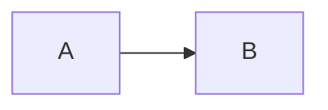
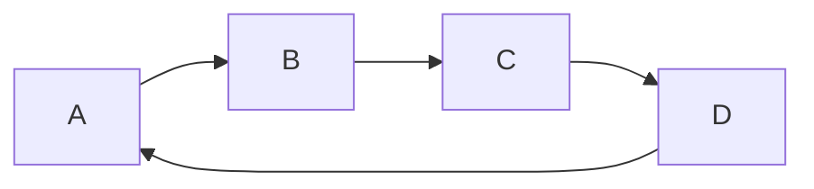
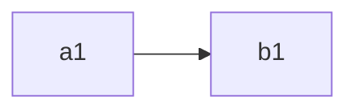
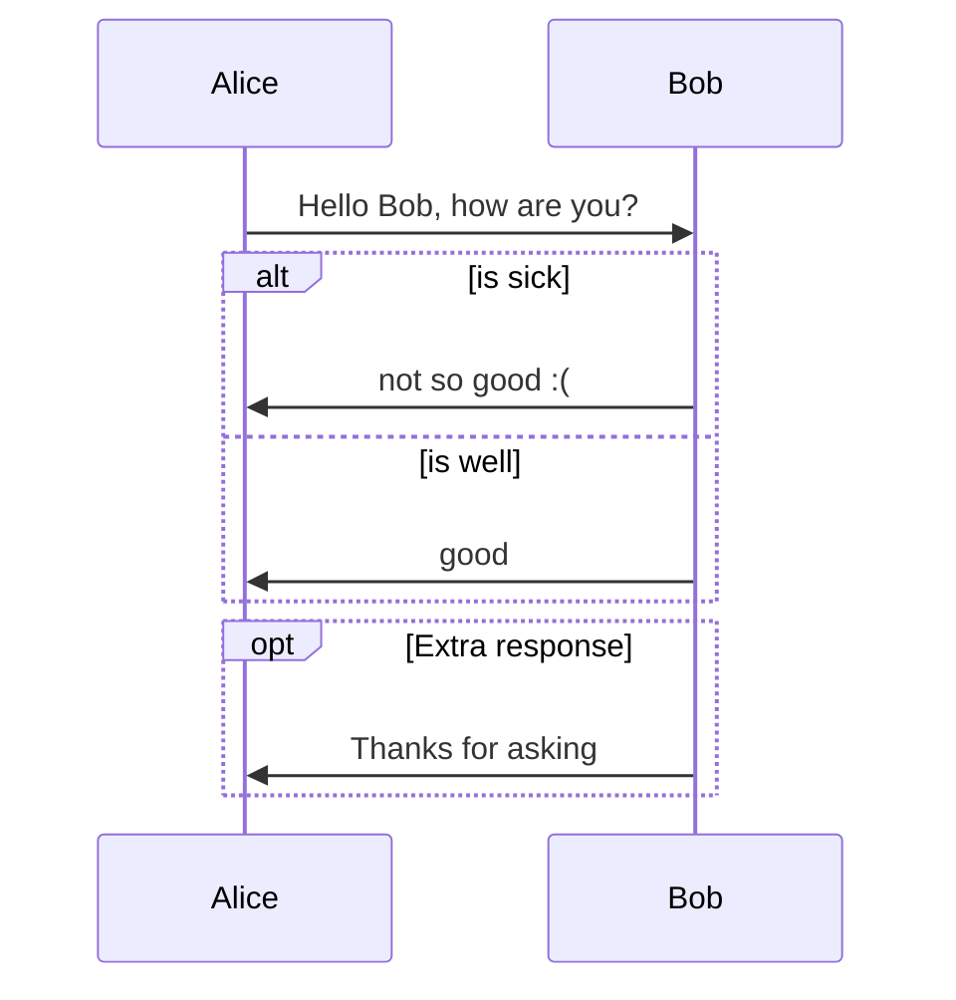
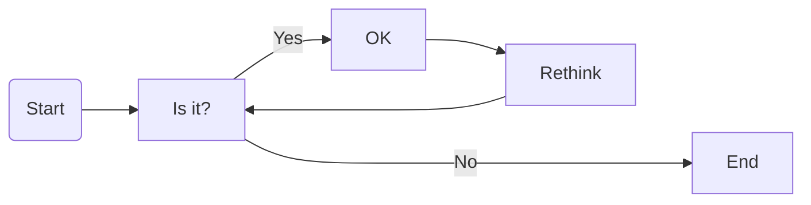

### 1.传送门
1. [mermaid教程](https://zhuanlan.zhihu.com/p/17880793496)

```mermaid
    graph LR;
    A-->B

```

```mermaid
    graph LR;
    A-->B
    B-->C
    C-->D
    D-->A
```

```mermaid
graph LR;
a1 -->b1
```

```mermaid
sequenceDiagram
　　Alice->>Bob: Hello Bob, how are you?
　　alt is sick
　　　　Bob->>Alice:not so good :(
　　else is well
　　　　Bob->>Alice:good
　　end
　　opt Extra response
　　　　Bob->>Alice:Thanks for asking
　　end
```

```mermaid
graph LR
    A(Start) --> B[Is it?];
    B -- Yes --> C[OK];
    C --> D[Rethink];
    D --> B;
    B -- No ----> E[End];

```