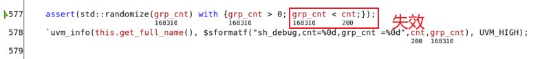
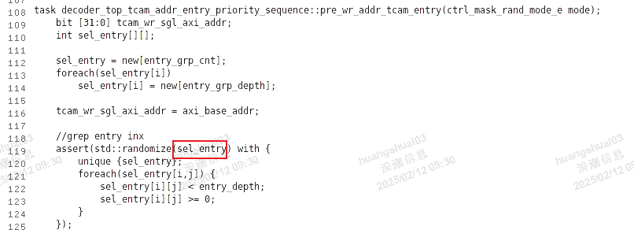
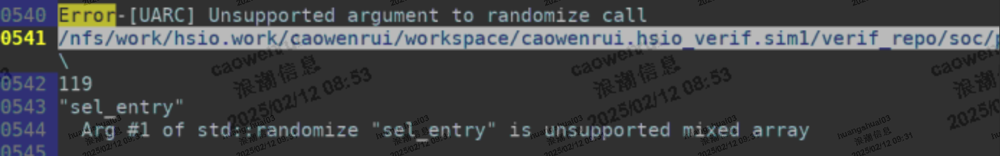
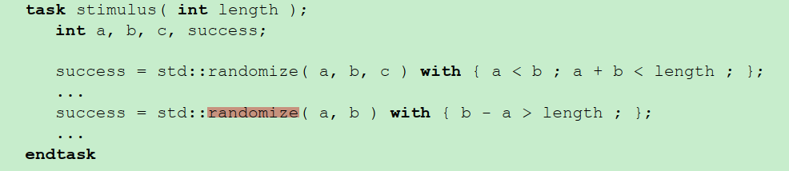
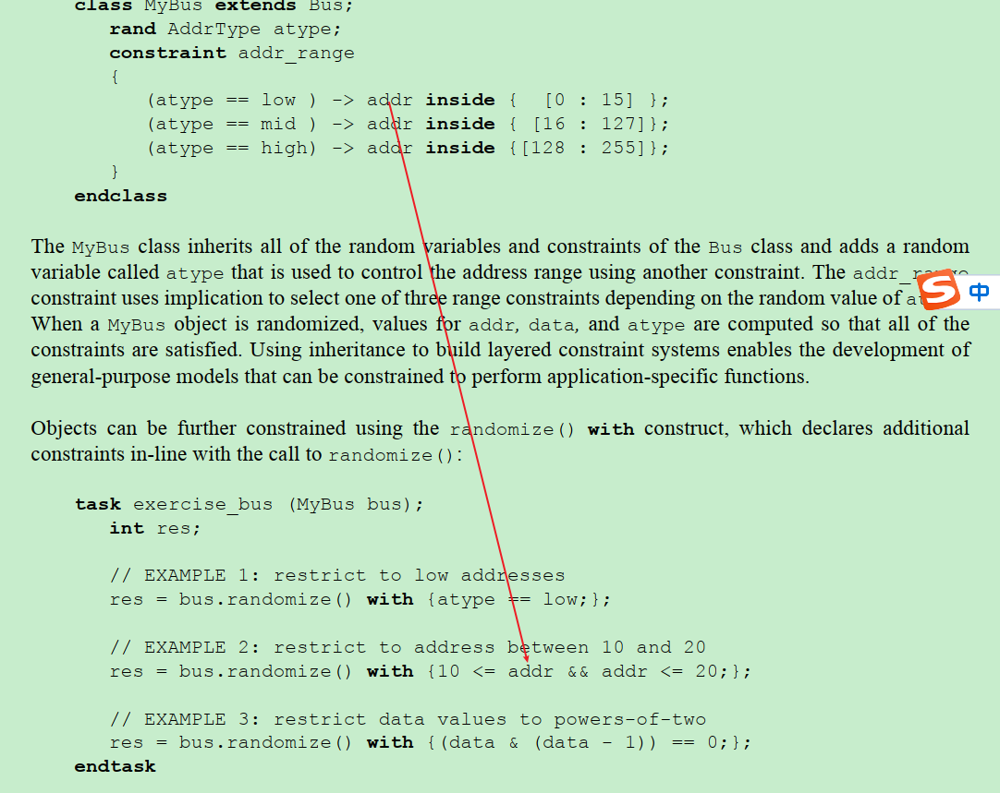
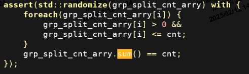
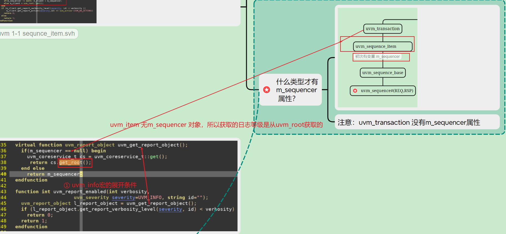
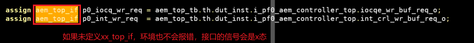
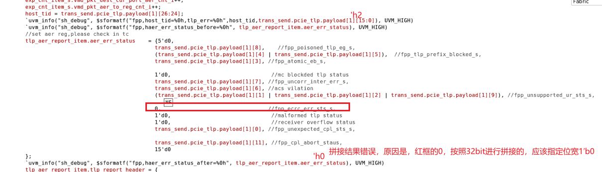

#### 1. sv 约束范围约束的时候，必须inside{[小：大]}， 如果写反编译器不会报错，也不会报约束失败
####  2. super.configure_phase(),报错，super is not expect in this contex, 原因，**子类名称后忘记逗号**
####  3. 约束中local的使用
    在使用内嵌约束randomize（）with {CONSTRAINT}时，约束体中的变量名的查找顺序默认是从被随机化对象开始查找，但如果调用randomize（）函数局部域中也有同名变量，那就需要使用local::来显式声明该变量来源于外部函数，而非被随机化的对象（在约束中也可用this/super来索引这些变量
#### 4. 队列的长度不要直接作为循环的条件，易错
#### 5 .非类的变量约束,rand 变量能约束类变量,不能约束内的函数变量
#### 6. 语法错误,编译器不会报错:
~~~
task  xx_tc::main_phase(uvm_phae phase);
        int q_rand;//函数内只能定义为变量,不能用rand 修饰
	beign

		//std::randmize(q_rand);
                //std::randomize(q_rand) with(q_randinside{[1:31]};); // 正确,注意语法,编译器不会报错,randomize后有括号,括号内包含q_rand,然后with 约束
                std::randomize() with(q_rand inside{[1:31]};); // 语法错误,编译器不会报错,randomize后有括号,括号内包含q_rand,然后with 约束

		$display("q_rand=%0d",q_rand);// 真随机，调用系统函数，
		$display("random_data=%0d",$random);//伪随机
	end
endmodule
~~~
#### 6.约束失败导致的卡死,计算器卡死,导致平台卡死,无波形,固定卡在某个时间点,APB下配置的阶段,定位方向错误,所以, 有错误全文多上下文日志,否则看初始化流程,初步定位卡死的点
~~~
solver time out when solving following problem
sof cq_queue[i].depth dist{2:=10,[3:4095]:/30,[5096:65535]:/30,4095:=10}; //范围重复
sof cq_queue[i].depth dist{2:=10,[3:4095]:/30,[5096:65535]:/30,65536:=10};//错误,16bit最多表示65535
~~~

#### 7.Verilog 位拼接运算符{}语法要点总结
[Verilog 位拼接运算符{}语法要点总结]
(https://blog.csdn.net/hanshuizhizi/article/details/116521728)
~~~
bit[11:0] aq_size;
bit[11:0] sq_size;
bit[31:0] aqa;
constrant aq_size_cons{aq_size dist {2:/10,[3:4095]:/30,4096:/10};}
constrant sq_size_cons{sq_size dist {2:/10,[3:4095]:/30,4096:/10};}
constran  aqa_cons{slove aq_size before aqa;slove sq_size before aqa;}
constrain qu_con {
  //soft aqa == {4'b0,aq_size,4'b0,sq_size}; //易错点,结果[31:28]  [15:12] 不为0
  soft aqa == {{4'b0},aq_size,{4'b0},sq_size}; //知识点:变量或者常量的重复（扩展）与拼接,变量必须用{}括起来再参与拼接
}
~~~

#### 8.复杂的约束,求解器约束失败,系统卡死
在transaction 内有如下约束
~~~
...
	soft cq_queue[0].base_addr[63:12] inside{[64'h500,64'h600]};
	soft cq_queue[0].base_addr[11: 0] == {12{b'0}};
	soft cq_queue[0].depth dist{2:=10,[3:4095]}
	
	foreach(cq_queue[i]) { //cq_queue 深度33
		if(i > 0) {
			//soft cq_queue[i].depth dist {2:10,[3:4095]:/30}; //复杂度太高,求解器无法求出,仿真卡死
			soft cq_queue[i].depth inside {[2:4095]};
			soft cq_queue[i].base_addr == cq_queue[i-1].base_addr + 16* cq_queue[i-1].depth;
		}
	}
...
...
~~~

2种解决方案:
1. 将上述计算cq_queue[i].base_addr移至post_randomize
2. 写新类,内部用randc,选择addr的初值

#### 9. for 循环内嵌套foreach
~~~
...
for(int i=0;i<5;i++) begin
	foreach(pf_cfg_pkt_p[i].cq_queue[j]){         //for循环内嵌套forech ,foreach变量j,内循环
		pf_cfg_pkt_p[i].cq_queue[j].depth > 32; 
	}
end
...
~~~

#### 10. 结构体 auto_file 那个函数？
无，不能传递结构体，只能传递函数，函数用file_object实现

#### 11. unpack  数组定位是那个方法？
packer.counter

#### 12.类里面只能是变量初始化和复制,不能在类内直接计算
~~~
class xx_test extends basic_tc4;
int i =5;
int j =8;
if(i>5)                  //编译报错,类内不能直接赋值
  $print("i out rang");  //编译报错,类内不能直接赋值

~~~

#### 13. for 循环内用fork
- 函数传参必须是automatic
- 被调函数也应该是automatic类型,否则被调函数内部变量会被公用
~~~
task cal_exp_burst_cnt();
  ...
	for (int i =0 ;i<5; i++) begin
		fork
			automatic int pf_id = i;  //必须是automaitc,否则cal_pf_exp_burst_cnt参数是5
			if(pf_bitmap_en[pf_id])
				cal_pf_exp_burst_cnt(pf_id);
		join_none
	end	
  ...
~~~

~~~
task automatic cal_pf_exp_burst_cnt(pf_id);
	int req_split; //如果函数类型不是automatic,则全部子进程公用一套req_split 变量
	...
endtask
~~~

#### 14. 尽量选择同步电路,慎重使用组合逻辑,监测上升沿
背景:检测某型号的上升沿,采用@(posdege xx),
~~~
while(1) begin
   ...
   @(posdege xx);
   ...
end
~~~
问题:不可靠,组合逻辑内部是有可能出现毛刺,但是波形上不显示(受显示策略的影响)
解决方案:参考逻辑的实现,监测上升沿, if(singe == 1 && singe_1dely == 0)
~~~
while(1) begin
   ...
   @(posdege sys.clk);
   if(singe == 1 && singe_1dely == 0) begin 
   ...
   end
   ...
end
~~~

#### 15 .跨时钟域的处理
- 背景: elbi 接口ack 和rsp 握手时候,信号采丢了,系统时钟是500M,elbi 时钟是1G. 核心问题,**ack 下降沿采丢了,没有做信号宽度扩展**
- 知识点: 跨时钟域的处理
  1. 单bit: 打一拍
  2. 多bit: 握手/ 异步fifo /转为独热码或格雷码
- 传送门   
  1. [芯片设计进阶之路——跨时钟信号处理方法](https://zhuanlan.zhihu.com/p/113832794)
  2. [跨异步时钟域的6种方法](https://blog.csdn.net/z951573431/article/details/117260698)

#### 16. 跨层级的约束注意问题(易犯错)
在用例中通过seq约束transaction中的结构体数组,需要注意,结构体元素和结构体数组都应该设置为rand 类型,否则报约束冲突错误

### 16. 跨层级的约束
- 背景:transaction中基础约束,seq中附件约束,最终在用例中继续实现多态的约束
- 实现:尽量避免跨层级的约束,如果非要跨层级约束,建议修改为用例传参给下一级seq,
- 然后在seq内约束tranaction,不建议直接约束

#### 17.正确理解rand 类型
- 知识点: 只有rand 类型的数据才能被randmomzize ,
- 背景:seq 中定义的变量如果是rand类型,则才能被randomize ,否则只能被之间赋值
- 方式1: \
1. xxx_sequence.sv
~~~
class xxx_sequence extends xxx_base_sequence
    ...
    rand bit [4:0] pf_bitmap_en;
    rand bit [4:0][32:0]  msix_ch_bitmap_en;
    ...
~~~
2. xxx_test.sv
~~~
assert(xxx_seq.randmozi with{
   ...
   xxx_seq.pf_bitmap_en == local:pf_bitmap_en;     // 只有rand 类型的才能在randmoize内约束
   xxx_seq.msix_ch_bitmap_en == local:msix_ch_bitmap_en;
   ...
});
~~~

- 方式2:
1. xxx_sequence.sv
~~~
class xxx_sequence extends xxx_base_sequence
    ...
    bit [4:0] pf_bitmap_en;       //非rand 类型
    bit [4:0][32:0]  msix_ch_bitmap_en;   //非rand 类型
    ...
~~~

2. xxx_test.sv
~~~
    //assert(xxx_seq.randmozi with{
    //  ...
    //  xxx_seq.pf_bitmap_en == local:pf_bitmap_en;     // 只有rand 类型的才能在randmoize内约束
    //  xxx_seq.msix_ch_bitmap_en == local:msix_ch_bitmap_en;
    // ...
    //});
	xxx_seq.pf_bitmap_en =  pf_bitmap_en;

	xxx_seq.msix_ch_bitmap_en == msix_ch_bitmap_en;
	xxx_seq.randmize();
~~~
#### 18.assert 语法常见错误,多条件std约束时候,最后一个约束条件, 后必须有分号
~~~
assert(std::randomize(target) with{target>10;target<20;}); //注意,多条件std约束时候,最后一个约束条件,targe<20 后必须有分号
~~~

#### 19. Makefile 编译的理解
编译时,指定sv的文件路径,如果该路径无sv文件,则编译错误,跳出编译
总结:依赖关系必须是要对应
~~~
.shadow/complile_tb:./shadow/compile_uvm $(TB_PAHT)/atc/*/*.sv  $(TB_PAHT)/atc/*/*/*.sv
~~~
问题描述:如果$(TB_PAHT)/atc/*/*.sv找不到文件,则依赖关系未解决,退出编译
修改:如果该路径无用例,则删除该路径;否则在路径下添加用例

#### 20. 慎用disabale fork禁用整个衍生进程
~~~
fork
	begin:ring_host_dbl_timeout
		for(int i=0; i<5; i+++) begin
			automatic int pf_id = i;
			for(int cq_id; cq_id<33; cq_id++) begin
				fork
					automatic int cq_ch_id = cq_id;
					ring_host_dbl_with_mode(pf_id,cq_ch_id); //该子进程内部是死循环,内部调用AHB总线查询寄存器
				join_none				
			end
		end
	end
	
	while(1) begin
		@(posedeg aem_top_vif.aem_top_clk)
		if(!aem_top_vif.axim_wlast_o)
			idle_clk_cnt++;
		else 
			idle_clk_cnt =0 ;
			
		if(idle_clk_cnt > 2000) begin
			disable ring_host_dbl_timeout;  //问题:timeout跳出的时候,有可能上面的衍生子进程ring_host_dbl_with_mode,还在while(1) 调用AHB_vip
											//因:AHB_VIP 发送了seq请求,但是ring_host_dbl_with_mode被kill 掉,AHB_VIP 报错
			break;
		end
	end
join //join_any
~~~

- 报错信息:
xxx_uvm_test_top.env.ahb_sys_env.master[0].sequencer[SEQREQZMB] SEQREQZMB] The task responsible for requesting a wait_for_grant on sequencer 'xxx' for sequence 'default_parent_seq' has been bkilled, to avolid a deadlock thee sequence will be removed form the arbitraction queues.
- 解决方案
  在ring_host_dbl_with_mode 内部判断aem_top_vif.axim_wlast_o 超时,超时后break跳出
- 建议
  不建议,粗暴的之间disabel fork join 块,慎用

#### 21. 合理的选择实现死循环读取的操作,建议写成seq,并且合理的选择 fork_join的操作,尽量避免fore循环嵌套多次层的fork join,
原因:如果最底层调用SEQ 读取接口,可以回报 xxx_uvm_test_top.env.elbi.sequencer[SEQREQZMB] SEQREQZMB] The task responsible for requesting a wait_for_grant on sequencer 'xxx' for sequence 'default_parent_seq' has been bkilled, to avolid a deadlock thee sequence will be removed form the arbitraction queues.

~~~
task check_msix_int_func()
	for(int i =0; i<5 ;i++) begin
		automatic int pf_id =i;
		...
		for(int j=0;j<33; j++) bgein
			automatic int int_ch_id =j;
			fork
				check_msix_ch_int_func(pf_id, int_ch_id);
			join
		end
	end	
endtask
~~~

~~~
task automatic  check_msix_ch_int_func(int pf_id, int int_ch_id);
	while(1) begin
		@(posedge aem_top_vif.aem_top_clk);
		if(cfg.main_phase_to_done_flag == 0) begin
			check_cqe_exit(pf_id,int_ch_id);
			delay_times(1000);
		end else if(cfg.main_phase_to_done_flag == 1)
		    break;
	end
endtask
~~~

~~~
task automatic check_cqe_exit(int pf_id, int int_ch_id);
	int ch_size = msix_ch_map_cq_tbl[pf_id][int_ch_id].size;
	for(int i=0; i < ch_size; i ++) begin
		ch = msix_ch_map_cq_tbl[pf_id][int_ch_id][i];
		read_pf_host_dbl_head(pf_id,cd,cq_head);                       // 此处,由前门访问改为后面访问,否则太消耗仿真时间,导致main_phase_to_done_flag后任务删除,seq报错
		read_pf_host_dbl_tail(pf_id,cd,cq_tail);                       // 此处,由前门访问改为后面访问
		if(cq_head != cq_tail) begin
			int cq_head_target = (cq_head < cq_tail)? cq_head:cq_tail
			//fork                                                      //此次不宜加fork_join,并行的运行,减少提前发送seq
				ring_pf_host_hdbl(pf_id,ch,cq_head_target);
			//join
		end
	end
endtask
~~~

#### 22. 背景检查线程应该写在哪里? rm? basic_tc? seq? xx_tc?
根据aem项目经验,应该用seq实现,在用例中调用该seq,用例中控制该seq的启停,如果rm中有信号需要同步给tc,用全局变量或者event事件驱动

#### 23. 功能覆盖率,covergroup的bin设置的时候, 不能直接用变量传进去,会报运行错误
1. 问题
~~~
covergroup cq_doordbl_overage_cov;
	iocq_door_size: coverpoint ahb_trans.data[0] iff (ahb_trans.addr == 'h1008) {
		bins over_iocq_depth = {[cfg.iocqe_ring_depth[0] : $]};  //此处cfg.iocqe_ring_depth,不能直接传,需要用采用通用覆盖组参数传,或者直接改为常量
	}
	acq_door_size: coverpoint ahb_trans.data[0] iff (ahb_trans.addr == 'h1008) {
		bins over_acq_depth = {[cfg.acqe_ring_depth[0] : $]};    //此处cfg.iocqe_ring_depth,不能直接传,需要用参数传
	}
endgroup
~~~
2. 解决方案
   2.1 covgrp 传参
   ~~~
   covergroup cq_doordbl_overage_cov(aem_top_config cfg);
   	iocq_door_size: coverpoint ahb_trans.data[0] iff (ahb_trans.addr == 'h1008) {
		bins over_iocq_depth = {[cfg.iocqe_ring_depth[0] : $]};  //此处cfg.iocqe_ring_depth,不能直接传,需要用采用通用覆盖组参数传
	}
	acq_door_size: coverpoint ahb_trans.data[0] iff (ahb_trans.addr == 'h1008) {
		bins over_acq_depth = {[cfg.acqe_ring_depth[0] : $]};    //此处cfg.iocqe_ring_depth,不能直接传,需要用采用通用覆盖组参数传
	}
   endgroup
   ~~~
   2.2 bin仓改为常量
   ~~~
   covergroup cq_doordbl_overage_cov();
   	iocq_door_size: coverpoint ahb_trans.data[0] iff (ahb_trans.addr == 'h1008) {
		bins over_iocq_depth = {[3 : $]};  //直接改为常量
	}
	acq_door_size: coverpoint ahb_trans.data[0] iff (ahb_trans.addr == 'h1008) {
		bins over_acq_depth = {[5 : $]};    //直接改为常量
	}
   endgroup
   ~~~
3. 原理总结
   bin仓是一个已经规定好的仓,目的是coverpoint是否在该范围,所以默认是常量,如果需要用到变量,需要特殊的处理,eg,参数传递

#### 24. fork join 循环调用错误的使用,注意点:
    1. fork 内嵌套for循环,for 循环内的第一句应该就是automatic变量
    2. 后续条件中涉及cq_id 变量控制的,都应该替换为automatic变量
~~~
task automatic send_cq_axis(int pf_id,ref int send_iocq_hw_cnt[5]);
	fork
		for(int cq_id =0 ;cq_id <32 ;cq_id++) begin
			fork
				automatic int k = cq_id;        // for循环内的第一句应该就是automatic 变量问题
				//if(cqx_bitmap_en[pf_id][cq+1]) begin   //cq 在循环内必须完成需要已经,cq_id== 32
				if(cqx_bitmap_en[pf_id][k+1]) begin   //automatic内的必须是k为索引的
					send_cqe_axis_per_ch(pf_id,k,sen_iocq_hw_cnt)
				end
			join_none
		
		end
		while(1) begin
			@(posedge aem_top_vif.aem_top_clk);
			if(axi_rx_send_done[pf_id] == 'hffff)
				break;	
		end
	join
endtask
~~~

#### 25. 循环启动衍生线程,且等待衍生线程的执行结果,通过全局变量实现,并行启动衍生线程,衍生线程置全部变量控制位,父线程循环检测完成状态
 - 1.正确方法示范:\   
1.send_cq_axis.sv 循环启动多线程,设置并行线程,等待子函数运行结束,通过axi_rx_send_done全局变量控制
~~~
task automatic send_cq_axis(int pf_id,ref int send_iocq_hw_cnt[5]);
	fork
		for(int cq_id =0 ;cq_id <32 ;cq_id++) begin
			fork
				automatic int k = cq_id;        // for循环内的第一句应该就是automatic 变量问题
				//if(cqx_bitmap_en[pf_id][cq+1]) begin   //cq 在循环内必须完成需要已经,cq_id== 32
				if(cqx_bitmap_en[pf_id][k+1]) begin   //automatic内的必须是k为索引的
					send_cqe_axis_per_ch(pf_id,k,sen_iocq_hw_cnt)
				end
			join_none
		
		end
		while(1) begin
			@(posedge aem_top_vif.aem_top_clk);
			if(axi_rx_send_done[pf_id] == 'hffff) //循环等待32个子线程,每个子线程完成后至该全部变量1bit的值,全部线程执行完备等效与该变量为FFFF
				break;	
		end
	join  // 此处是join,两个条件都满足才能结束父线程
endtask
~~~
2.send_cqe_axis_per_ch.sv 被调函数,内部对 控制线程的全局变量至位
~~~
task automatic send_cqe_axis_per_ch(int pf_id,int cq_id,ref int send_iocq_hw_cnt[5]);
	aem_axi_iocq_seq = aem_axi_iocq_sequence::type_id::creat("aem_axi_iocq_seq");
	aem_axi_iocq_err_seq = aem_axi_iocq_err_sequence::type_id::creat("aem_axi_iocq_err_seq");
	aem_axi_iocq_seq.start(vsequencer);
        send_iocq_hw_cnt[pf_id] = send_iocq_hw_cnt[pf_id] +aem_axi_iocq_seq.send_iocq_hw_cnt[pf_id];
	
	delay_time_ns(11000);
	aem_axi_iocq_err_seq.start(vsequencer);
	send_iocq_hw_cnt[pf_id] = send_iocq_hw_cnt[pf_id] +aem_axi_iocq_err_seq.send_iocq_hw_cnt[pf_id];
	
	axi_rx_send_done[pf_id][cq_id] = 1;  //子函数运行完成后对应为置1
endtask
~~~
 - 2. 易错方法解析:\   
   1.send_cq_axis.sv 该函数只运行了aem_axi_iocq_seq,没有运行aem_axi_iocq_err_seq,原因fork join等待#0 和子线程被调用,但是不等待子线程的完成,所以建议采用方法1
~~~
task automatic send_cq_axis(int pf_id,ref int send_iocq_hw_cnt[5]);
	fork
		for(int cq_id =0 ;cq_id <32 ;cq_id++) begin
			fork
				automatic int k = cq_id;        // for循环内的第一句应该就是automatic 变量问题
				//if(cqx_bitmap_en[pf_id][cq+1]) begin   //cq 在循环内必须完成需要已经,cq_id== 32
				if(cqx_bitmap_en[pf_id][k+1]) begin   //automatic内的必须是k为索引的
					send_cqe_axis_per_ch(pf_id,k,sen_iocq_hw_cnt)
				end
			join_none
		
		end
		#0   //让上述的衍生线程执行
		//hile(1) begin
		//	@(posedge aem_top_vif.aem_top_clk);
		//	if(axi_rx_send_done[pf_id] == 'hffff) //循环等待32个子线程,每个子线程完成后至该全部变量1bit的值,全部线程执行完备等效与该变量为FFFF
		//		break;	
		//nd
	join  // 此处是join,两个条件都满足才能结束父线程
endtask
~~~
2.send_cqe_axis_per_ch.sv,该函数只运行了aem_axi_iocq_seq,没有运行aem_axi_iocq_err_seq
~~~
task automatic send_cqe_axis_per_ch(int pf_id,int cq_id,ref int send_iocq_hw_cnt[5]);
	aem_axi_iocq_seq = aem_axi_iocq_sequence::type_id::creat("aem_axi_iocq_seq");
	aem_axi_iocq_err_seq = aem_axi_iocq_err_sequence::type_id::creat("aem_axi_iocq_err_seq");
	aem_axi_iocq_seq.start(vsequencer);
        send_iocq_hw_cnt[pf_id] = send_iocq_hw_cnt[pf_id] +aem_axi_iocq_seq.send_iocq_hw_cnt[pf_id];
	
	delay_time_ns(11000);
	aem_axi_iocq_err_seq.start(vsequencer);
	send_iocq_hw_cnt[pf_id] = send_iocq_hw_cnt[pf_id] +aem_axi_iocq_err_seq.send_iocq_hw_cnt[pf_id];
	
	//axi_rx_send_done[pf_id][cq_id] = 1;  //子函数运行完成后对应为置1
endtask
~~~
#### 26. override时候注意事项
    1. 新类定义的参数必须和原参数保持一致,与虚函数类似
    2. override的时候不需要体现参数
    3. override class和instanse 2中,如果直接是类重载,需要在类被创建前先重载,否则失效
#### 27. 代码覆盖率
    1. 问题描述: 如果是硬连续,如果初始态为X态,过程中配置该值为1or0 ,因为是从x-->0/1,所以不会toggel 不会变化
    2. 解决方案: 给一个初始的值
    3. 需要注意的问题: 同步电路,在修改该dut 的值,建议采用阻塞复制 xxx <= 'hffff;
#### 28. seq_lib 中的方法和basic_test中的方法
    1. 问题eg, seq中使用read_reg,并在此函数上封装了其他接口,但是因为pack的关系,无法在用例中直接使用该方法
    2. 解决方案: 在basic_test内再次实现该方法,相当于有2套相同的方法,1套给用例使用,一套给seq使用
#### 29. 顶层连线注意事项
     1. 错误示例,aem_top_th.sv,initi begin 只执行一次,期望是是将aem_fp0_flr_rstn_n_i信号用aem_pf_flr_o 和aem_rst_n_i 计算得到
        ~~~
        ...
        initi begin
	 aem_top_if.aem_fp0_flr_rstn_n_i  = (~aem_top_if.aem_pf_flr_o[0] & aem_top_if.aem_rst_n_i);
         //aem_top_if.aem_fp0_flr_rstn_n_i  <= (~aem_top_if.aem_pf_flr_o[0] & aem_top_if.aem_rst_n_i);
        end
        ...
        ~~~
    2. 单语句用assgin,实现连接
       ~~~
       ...
       assgin aem_top_if.aem_fp0_flr_rstn_n_i  = (~aem_top_if.aem_pf_flr_o[0] & aem_top_if.aem_rst_n_i);
       ...
       ~~~
    4. 多条语句用always块, 阻塞赋值,需要重复考虑posdege的 对象
       ~~~
       ...
       always_ff(@ posdege aem_top_if.clk )
	    assgin aem_top_if.aem_fp0_flr_rstn_n_i  <= (~aem_top_if.aem_pf_flr_o[0] & aem_top_if.aem_rst_n_i);	
       end
       ...
       ~~~
#### 30. 寄存器模式使用的注意事项,default_map的addr 可能累加计算,需要特别注意,真实值是 map的base_addr + reg的偏移
#### 31. type_id 是关键字,不能随便使用
#### 32. sv 通过 $system()可以调用shell命令,eg,在jump 到reset_phase后先删除本地日志
    [systemVerilog的$system系统命令可以调用linux的命令](https://blog.csdn.net/cy413026/article/details/105055970)
#### 34. main_phase内跳转到reset_phase,main_phase不用dropobjection,UVM会自动清理objection,查看日志,有UVM_warning的打印提醒
#### 35. 同一条语句声明和例会类数组,需要注意,类的对象数组时候,需要注意
    - 错误示例
    ~~~
    for(i=0; i<5; i++) begin
    clock_clk_set_seq cr_seq_[i] = clock_clk_set_seq::type_id::creat::($sformatf("cr_seq[$0d]",i)); //编译报错,因为clock_clk_set_seq cr_seq_[i]错,i是变量,出错
    end
    ~~~
    - 正确示例
    ~~~
    clock_clk_set_seq cr_seq_[i];// 声明和例会不要一条语句实现,分开实现,先声明后例会
    for(i=0; i<5; i++)
       cr_seq_[i] = clock_clk_set_seq::type_id::creat::($sformatf("cr_seq[$0d]",i)); //编译报错,因为clock_clk_set_seq cr_seq_[i]错,i是变量,出错
    end
    ~~~
#### 36. 寄存器模型后门读写 vs hdl_forece 系列 对比
    - 寄存器模型后门读写:  针对寄存器列表中的值
    - hdl_forece 可以force dut 内的任何信号
#### 37. poke的是对hdl_deposite 进行封装的
#### 38. peek poke 是不消耗仿真时候的,如果需要看到效果,需要加一段延时代码
#### 39. verdi 单步调试技巧, 在stack 内找到要调试的线程,选中,然后F12调试
- 注意:不能在期望的地方打断点,否则线程还是循环进入,要在将进入的子线程前断点,单步跳入,然后鼠标点击stack,F12 单步
#### 40. p_sequencer可以实现在seq 内访问uvm_component的数据
- `uvm_declare_p_sequencer(my_sequencer) 注册 //使用宏定义my_sequencer
- 使用时候,之间用p_sequencer 可以访问被调的sqr
- sqr是env 组件的一部分,所以可以通过才sqr 配合get_parent 访问其他组件的数据.
#### 41. get_parent 实现访问父uvm_component,实现兄弟组件间的数据共享
1.  主要，注意跨层次访问时候，属性是普通变量还是类变量， 如果是普通变量，是单次复制；如果是类变量，则才可以实时感知到变化
~~~
//xx_rm.sv
class xx_rm extends uvm_componet
int exp_report_qu[$], act_report_qu[$];
endclass

//xx_scb.sv
class xx_scb extends uvm_componet
int exp_report_qu[$], act_report_qu[$];
xx_env env;

task  main_phase;
env = $cast(u_cq_env, get_parent());
//错误，exp_report_qu、act_report_qu是非类变量，如下赋值是单次赋值，非句柄传递
exp_report_qu = env.xx_rm.exp_report_qu；
act_report_qu =  env.xx_rm.act_report_qu

// 正确，直接句柄访问
exp_item =env.xx_rm.exp_report_qu[i];
act_item = env.xx_rm.exp_report_qu[i]

end

endclass
~~~

#### 42. 重复相同的语句,可以考虑通过带参数的宏实现
#### 43.  句柄 vs 对象
- 1. 对象: 则是类的实例
- 2. 句柄: 指向对象的“指针”，通过对象的句柄来访问对象
#### 44.  mask的正反用法
~~~
wdata = ($urandom_range(32'h0,32'hffff_ffff) &mask)  | (val &^(~mask)))
//解读:mask 为1,选择随机值, mask为0,不屏蔽,选取VAL值
~~~

#### 45. $test$plusargs 和 编译选项传递宏的区别, 
  1. 生效的阶段不同
  2. 启动的方式不同.$test$plusargs是+参数, 宏是 +define+参数
  3. 参考
     [$test$plusargs 和 宏的区别](https://github.com/bulaqi/IC-DV.github.io/blob/main/doc/%5BSV%5D%20%24test%24plusargs%20%E5%92%8C%20%E5%AE%8F%E7%9A%84%E5%8C%BA%E5%88%AB%20.md)
#### 46. vcs 最小编译选项是vcs +full64 +sverilog
 - 如果未加full,可能访问的是vcs1, 提示/opt/eda/synopsys/vcs-mx/N-2017.12-SP2/linux/bin/vcs1找不到
 - 参考:https://blog.csdn.net/weixin_59105807/article/details/120190906
#### 45. vcs debug_access_all是编译选项,非运行选项,如果误在运行选项内添加该选项,日志报warning 
#### 46. 三步编译法,vlogan ->elab ->run, analysis生成过程文件,真正编译生成层次化的可执行文件,运行
- vlogan
  analysis　phase中VCS会检查文件的语法错误，并将文件生成elaboration phase需要的中间文件，将这些中间文件保存在默认的library中（也可以用-work指定要保存的library
- elaboration
  在此阶段，VCS MX使用分析期间生成的中间文件构建实例层次结构，并生成二进制可执行simv
- run
  运行elaboration phase生成的二进制文件simv来运行仿真。

- eg. [VCS仿真流程](https://www.cnblogs.com/east1203/p/11568460.html)
#### 47. sv 在@事件控制中添加了iff修饰词
- 只有当iff后的条件为真时，@事件才会触发。注意，iff可以在always和always_ff下使用，但是不能在always_comb、always_latch中使用。
- 参考:
  1. [iff 限定符的使用指南](https://recclay.blog.csdn.net/article/details/123206032?spm=1001.2101.3001.6661.1&utm_medium=distribute.pc_relevant_t0.none-task-blog-2%7Edefault%7ECTRLIST%7EPayColumn-1-123206032-blog-111086864.235%5Ev38%5Epc_relevant_yljh&depth_1-utm_source=distribute.pc_relevant_t0.none-task-blog-2%7Edefault%7ECTRLIST%7EPayColumn-1-123206032-blog-111086864.235%5Ev38%5Epc_relevant_yljh&utm_relevant_index=1)
#### 48. 注意uvm_object 和uvm_component  util注册的函数不同,混用会报错,在register时候报错

#### 49.  注意uvm_object 和uvm_componen的构造函数不同,因为uvm_componen是树型的,所以多一个parent的参数
#### 50. 跨组件访问的时候,需要注意是否是单次将A组件内的值覆盖B组件,还是多次. 需要重新梳理该部分的机制,否则用while(1) 在每个clk 都赋值一次
#### 51. 数量聚合和时间聚合的代码示例,等到一个条件满足父进程继续
~~~
std::randmize(coal_num) with{coal_num inside {[1:8]};};
std::randmize(cola_timeout) with{cola_timeout inside {[1:20]};};
fork
	process proc_a;
	process proc_b;
	begin
		proc_a = process::self();
		wait(act_sqe_q[sq_id].size >= coal_num);
		proc_b.kill();
	end
	begin
		proc_b = process::self();
		repeat(100*cola_timeout) 
			@(posedge vif.clk);
		proc_a.kill();
	end
join

~~~
#### 52. 用例本身也是compent, 所以uvm组件可以通过tlm port 连接到 用例上
#### 53. 新建pahse 内的task(消耗仿真时间)没有被执行,请确认pahse 是不是没有raise objection 和drop objection
#### 54. shell脚本对空格有严格的规定，赋值语句等号两边不能有空格，而字符串比较，等号两边必须有空格
- 参考 [shell脚本中空格问题](https://blog.csdn.net/ChaseRaod/article/details/107460737#:~:text=shell%E8%84%9A%E6%9C%AC%E5%AF%B9%E7%A9%BA%E6%A0%BC%E6%9C%89%E4%B8%A5%E6%A0%BC%E7%9A%84%E8%A7%84%E5%AE%9A%EF%BC%8C%E8%B5%8B%E5%80%BC%E8%AF%AD%E5%8F%A5%E7%AD%89%E5%8F%B7%E4%B8%A4%E8%BE%B9%E4%B8%8D%E8%83%BD%E6%9C%89%E7%A9%BA%E6%A0%BC%EF%BC%8C%E8%80%8C%E5%AD%97%E7%AC%A6%E4%B8%B2%E6%AF%94%E8%BE%83%EF%BC%8C%E7%AD%89%E5%8F%B7%E4%B8%A4%E8%BE%B9%E5%BF%85%E9%A1%BB%E6%9C%89%E7%A9%BA%E6%A0%BC%20%E8%B5%8B%E5%80%BC%E6%97%B6%EF%BC%9A%20i%3D1%20i%3D%24%20%28%28i%2B1%29%29%20%2F%2F%20%3D%E7%94%A8%E4%BD%9C%E8%B5%8B%E5%80%BC%E6%97%B6%EF%BC%8C%E4%B8%A4%E8%BE%B9%E7%BB%9D%E5%AF%B9%E4%B8%8D%E8%83%BD%E6%9C%89%E7%A9%BA%E6%A0%BC%20%E6%AF%94%E8%BE%83%E6%97%B6%EF%BC%9A,if%20%5B%20%24a%20%3D%20%24b%20%5D%20%E3%80%80%E3%80%80%2F%2F%20%3D%E7%94%A8%E4%BD%9C%E6%AF%94%E8%BE%83%E5%88%A4%E6%96%AD%E6%97%B6%EF%BC%8C%E4%B8%A4%E8%BE%B9%E5%BF%85%E9%A1%BB%E6%9C%89%E7%A9%BA%E6%A0%BC)
#### 55. 接口if  初值的影响
- 背景,定义了接口数据,类型是logic,但是未赋初值,在使用的时候判断 if(vif.fulsh_state != 1)
- 注意,接口未赋初值是x太,x态 !-1 ,还是x态,目的是结果为1才进入if语句
- 参考 1. [SystemVerilog 中的相等运算符：== or === ？](https://www.cnblogs.com/bitlogic/p/14589903.html)
#### 56. 端口get和try_get
- 背景: 在用例中有port 接口get 平台msix的数据,msix数据个数未知, 仿真时间持续推进,用例的main_pahse 未正常结束
- 分析: 对传输数量未知的port使用时候,需要考虑时间的推进,建议用try_get
- 总结: 对传输数量未知的port使用时候,需要考虑时间的推进,建议用try_get
~~~
 //用例
task xxtc::mian_phase(uvm_phase pahse);
	fork
		chk_amix_bus_idle(5000,axim_wr_bus_idle_flag); // axim_wr_bus_idle_flag是全局变量, 超时等待标记,置1表示总线空,平台结束
		for(int pf_id; pf_id<5; pf_id++) begin
			//write_reg("NVME_TDBL",pf_id);
		end
		proc_msix_msg(0);// 内部根据axim_wr_bus_idle_flag状态跳出循环
	joinsss
endtaks

// 错误代码
task xxtc::chk_amix_bus_idle();
	...
	while(1)
		@(posdege vif.clk);
		if(axim_wr_bus_idle_flag== 1)
			break;
		msix_info_inport.get(req);  //如果在axim_wr_bus_idle_flag==0 时候,在此死等,程序挂死		
                $cast(msix_msg_item,req.clone);
		len = req.lens;
		for(int i=0; i<len ;i ++) begin
			xx_proc();
		end
		//break;
	end
	...
endtask

// 正确代码
task xxtc::chk_amix_bus_idle();
	...
	while(1) begin
		@(posdege vif.clk);
		if(axim_wr_bus_idle_flag== 1)
			break;
		while(msix_info_inport.try_get(req))begin //改为try_get,未get到数据后,跳过,继续外循环判断
			$cast(msix_msg_item,req.clone);
			len = req.lens;
			for(int i=0; i<len ;i ++) begin
				xx_proc();
			end
		end
		//break;
	end
	...
endtask

~~~
#### 57.include 本质是文件展开,是预编译
- 传送门 [程序员应如何理解include](https://zhuanlan.zhihu.com/p/191616105)

#### 58.package内 不能内嵌module
- 报错信息:'endmodule'之前在模块中找到'module'关键字
- 解决方法: 将`include线移动到module上方或endmodule下方
- ['endmodule'之前在模块中找到'module'关键字](https://www.soinside.com/question/qyjXGrDyuVXR9eJ4PSpNEY)

#### 59.interface的例化和声明的区别
- interface是一组双向信号的组合,使用loigc数量类型,使用过程语句驱动
- interface　不是类，不需要构造函数，不要new 或者create
- 例化
  ~~~
  //定义
  interface ticket_if(input logic clk,rst_n,[5:0]m_in,output logic ticket_out,[5:0]m_out);
    
    logic [5:0]sum;

    task change(input logic [5:0]in_data,
                          output logic [5:0]out_data );
                          
             out_data = in_data - 6;
    endtask //automatic

    modport ticket_ports(input clk,rst_n,m_in,
            output ticket_out,m_out,sum,
            import task change(input logic [5:0]in_data,
                               output logic [5:0]out_data )
            );
  endinterface //interfacename
  ...
  //ticket_if ports(.*);如果信号名称一样，你也可以直接按照这种方式来例化
  ticket_if ports(.clk(clk),.rst_n(rst_n),.m_in(m_in),.ticket_out(ticket_out),.m_out(m_out));
  ticket u_ticket(ports.ticket_ports);
  ...
  ~~~
#### 60.override注意事项,被重载的类必须是重载类的父类。--- 非严格的条件
- 结论:被重载的类必须是重载类的父类,不是必须的,实操,兄弟seq之间可以被重载,猜测,只要满足继承的关系,不会出现空方法,空属性即可
- 知识点
~~~
1. 无论是重载的类（parrot）还是被重载的类（bird），都要在定义时注册到factory机制中。
2. 重载的类（bird）在实例化时，要使用factory机制式的实例化方式，而不能使用传统的new方式
3. 最重要的是，重载的类（parrot）要与被重载的类（bird）有派生关系。重载的类必须派生自被重载的类，被重载的类必须是重载类的父类。
4. component与object之间互相不能重载。虽然uvm_component是派生自uvm_object，但是这两者的血缘关系太远了，远到根本不能重载。从两者的new参数的函数就可以看出来，二者互相重载时，多出来的一个parent参数会使factory机制无所适从
~~~
#### 61. 仿真GUI dump 波形的,可以设置,在instance 页签,hierarchy页面,选中需要dump的模块,右击选中dump
#### 62. module 不能定义在package内,否则编译器报错
- ['endmodule'之前在模块中找到'module'关键字](https://www.soinside.com/question/qyjXGrDyuVXR9eJ4PSpNEY)
#### 63. 正确的理解port,interface 内的logic 变量,不是port,是局部变量,
- 根据端口的方向，端口类型有 3 种： 输入（input），输出（output）和双向端口（inout）
- 端口是模块与外界交互的接口。对于外部环境来说，模块内部是不可见的，对模块的调用只能通过端口连接进行。
- [Verilog 模块与端口](https://www.runoob.com/w3cnote/verilog-module-port.html)
#### 64. rand_mode vs constrain_mode
- rand class的rand_mod
~~~
class必须先声明为 rand 型；
对于多级rand class层次，rand_mode会作用于当前对象的整个层次结构；
如果多个rand 型类的句柄指向同一个rand型对象，那么需要对所有指向此rand型对象的rand型句柄调用rand_mode方法；
~~~
- constraint_mode(0)，关闭约束
- 区:不随机的语法: xx.rand_mode(1)  or   xx.constraint_mode(0)
- 传送门
  [systemverilog 中rand class的rand_mode](https://zhuanlan.zhihu.com/p/324216890)
#### 65.sed、awk、grep 尽量配合单引号使用
- 区别
  1. 双引号:保护特殊元字符和通配符不被shell解析，但是允许变量和命令的解析，以及转义符的解析
  2.单引号: 内不允许任何变量、元字符、通配符、转义符被shell解析，均被原样输出
- 经验
  ~~~
  shell脚本:
  sed -i s/"bit[4:0]"/"bit[`MAX_PF_CUN-1 : 0]"/gI *.SV //失败
  //首先sed 是独立命令,后面跟参数,建议整理括起来, 建议修改为 sed -i "s/bit[4:0]"/"bit[`MAX_PF_CUN-1 : 0]/gI" *.SV
  //单引号s/"bit[4:0]"/"bit[`MAX_PF_CUN-1 : 0],命令内部需要匹配原字符,[]需要被转义,所以修改为sed -i 's/bit\[4:0\]/bit[`MAX_PF_CUN-1 : 0]'/gI *.SV
  //替换的值bit[`MAX_PF_CUN-1 : 0]'中的[]实践是可以不加的,即被替换的目标/替换的值要求不一致,后期如找到归零请补充,& 在正则中有特殊意义(待确认),所以需要转义,[]本身作为替换表达式,影响不大
  ~~~
- 总结
  sed、awk、grep运行的机制是,先shell,才是3个命令,所以用单引号括起来具体的命令,交给sed、awk、grep处理,结构清晰,推荐使用
- 传送门:
 1. [Linux中三种引号(单引号、双引号、反引号)的区别](https://blog.csdn.net/mahoon411/article/details/125426155?spm=1001.2101.3001.6650.1&utm_medium=distribute.pc_relevant.none-task-blog-2%7Edefault%7ECTRLIST%7ERate-1-125426155-blog-122901636.235%5Ev38%5Epc_relevant_yljh&depth_1-utm_source=distribute.pc_relevant.none-task-blog-2%7Edefault%7ECTRLIST%7ERate-1-125426155-blog-122901636.235%5Ev38%5Epc_relevant_yljh&utm_relevant_index=2)

#### 66.sed脚本的替换
- 背景:将if(pf_bitmap_en[pf_id] && (pf_init_seq.pf_cfk_pkt_p[pf_id].if_tyep == HW_MODE)) 替换成if(pf_bitmap_en[pf_id] && (init_seq.pf_mode == MULTI_MODE))
- eg:
  ~~~
  sed -i 's/if(pf_bitmap_en\[pf_id\] \&\& (pf_init_seq.pf_cfk_pkt_p\[pf_id\].if_tyep == HW_MODE)/if(pf_bitmap_en[pf_id] \&\& (init_seq.pf_mode == MULTI_MODE))/gI' *.SV
  //只需要将& 和[]转义,.本身也可以代替.所以,严格要求的前提下也可以不转义
  //如果对()转义则匹配不上, 原因() 可能引发子表达式
  //如果没有将替换值&&转义,则会出现多次重复匹配的问题, 原因& 在正则中有特殊意义(待确认),所以需要转义,[]本身作为替换表达式,影响不大
  ~~~
- 传送门
  1. [正则表达式 子表达式](https://geek-docs.com/regexp/regexp-tutorials/regular-expression-subexpression.html#google_vignette)
 
#### 67. uvm_oject 调用compare函数, 对比失败, 会打印UVM_info, 报MISCMP,乱序比较可能会产生海量日志,解决方案,才可以!= 或者== 比较, set_report_id_verbosity只能针对uvm_comp才可以
#### 68. 易错语法
-编译报错,因为uvm宏有分号,本质是2行,不满足if else的要求
~~~
错误代码如下
if (rd_data[15:14] == 2'b10)
	`uvm_info(this.get_full_name(), $sformatf("sh_debug_1"),UVM_MEDIUM));
else
	`uvm_error(this.get_full_name(), $sformatf("sh_debug_1")));
~~~
- 解决方案:
  1. 删除uvm宏的分号
  2. if else 用begin_end 括起来
#### 69. PCIE地址对齐
- PCIE addr要求DW对齐,pcie tlp addr的限制
  
- 传送门
  [[PCIe]地址边界与地址对齐](https://aijishu.com/a/1060000000351663)
#### 70. 请task 和函数 多个参数方向不同的时候,需要特别注意参数的方向,请默认指定方向input/output
- 错误范例
  ~~~
  extern virtual task automatic read_reg_nvme_f(string reg_name, string field_name, output uvme_reg_data_t rdata, ctrl_id='hf,input bit is_bac=0); //ctrl_id 未定义方向,默认方向左对齐,为ouput
  ~~~
- 正确范例
  ~~~
  extern virtual task automatic read_reg_nvme_f(string reg_name, string field_name, output uvme_reg_data_t rdata, input ctrl_id='hf,input bit is_bac=0); //ctrl_id 定义为input
  ~~~
#### 71. sort的踩坑,sort排序一定要分出大小，当指定列内容相同时，会自动以其他列作为排序标准, 会自动跳过-k 指定的域段
1. 原始数据test如下
   - 
3. 期望,按照第一列排序,如果第一列相同,则顺序相对顺序不变
4. sort -t ' ' -k 1,1 test
   - 
5. sort 结果分析, 虽然-k 指定列,第一列,但是列1 如果数据都是都是01,无法分开,sort命令则自动忽略-k 指定的域段,用下个域段比较, 直到sort 出结果,然后就是如上结果
6. 解决思路, 在第一列后添加行号, 然后sort排序,eg,列1 分不出来,则列2(行号)一定可以区分出来
   - 

#### 72. 验证思路
- 不是所以的数据都要用scb精确比对,换个思路可能方法更简单,
- 某些不RM中不容易精确计算的的域段,可以采用交叉覆盖,直接采用act transaction 之间的规律, 其他域段精确比较,保证总体ok
- eg,cqe 的phase_tag,在hw/sw 混发的情况下, rm计算该域段有难度, 但是,如果该域段不参与scb的精确比对,详细act输出的,每一个cqe都分析,该域段是否需要翻转,就足够了,scb保证他域段正常,phase_tag单独算
#### 73. 宏函数在fork join 内应该注意用begin end 括起来,否则结果可能不符合预期
1. 宏定义
  ~~~
  `define SEND_CQ_HW(HW_SEQ_TYEPE, PF_ID, CQ_ID, TO_SEND_CNT) \
  	axis_iocq_seq[CQ_ID] = HW_SEQ_TYEPE::type_id::creat(sformat("axis_iocq_seq[%0d]",CQ_ID));\
  	axis_iocq_seq[CQ_ID].pf_id = PF_ID; \
 	axis_iocq_seq[CQ_ID].cq_id = CQ_ID; \
  	axis_iocq_seq[CQ_ID].max_cnt_to_send = TO_SEND_CNT; \
  	axis_iocq_seq[CQ_ID].start(vsequencer);\
  ~~~
2.  使用
  ~~~
  	aem_axis_iocq_sgl_burst_with_large_burst_gasp_sq_dec_sequence axis_iocq_seq[64*4];
	...
	fork
	    #1 	 `SEND_CQ_HW(aem_axis_iocq_sgl_burst_with_large_burst_gasp_sq_dec_sequence,pf_id,0,loop_cnt)
	join
 	...	
  ~~~
3.  结果报错,`SEND_CQ_HW 报空指针,如果上述行不包括#1 ,则正常
4.  分析,`SEND_CQ_HW是展开,如果是上述的问题,宏展开如下,,全部行并行执行, 第一行creat延时1us 执行, axis_iocq_seq[CQ_ID].start(vsequencer) 0时刻执行,因为暂时没有create,需要会报空指针
   ~~~
	fork
  		#1us axis_iocq_seq[CQ_ID] = HW_SEQ_TYEPE::type_id::creat(sformat("axis_iocq_seq[%0d]",CQ_ID));\
  		axis_iocq_seq[CQ_ID].pf_id = PF_ID; \
 		axis_iocq_seq[CQ_ID].cq_id = CQ_ID; \
  		axis_iocq_seq[CQ_ID].max_cnt_to_send = TO_SEND_CNT; \
  		axis_iocq_seq[CQ_ID].start(vsequencer);\
        join		
   ~~~
5.  解决方案,`SEND_CQ_HW 内容用begin end 括起来,让整体并行执行
  ~~~
  `define SEND_CQ_HW(HW_SEQ_TYEPE, PF_ID, CQ_ID, TO_SEND_CNT) \
        begin \
  		axis_iocq_seq[CQ_ID] = HW_SEQ_TYEPE::type_id::creat(sformat("axis_iocq_seq[%0d]",CQ_ID));\
  		axis_iocq_seq[CQ_ID].pf_id = PF_ID; \
 		axis_iocq_seq[CQ_ID].cq_id = CQ_ID; \
  		axis_iocq_seq[CQ_ID].max_cnt_to_send = TO_SEND_CNT; \
  		axis_iocq_seq[CQ_ID].start(vsequencer);\
        end \
  ~~~
 #### 73. 多行宏,在行尾的反斜杠“ \ ”之后不能有空格或字符，否则编译器会报错。  
 

 #### 73. 多行宏展开,同名变量易错,小心实际用的是临时变量
 

 #### 74. 复杂数据类型汇总,请特别注意 对象和普通属性的区别
  - 句柄,类的指针,属性,是数组,非类的属性,
  - 初始化的区别: 句柄的对象需要例化, 属性不需要例化
  - 复制的区别: 句柄赋值后可以实时感知变化, 属性赋值是单次有效,后续非实时
  - 属性如果联动关联,2个方法,①建议用该属性的类的句柄去操作(推荐) ②每个cycle都去复制(不推荐)
  - 易错点: 类定定义的属性,svt_axi_transaction axi_trans_axis_q[64][$]; 注意svt_axi_transaction axi_trans_axis_q[i][$]是数组,是类属性,内部装数组,不需要new,跨类实时引用的时候,需要实时赋值
  - 

 #### 75. tlm 组件通讯,不一定是在posedge取到的数据
  - 
 
 #### 76. 不同类型class 声明为一个相同的变量, VCS编译器会按照第一个类定义为变量,后面的不会覆盖前面的,后面的其实的重复定义,请特别注意!
 #### 77. uvm中void‘的使用方法
 ~~~
 uvm中void’(A_port.try_put(tr))
 ~~~
 - 注释：其中使用void’的意义表示不考虑返回值。对于括号中有返回值的函数，加上void’操作符的意思就是告诉仿真器这个函数虽然有返回值，但是我不需要这个返回值。
 - 优点：加上这个的唯一好处是可以让仿真器闭嘴：本来函数有返回值，但是你不使用，这时仿真器会抛出警告。加上void’可以关闭警告，让仿真log更干净。
 - 传送门： [uvm中void‘的使用方法](https://blog.csdn.net/michael177/article/details/120809007)
 #### 78. uvm 挂死，最终timeout超时的问题定位，---AHB 总线冲突，其中A进程持续读，导致B进展持续写的，无法接入，原子操作，get到信号量  
 
 

  #### 79.   FIFO的类型对比
- 分类：uvm_tlm_analysis_fifo和 uvm_tlm_fifo。 
- 本质：FIFO是一个component，所以其前两个参数是uvm_component的new函数中的两个参数。 第三个参数是size， 用于设定FIFO缓存的上限， 在默认的情况下为1。 若要把缓存设置为无限大小， 将传入的size参数设置为0即可。 通过size函数可以返回这
个上限值。
- 区别：
    1. 前者有一个analysis_export端口， 并且有一个write函数， 而后者没有
    2. uvm_tlm_analysis_fifo：默认size：0， uvm_tlm_fifo默认size：1uvm 挂死，最终timeout超时的问题定位，---AHB 总线冲突，其中A进程持续读，导致B进展持续写的，无法接入，原子操作，get到信号量  

  #### 80.   平台组件设计思路
  在平台内尽量减少用，clk, 因为阻塞端口，应该是基于有数据就处理的原则，而不是按照clk处理，除非特殊情况
 
  #### 81.   std randomize 可以对多个变量同时约束， std::randomize(val_1,val_2,val_3) with {xxx}
  ~~~
	sucess = std::randomize(val_1,val_2,val_3) with { 
	val_1 inside { A ,B ,C};
	val_2 dist { A := 2 ,B := 5 ,C := 4 };
	val_3 inside {[0:{32{1'b}}]}; 
	};
	
	if(  sucess == 0 ) begin
	`uvm_fatal("TEST", " randomization failed")
	end
  ~~~
  #### 82. reset 时候，sequencer 报错，The task responsible for requesting a wait_for_grant on sequencer 错误
     -  调用，相关sequencer的stop_sequences方法
     -  错误：
     ~~~
	[SEQREQZMB] The task responsible for requesting a wait_for_grant on sequencer ‘uvm_test_top.m_env.m_xxx_agent.m_sequencer’ for sequence
        ‘case_rstn_rand_vseq’ has been killed, to avoid a deadlock the sequence will be removed from the arbitration queues. 
     ~~~
     -  传送门:https://blog.csdn.net/qiuzhongyu123/article/details/121498199
  #### 83. vcs run_option -do simrun.do  指定tcl 文件不能重复指定，只能包含调用
      - 错误： -do simrun.do -do debug.tcl
      - 正确： -在simrun.do 内调用debug.tcl
      ~~~
  	//simrun.do
  	if{[file exists debug_tcl,do] == 1} {
		do debug_tcl.dp
  	}	
      ~~~
  #### 84. set_timeout的使用
  1. 基础概念
     function void set_timeout(time timeout, bit override=1)
  2. eg
	~~~
	18 function void base_test::build_phase(uvm_phase phase);
	19 super.build_phase(phase);
	20 env = my_env::type_id::create("env", this);
	21 uvm_top.set_timeout(500ns, 0);
	22 endfunction
	~~~
  3. set_timeout函数有两个参数， 第一个参数是要设置的时间， 第二个参数表示此设置是否可以被其后的其他set_timeout语句覆盖。 如上的代码将超时的时间定为500ns。 如果达到500ns时， 测试用例还没有运行完毕， 则会给出一条uvm_fatal的提示信息， 并退出仿真。

  #### 85. sv 中的time类型
   1. 基础概念
      - 无符号数64位的变量（time）
      - 时间进度10ns
      - 可以表示的最大时间：584.5年
   3. 传输门
      1. [sv 中的time类型](https://wenku.csdn.net/answer/17117f7e419c4910a2c10a9762c4edc3)
      2. [SystemVerilog数据类型](https://zhuanlan.zhihu.com/p/146178041)
  #### 86. systemverilog  队列sum 求和注意点
    1. 经验：队列sum 求和注意点：代码修改思路应该是将逻辑表达式的结果强制转换成int型，如：
   	count = d.sum(x) with (int'(x > 7));

    2.  知识点：
  	~~~
   	array.sum with (express) 的理解：sum的数据源来自array，针对express求和，结果数据类型也取决于express。套用这个框架理解以下各种状况。
	array.sum with (item > x), 是对item>x的表达式结果求和，这是一个逻辑表达式，结果为一个逻辑值。求和结果的数据类型与表达式item > x 一致，即一位逻辑值
	array.sum with ((item > x)? item:0)，是对item > x ? item:0求和，这个表达式的结果是item（如果大于x）或者0(如果不大于x）
	array.sum with (item), 对item求和，结果数据类型和item一致
	array.sum with (int'(item)), 对int'(item)求和，即item转为int型后求和，结果数据类型也和表达式表达的数据类型即int型一致
	array.sum with ((item >x) * item), 对表达式结果即满足item >x的item求和，和值的结果类型与表达式结果item的数据类型一致
        ~~~
    3. 传送门
        [systemverilog 再谈数组求和](https://zhuanlan.zhihu.com/p/57413839)
 #### 87. fsdb fsdbAutoSwitchDumpfile 波形拆分
  1. fsdbAutoSwitchDumpfile 参数file_size—波形文件大小限制，单位为MB，最小为10M，若值小于10M则默认10M；
  2. eg
     
  4. 传送门
     [FSDB dump](https://blog.csdn.net/zyn1347806/article/details/105554103)
### 88. verdi显示毛刺 
  1. 基础知识
    - 
  2. 经验
  3. 传送门
     1. [在Verdi中找出Glitch](https://blog.csdn.net/gsjthxy/article/details/115)
### 89. 变量的随机和约束块的随机
  1. rand_mode:使能和关闭变量随机
  2. constraint_mode:控制constraints
  3. randomize变量随机控制
  4. 传送门
	1.[systemverilog随机化控制方法](https://github.com/bulaqi/IC-DV.github.io/blob/main/doc/02%20SV%20rand%20%E5%92%8C%E9%9A%8F%E6%9C%BA%E6%8E%A7%E5%88%B6.md)
### 90. 利用sequence library ,实现对并发seq 的随机启动
   传送门
  1. [seq libray 实现seq随机触发](https://github.com/bulaqi/IC-DV.github.io/blob/main/doc/03%20UVM%20%20seq%20%20libray.md)
  2. [UVM——Sequence Libirary的运用（sequence的添加、控制执行](https://blog.csdn.net/weixin_46022434/article/details/119604136)
### 91. seq 和环境通过config_db 传递参数，
  1. 应用：
     - 通过seq控制scb.cmp_en 开关
     - 仿真中，用例随机控制seq的变量，修改seq body内的处理逻辑（ps:静态控制可以通过start_seq前，修改seq的变量）
  2. 传送门:
     1.[sequence的config_db使用]（https://github.com/bulaqi/IC-DV.github.io/blob/main/doc/03%20UVM%20%20sequence%E7%9A%84config_db%E4%BD%BF%E7%94%A8.md）
### 92. 带随机属性的seq，如果没有randmozie()随机化，new后直接使用，其实constrain 约束块是没有起作用的，需要特别注意
### 93. UVM中seq的构造函数传参
  1. 方法1：seq 类中注释掉uvm_object_utils行，其他正常，参考sv new构造函数传参
     

### 94. TCL脚本验证过程中，如果有嵌套调用，注意tcl语句，选择非阻塞语句，尽量不要阻塞后续的tcl脚本的执行
  1. 分析，如果user.do 先于ppm0_forece_c.do、ppm0_user.do执行，如果user.do语句非阻塞，会影响ppm脚本的执行，操作初始化流程不完整的问题
  2. 
  3. 

### 95. 数据存储和传输的大小端
  1. 总线传输过程中，数据的字节顺序是指当一个**多字节的数据值**通过总线从一个位置移动到另一个位置时，**各个字节是如何排列**的。这主要涉及到两种格式：大端和小端
  2. 传输:在大端格式中，数据的最高有效字节（Most Significant Byte, MSB）首先传输，而最低有效字节（Least Significant Byte, LSB）最后传输
  3. 存储：接上，**这意味着在内存中，最高有效字节将存储在最低的地址上**，而最低有效字节将存储在最高的地址上
  4. 反之则是小端

### 96. 寄存器，寄存器的reset值和tie固定值是2个概念，易混淆
  1. 寄存器的 reset值可以是0，不影响该寄存器的功能tie 固定值
  2. reset值是寄存器模块内设置的默认值，该默认值是**.sv文件class定义的（verilog 唯一用sv语法的地方）
  3. tie 固定值：eg,w属性的寄存器，AHB配置寄存器 域段 的不同值，DUT的寄存器模块，将该寄存器拆分为代表不同功能的output线，传给功能控制模块。tie 固定值，类似将output线,tie为固定值
  
### 97. 拼接 对象 数组元素的赋值 易混淆
1. 第一种，不加单引号，拼接，要求拼接前元素/成员指定好位宽，不然就出错。
2. 第二种，加引号，不拼接，是数组的初始化，每个元素/成员单独赋值（成员位宽不一致），不要整体赋值。

### 98. 及时断言和并发断言
1. 及时断言
   - 在一个过程块（如 always 块）内执行的断言。
   - 通常与同步时序逻辑一起使用，并且只在指定的时钟边沿上被评估。
   - 及时断言不会影响仿真时钟的速度，因为它们是作为过程的一部分来执行的
   - 断言会在每个时钟上升沿被评估。
   - eg
		~~~
		always @(posedge clk) begin
		assert property (a == b) else $display("Assertion failed at time %0t", $time);
		end
		~~~
2. 并发断言:
   - 在模块级别定义的断言，
   - 它们独立于任何过程块，
   - 并且在整个仿真过程中持续运行。
   - 并发断言可以捕获非时序的错误，比如组合逻辑中的错误，并且它们可以与多个时钟域同时工作
   - 如下：assert 语句定义了一个并发断言，它会不断地检查 a 和 b 是否相等
   - eg
		~~~
		module my_module();
		input wire a, b;
		// ...
		always @(a or b) begin
			// ...
		end
		`ifndef VERILATOR
		// Verilator does not support concurrent assertions
		property p1;
			a == b;
		endproperty
		assert property (p1) else $display("Concurrency assertion failed at time %0t", $time);
		`endif
		endmodule
		~~~
3. 总结
   - 及时断言 是在过程块内部定义的，通常用于检查时序逻辑。
   - 并发断言 是在模块级别定义的，可以用来检查整个设计的行
4. 应用
	- 需要确保在**任何时刻**都满足某些条件，那么你应该使用并发断言；
	- 需要在特定的时钟**边沿**检查条件，则应该使用及时断言。

### 99. 积极使用unique随机数组
1. 在std::randomosize中随机
~~~
int sel_entry[10][10];
asset(std::randomize(sel_entry) with{  //unique随机sel_entry
	unique {sel_entry};
	sel_entry[i][j] < `max_size;
	sel_entry[i][j] > 0;      //注意因为是int 是有符号的，所以必须限制>0条件
});
~~~
2. 在类中constrain 随机的控制
   -[02_SV_随机化_unique.md](https://gitcode.com/bulaqi/IC/blob/main/doc/02_SV_%E9%9A%8F%E6%9C%BA%E5%8C%96_unique.md?init=initTree)

### 100. 将一堆数据随机分在不同的组内，组的个数随机，元素随机
~~~
class A
	bit[31: 0] key[];

	task fun1();
		...
		//填充key数据
		...
	endtask

	task def_sort();
		int cnt,grp_cnt,cnt_tmp;
		int grp_split_cnt_array[];
		bit[31:0] tmp[][$];

		cnt = key.size();

		//assert(std::randomize(grp_cnt) with (grp_cnt>0; grp_cnt<cnt>));
		grp_cnt = $urandom_range(1,cnt)

		assert(std::randomize(grp_split_cnt_array) with {
			foreach(grp_split_cnt_array[i]) {
				grp_split_cnt_array[i] > 0;
				grp_split_cnt_array[i] < cnt; //must,否则会溢出
			}
			grp_split_cnt_array.sum == cnt;
		});

		tmp = new[grp_cnt]; //变量可以作为动态数组new的参数
		for(int i = 0; i <grp_Cnt; i++) begin
			repeat(grp_split_cnt_array[i]) begin
				tmp[i].push_back(key[cnt_tmp]);
				cnt_tmp++
			end
		end
		...
	endtask
endclass
~~~

### 101. foreach sum 约束的时候，务必考虑 元素累加溢出 满足的情况
~~~
	int grp_split_cnt_array[];
	assert(std::randomize(grp_split_cnt_array) with {
		foreach(grp_split_cnt_array[i]) {
			grp_split_cnt_array[i] > 0;
			grp_split_cnt_array[i] < cnt; //must,否则会溢出
		}
		grp_split_cnt_array.sum == cnt;
	});
~~~

### 102. 请注意int 是有符号，尤其是在约束的时候
~~~

		assert(std::randomize(grp_split_cnt_array) with {
			foreach(grp_split_cnt_array[i]) {
				grp_split_cnt_array[i] > 0;
				grp_split_cnt_array[i] < cnt; //must,否则会溢出
			}
			grp_split_cnt_array.sum == cnt;
		});

~~~
### 103. std 随机控制的范围问题
1. 错误
2. 
~~~
assert(std::randomozie(delay_time) with{ delay_time >0; delay_time < 100;}) // 约束失败，不在0~100 内，原因是2条语句，
~~~
3. 正确
~~~
assert(std::randomozie(delay_time) with{ delay_time >0 &&  delay_time< 100;}) //&&连接，限定为&
~~~
4. 对比，使用类和约束块的方式来定义随机变量及其约束，注意： 无需在块内用&& 连接；
~~~
class RandomClass;
    rand int value;

    // 定义约束块
    constraint c_value { value > 10; value < 20; }
endclass

module test;
    RandomClass rc = new();

    initial begin
        // 随机化对象中的变量
        if (!rc.randomize()) $fatal("Randomization failed");
        $display("Random value between 10 and 20 is %0d", rc.value);
    end
endmodule
~~~

### 104. 二位动态数组的使用,分层分配空间
~~~
int array_width=5;
int arrary_depth=10;
...
bit [7:0] d_array[][];
  
  initial begin
    //memory allocation
    d_array = new[array_width];        //首先创建第一层的
    
    foreach(d_array[i])
		d_array[i] = new[arrary_depth];    //然后创建第二层的
 ...
~~~

### 105. for循环的执行顺序,注意首次是12
- 执行顺序为：1243，243，243
~~~
for(表达式1;表达式2;表达式3){
  表达式4;
}
~~~
### 106. std::randomozie 对不同vcs 版本的支持
0. eg

1. vcs2023版本支持
2. vcs2019版本不支持，编译报错

1. 结论：std::randomozie倾向支持简单类型的变量随机

### 107. std::randomozie 对一个数进行，多维度的约束，是否需要&，如果是数组呢？ 数组sum 和每一个数组元素大小的限制？
1. 结论：
   1. 2种方式都需要对同一个数据进行约束，都需要& 连接
   2. 如果是对数组的每个元素限制& sum 为固定值，代码实现不需要& 连接， 见第3条
2. std
   
3. randomozie
   
4. 

### 108. sprint 打印tranaction 内部包嵌object 类型对象

1. 步骤1：定义内嵌对象类并使用字段自动化宏,确保内嵌对象继承自uvm_object，并使用字段宏注册其成员：
	~~~
	class my_config_object extends uvm_object; //注意1：此处uvm_object和uvm_sequence_item 都可以
		rand int mode;
		rand int timeout;

		`uvm_object_utils_begin(my_config_object)
			`uvm_field_int(mode, UVM_ALL_ON)
			`uvm_field_int(timeout, UVM_ALL_ON)
		`uvm_object_utils_end

		function new(string name = "my_config_object");
			super.new(name);
		endfunction
	endclass
	~~~
        
2. 步骤2：在Transaction中注册内嵌对象,在transaction类中使用uvm_field_object宏注册内嵌对象，确保UVM自动处理其打印，**内嵌object 必须create方式例化**
	~~~
	class my_transaction extends uvm_sequence_item;
		rand int data;
		rand my_config_object config_obj;   //注意2: 此处必须是rand,否则会出现约束失败的问题

		`uvm_object_utils_begin(my_transaction)
			`uvm_field_int(data, UVM_ALL_ON)
			`uvm_field_object(config_obj, UVM_ALL_ON)
		`uvm_object_utils_end

		function new(string name = "my_transaction");
			super.new(name);
			config_obj = my_config_object::type_id::create("config_obj"); //注意3：必须是create，不能直接new
		endfunction
	endclass
	~~~
        
3. 步骤3：打印Transaction信息
使用sprint()方法打印transaction，确保包含内嵌对象内容：
	~~~
	// 在UVM组件（如driver或monitor）中：
	my_transaction tx;
	tx = my_transaction::type_id::create("tx");
	tx.randomize();

	// 使用sprint()自动递归打印所有字段
	`uvm_info("TX_DEBUG", $sformatf("Transaction: %s", tx.sprint()), UVM_LOW)
	~~~

### 108. VCS 的synopsys_sim.setup的编译控制
1. VCS 查找synopsys_sim.setup文件优先级：SYNOPSYS_SIM_SET环境变量 > $PWD/synopsys_sim.setup > $HOME/synopsys_sim.setup > $VCS_HOME/bin/synopsys_sim.setup
2. synopsys_sim.setup文件支持include形式。可从项目层级考虑，对该文件公共部分进行划分、定义。以避免不合理的使用。

### 109. 不能在子类的seq中new方法中调用p_sequencer，原因未创建
1. 解决方案，在父类的pre_body中才能使用p_sequencer

### 109. UVM不常用方法
1. set_item_context
2. pre_body
3. 传送门：
   [UVM设计模式 （七）命令模式、三种sequence启动方式、start_item/finish_item、中介模式、virtual sequence](https://blog.csdn.net/Holden_Liu/article/details/111740898)
   
 ### 110. SV 数组复制操作符
 ~~~
   int acs_result[8] = '{8{3}}; //将值 3 重复 8 次，生成数组 {3, 3, 3, 3, 3, 3, 3, 3}
~~~

 ### 111.  inside的用法
 1. inside 主要功能包括2种：
	   1. 在约束内约束值（包括类的constrain块&std块）
 	  2. 在方法/函数内，作为判断语句、条件，输出ture/fail
 2. inside 在方法/函数内，不能作为赋值语句，语法报错
 3. eg:
       1.  随机约束(略)
       2. 条件判断
       ~~~
       logic[2:0] a;
       if (a inside {3'b001, 3'b010, 3'b100}) 
       // 等价于 if ((a == 3'b001) || (a == 3'b010) || (a == 3'b100)) 
       ~~~
       ~~~
       class ABC;
          rand bit [3:0] 	m_var;

          // Inverted inside: Constrain m_var to be outside 3 to 7
          constraint c_var { !(m_var inside {[3:7]}); }

       ~~~
       3. **与数组结合使用, 队列也可以，算是一种特殊数组**
       ~~~
           int d_array[0:1023];
          if (13 inside d_array) 
       ~~~~  
       4.   使用z或x表示无关条件
      ~~~
          logic[2:0] a;
          if (a inside {3'b1?1}) 
          // 如果 a 含有 3'b101、3'b111、3'b1x1、3'b1z1 值，结果都为真 
      ~~~
      5. case 语句中使用
      ~~~
          logic[2:0] sel;
          case (sel)
            inside {3'b001, 3'b010}: // 当 sel 为 3'b001 或 3'b010 时执行
              // 执行相应的代码
            default: 
              // 其他情况执行的代码
          endcase 
      ~~~
      6.  条件赋值（三元运算符
      ~~~
          logic flag;
          flag = (value inside {1, 2, 3})? 1 : 0; 
          // 如果 value 的值在 1、2、3 中，flag 被赋值为 1，否则为 0 
      ~~~
       7. inside的返回值
      ~~~
      int a;
      int b;
      int c;
      int q[$] = '{7,8,9,67};
      if(a inside{1，2，3，4，q,[12:18]}) 
      	c= 56;
      else  
      		c = 9;
      ~~~
  
 4. 传送门：
 [systemverilog中inside的常见用法](https://blog.csdn.net/m0_71354184/article/details/140425716)
 
 ### 111.  设置object的日志等级，如trans，reg等，非componte组件的日志
 1. 方法 ：set_report_id_verbosity_hier  & set_report_id_verbosity
 2. 注意：如果要全局控制，可以在base_tc中调用set_report_id_verbosity_hier实现，当然也可以 env.i_agt.drv.set_report_id_verbosity("ID1", UVM_HIGH);
 3. 注意set_report_id_verbosity_hier 等方法是设置 组件/ID的冗余阈值，而不是修改UVM_INFO的日志等级，该阈值和uvm_info宏的阈值比较，决定是否打印。 eg,日志等级为uvm_high, 通过set_report_id_verbosity_hier不同值的效果
     1. set_report_id_verbosity_hier设置为uvm_high,则正常打印，
     2. set_report_id_verbosity_hier设置为uvm_debug, 正常打印
     3. set_report_id_verbosity_hier设置为uvm_low, 
 4. 传送门：[UVM冗余度设置](https://www.cnblogs.com/csjt/p/15571408.html)
 5. 如果有的还未生效，可能是因为某些原因，object 类型的日志等级没有设置成功，因为seq类的等级是与绑定的sqr相关，sqr是uvm树的一部分，可以在树顶uvm_root 递归设置，则全部的sqr都会被影响到，才能生效
 ~~~
 // base.connect phase
 uvm root too = uvm_root::get();
root.set_report_id_verbosity_hier("get_dword_array",UVM_NONE)  // 过滤掉get_dword_array表情的日志
 ~~~
 
 ### 112.  为什么transaciton不能通过在bast_tc中直接set_report_id_verbosity_hier控制日志等级
 1. 
 2. 解决方案，参考上一条，在root域内调用set_report_id_verbosity_hier
 3. 参考：[02_UVM_INFO_ 宏的理解.xmind](https://gitcode.com/bulaqi/IC/blob/main/doc/02_UVM_INFO_%20%E5%AE%8F%E7%9A%84%E7%90%86%E8%A7%A3.xmind?init=initTree)
 
 ### 113.  在object 类型只能new，不能create? 存疑待确认

 ### 114. 在数据拼接的时候，要注意数据位宽，特别注意，系统函数$urange返回的是32bit数据，要截断使用，需要强制转换长度
 
 
 ### 115. vcs 选项，loopreport, 可以辅助解决loopreport的问题
 在编译选项添加+vcs+loopreport+number，可协助定位零延时环的位置，并打印到专门的log中
 
  ### 116. sv结构体和枚举的语法注意点
  1. 枚举： 
  - 是用逗号分开，最后一个不能有逗号，枚举因为是统一的结构，所以枚举头需要定义枚举的数据长度,
  - 枚举数据默认的存储类型为int型
  ~~~
  typedef enum {
  		INIT, 
        DECODE,
    	IDLE
   } fsmstate_e;//默认INIT=0，DECODE=1，IDLE=2
  ~~~
  
  ~~~
  //结构体 定义包含类型，eg bit
 typedef  enum bit {
  		FALSE, 
  		TRUE
  } boolstate_e;
  ~~~
  
  2. 结构体：元素间是不同类型的数据的集合，并且元素之间是独立的，所以结构体头不用类型定义，即类型缺失，因元素独立，类似语句，元素之间是分号隔离，每行都需要分号结尾
  ~~~
  typedef struct packed{
  		bit [7:0] r;
  		bit [7:0] g;
  		bit [7:0] b;
   } pixel_t;
  ~~~
 
 ### 117. foreach踩坑，执行的序
    - 执行的顺序，和声明的形式有关，声明是降序，则foreach执行也是降序，否则是升序
    
 ~~~
// 特别注意
int arr[5:3]; // 索引范围：[5:3]（降序声明）
foreach (arr[i]) 
    $display("Index: %0d", i); // 顺序：5 → 4 → 3（按索引值升序）
~~~

~~~
int arr[3]; // 索引范围：[0:2]
foreach (arr[i]) 
    $display("Index: %0d", i); // 顺序：0 → 1 → 2
~~~

~~~
int arr[2:4]; // 索引范围：[2:4]
foreach (arr[i]) 
    $display("Index: %0d", i); // 顺序：2 → 3 → 4
~~~

### 118. xx_th.sv如果有未定义的信号，也不会报错，需要特别注意，尤其是自建的接口信号，缺少vif的头,尤其是断言的时候需要注意

### 119. 数据拼接一样要注意位宽，如果未定位位宽，会按照int 32位宽的数据进行处理
