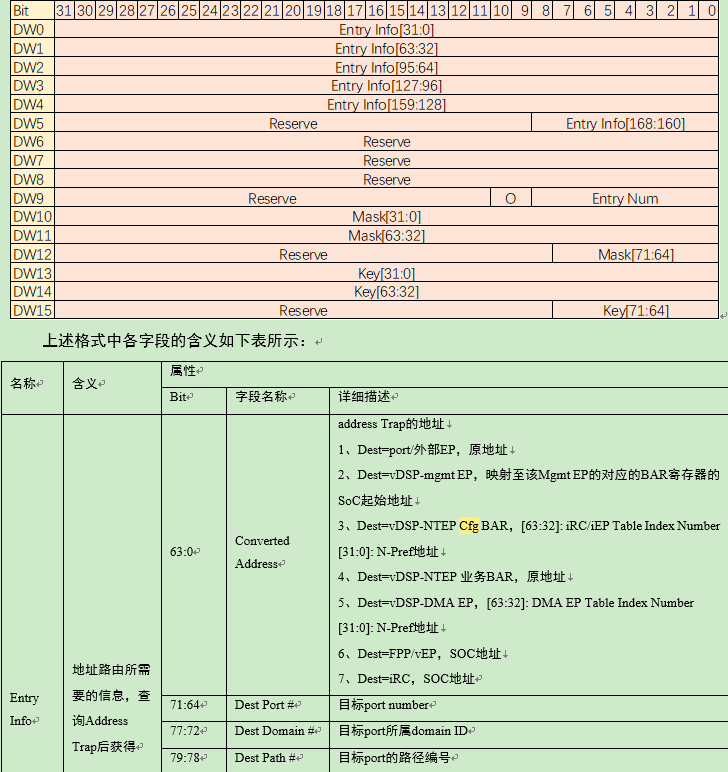
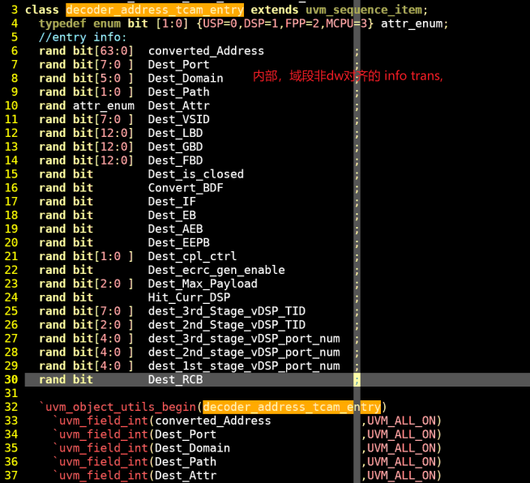
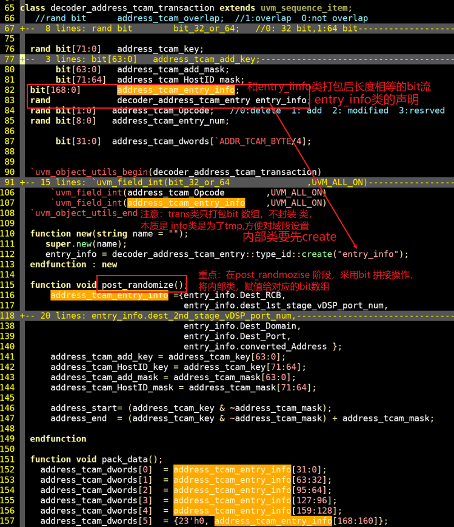
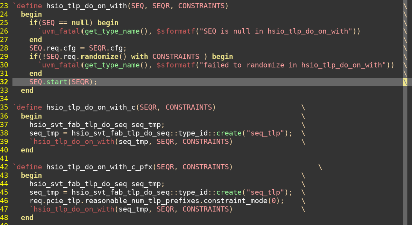
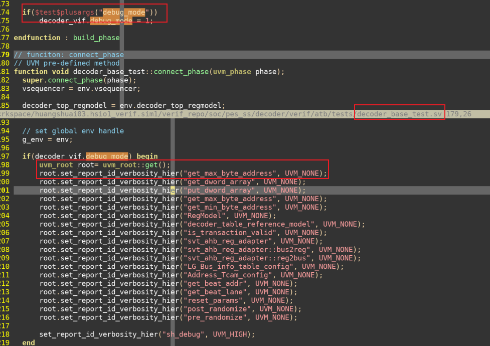
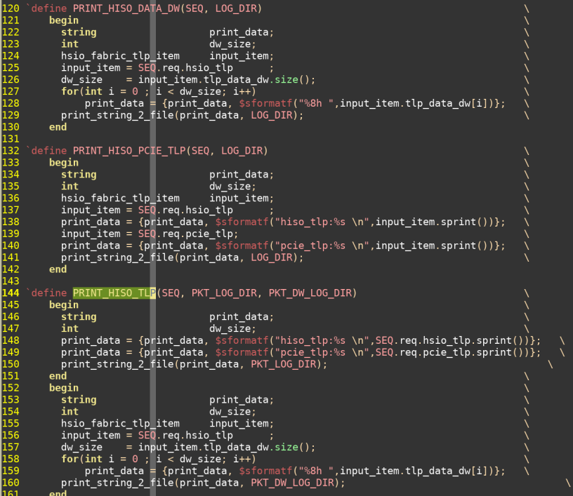

## 1. 代码技巧
### 1. pcie的长度不超过4k的限制，长度和地址相关联，并且是0 base地址的写法

~~~
bit[10:0] lenth_add1bit
do begin
	//根据addr约束lenth，避免4k 越界，
	//如果addr[63:12] != addr_end[63:12],则认为是属于不同的4k,则lenth在当前地址和当前4K页内随机
	//如果addr[63:12]  == addr_end[63:12],则是同一个4k页，则 length 在1和当前addr_end范围内随机	
	//注意addr是8bit,pcie.length单位是dw，需要是*4 /4的转换
	
	//length_add1bit 不是值+1,只是位宽加1
	
	addr_idx = $urandom_range(0, addr_start.size() -1);
	std::randmozie(tlp_addr) with(tlp_addr inside{[addr_start, addr_end]};);
    tlp_addr[1:0] = 0 ;//dw 对齐
	
    if((addr_end[addr_idx][63:0] + 1 - tlp_addr)/4 <1)
    	length_add1bit =0;
    else if(addr_end[addr_idx][63:0] != tlp_addr[63:12])
        length_add1bit = $urandom_range(1, ('h1000- tlp_addr[11:0])/4);
    else 
       length_add1bit = $urandom_range(1,(addr_end[addr_idx][63:0]+1- tlp_addr/4));
end while((lenth_add1bit ==0 ) || (lenth_add1bit >11'b400))

//将11bit数据的地址赋给10bit的长度，就可以实现pcie协议中, 取值范围是0到1023，如果是0，表示数据长度为1024个DW,因为测试11bit数据刚好可以表示
//11'h400 代表1024，只取低10bit,则是0，但是lenth_add1bit
//lenth_add1bit 是11'h400,代表1024，取低10bit赋值给pcie.length,则是将pcie.length =0时候，代表了1024赋值给了= lenth_add1bit[9: 0];
pcie.length = lenth_add1bit[9: 0];
~~~

### 2. 关联数字的使用
~~~
bit lg_bus_info_test_num[bit[7:0]];
bit lg_bus_info_fifo[$]

if(lg_bus_info_test_num.first(key)) begin
	if(lg_bus_info_test_num[key] == 1)
		lg_bus_info_fifo.push_back(key);
		
	while(lg_bus_info_test_num.next(key)) begin
		if(lg_bus_info_test_num[key] == 1)
			lg_bus_info_fifo.push_back(key);
	end
end
~~~

##  2. 控制技巧

### 1. 用例级关闭断言,利用property中的disable iff，通过test plusargs控制
~~~
property  xx_vld_hit_mathl
  @(posedge clk_i) disable iff( $test$plusargs("xx_assert_disable"))
  ...
~~~

### 2. trasnaction 内部域段非dw对齐的，tranaction的定义

### 3. seq sqr宏

### 4. 打印的控制，在base中通过参数控制打印数据的等级

### 5. 打印数据包

##  3. 约束块的控制技巧
### 1. 通过bit_map实现，不同的bit组合后对应不同的逻辑
~~~
bit[2:0] contrl_mode_i; //每个bit都可以独立设置，分别对应不同的场景
int out_mode;

constrain rslt_c{
	out_mode inside {contrl_mode_i[0]*1, contrl_mode_i[2]*2,contrl_mode_i[3]*4}; //out_mode最终实现在{0,7}内，用out_mode作为int控制其他变量的随机
	//当然，也可以直接用contrl_mode_i多bit的组合直接控制约束
}

~~~