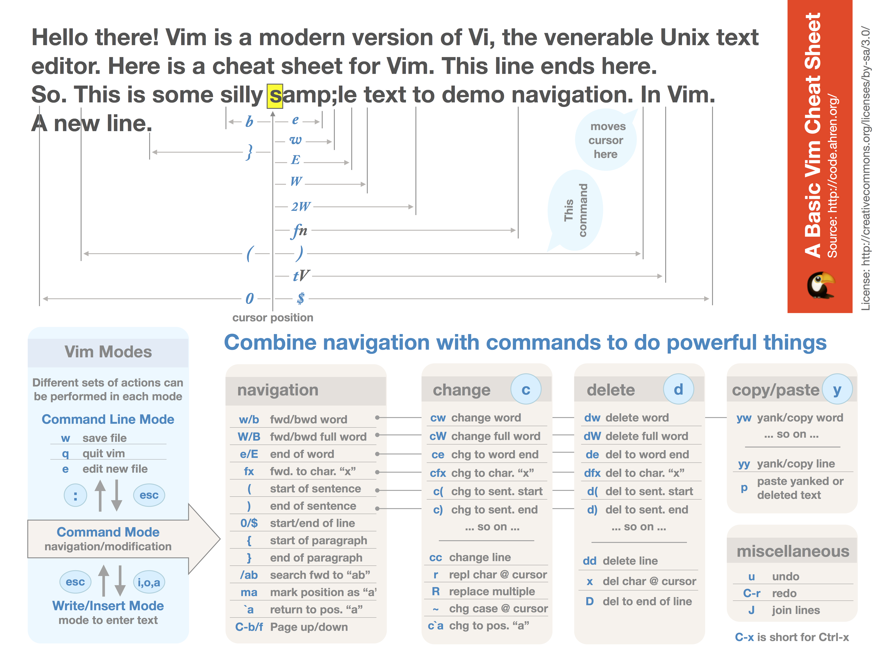

### 常用操作
#### 0. 概念
- 
- vim中三类文本对象 句，段落，节的区别：
~~~
1. 句子 : 一个句子以 '.'、'!' 或者 '?' 结尾并紧随着一个换行符、空格或者制表符。
2. 段落 : 一个段落从空行或某一个段落宏命令开始，段落宏由 'paragraphs' 选项里成对出现的字符所定义
3. 小节: 一个小节从首列出现的换页符 (<C-L>) 或某一个小节宏命令开始
~~~

#### 1. 编辑常用命令
~~~
.     重复上次修改
；    重复上次查找
cw    删除当前光标所在单词，并进入插入模式。
ea    在该word后修改

dt;    删除；字符前的word
ve    从此处选择到词尾

`.    跳到上次修改点 

ma    创建 局部 位置标记a, 跳回`a
mA    创建 全局 位置标记(文件件跳转),跳回`A

CTRL+N      自动扩展字符串

*:  自动查找鼠标位置当前的字符串
gf:   (go to file)显示光标处的文件
gd:   高亮

ea :单次尾插入
J: 两行合并
ta  //向后搜索,调转到a字母前
gd 选中 类似*
/AHB 搜索abh 或者Ahb  ahB
/\AHB 区分大小写
ma  `a
宏录制: qaaihell<esc>q  @a   //q 进入宏, a: 宏, 插入模式命令hell<esc>  q 结束  @a:运行名称的宏
括号移动 % 
选中 () 中的内容 vi (              // vision 模式, i :in  (
选中 {} 中的内容 vi {
选中 ""中的内容 vi"
一键美化格式 =

~~~~

#### 2. 移动、标记、跳转
1. 字符间跳转：h, j, k, l
2. 单词间跳转：w e b
3. 行首行尾跳转,  ^ 0 $
4. 行间移动：#G  1G, gg:

5. 句间移动：)	(
6. 段落间移动：	}	{
7. 标记：m，mark, 
~~~
	ma  将当前行标记为a； `a 跳转到a标记行
	delmark a  删除标记a
~~~
8. 查找: n,N
9. 折叠：marker方式（set foldmethod=marker）
~~~
	zf56G当前行到56行的折叠
	10zf当前行到后十行
	10zf-当前行到前十行
	z0、zd、zD打开折叠
~~~

#### 3.  查找,	？	/	global

#### 4. 基础编辑指令
##### 0. 删除
~~~
shift + ~：将光标所在位置的字母进行大小写转换；
r：替换光标所在的一个字符；
n + r：替换光标所在的n个字符替换；
x：行内删除，向后删除，支持nx，支持p；
X：行内删除，向前删除，支持nX，支持p；

~~~
##### 1. 数字增加
~~~
ctrl+ a /ctrl+x
~~~
##### 2. 删除：	x ,d ,dd,D
~~~
	x: 删除光标处的字符；
	xp: 交换光标所在处的字符及其后面字符的位置；
	
	d: 删除命令						
	dd 删除当前行 				
	D删除光标到行尾的字符
~~~
##### 3. 改变: c cc  r R
~~~
	改变命令(c, change)	
	c: 修改      编辑模式输入模式
	cc：删除当行并输入新内容
	
	r：替换光标所在处的字符
	R：逐字符替换
~~~
##### 4. 撤销u ,ctrl+r
~~~
	u 撤销
	ctrl+r撤销此前的撤销
 ~~~
##### 5. 重复:    .  重复之前操作
##### 6.   diff比对操作

##### 7. 数字配合：
~~~
均可结合w、e、b、数字等使用，如：
dw 删除当前单词；
3dw删除当前往后3个单词
3dd删除当前往后3行；
~~~

#### 5. 批量编辑命令
1. 列模式, Ctrl+v, shift+i（左侧插入）或shift+a（右侧插入）或delete批量插入或删除内容,V
例：使用ctrl+v并选中1到10行，按shift+i，输入//，按esc键结束，则第1到10行被注释。

2. 批量替换 :(Range) s/要查找的内容/替换为的内容/修饰符
~~~
1、Range为操作范围，n，m 为对n到m行进行操作，也可用.  $  %等代替。s为替换标志
2、修饰符有g （全局替换，不加则每一行只替换第一次出现）；c（检查）； i（忽略大小写）。
3、分隔符/也可用@或#代替。内容中有操作指令等，可用\转义符
~~~

3. 匹配
~~~
\(\)   子匹配
\1,\2 分别表示之前的子匹配
~~~

4. Global命令基础
~~~
:[range]g/pattern/cmd   
:g/pattern1/, /pattern2/cmd  // 在/p1/, /p2/之间执行cmd
~~~

5. Global 技巧, g v v//d
~~~
:g/A/d	查找并删除所有A，A缺省则为当前查找内容；
小技巧：在查找命令(* 也可以)后输入v//d，可以只显示搜索内容。（v为反转操作）
:g/^.*/mo0	行反序
t（复制行），co（复制行）
:5,10g/^/pu _    从第5行到第10行，在每一行下插入空行
:g/{/ .+1,/}/-1 sort    对被{}包围的文本按字母顺序进行排序。+1代表取下一行，-1代表取上一行
~~~ 

6. Global 技巧混合使用举例
部分匹配下的替换:g/A/s/B/C/ 
在有A的行中，将第一个B替换为C
~~~
:%s/\(A\)\(B\)/&C\2/g
将AB替换为ABCB；\(\)为子匹配，&为之前匹配到的内容，\2为第二次子匹配到的内容。
~~~
在行尾添加； :s/$/;/
在chapter1的下一行添加分割线:
~~~
:g/^chapter1/t. |s/./-/g
~~~

#### 6. 寄存器操作
~~~
qw	打开命令寄存器w		
cmd	输入命令
q	录入命令结束
n@w 	执行n次命令
~~~

#### 7. 常用技巧
~~~
Ctrl+w+f
gf
以上两个指令都是打开光标下路径的文件，区别在ctrl+w+f是新打开窗口，wf则是覆盖
v//d
iab 添加常用语句
~~~

#### 8. 基础操作
##### 1. 快捷鍵re-map.快速生成`uvm_info()的代碼：
- 在.vimrc中，添加如下定义：
~~~
 :map ui i `uvm_info("TRACE", $sformatf("",), UVM_LOW)
 :map ue i `uvm_error(get_full_name(), $sformatf("",))
 :map uf i `uvm_fatal(get_full_name(), $sformatf("",))
~~~

##### 2. 像Windows操作一样使用gvim，例如制作Ctrl+A（全选）这样的操作作
~~~
:map cc :s/^/\/\//    //cc ---> 注释当前行；nc：取消当前行的注释
:map nc :s/^\/\///   
:map sx :x!     // 保存后退出
map ggVGY 制作Ctrl+A（全选）这样的操

map H ^        //H直接调到行首
map L $        //L直接调到行尾
~~~

##### 3. 按鍵綁定：
~~~
复合命令：A，等效命令：$a，功能是在行尾插入。
~~~

##### 4. 好用的快捷键：
guu：转换为小写，gUU：转换为大写，g~：反转大小写。

##### 5. 矩形操作（也叫可视模式）    
~~~
：激活面向列的可视模式
gv：重选上次的高亮区域
~~~
##### 6. VIM中自定义字体
在.vimrc文件中添加如下语句，可以根据自己的喜好定义不同的字体：
~~~
set guifont = Monospace\ 12
~~~
##### 7.光标自动移动到匹配的括号内 
~~~
imap () ()<Left> 
imap [] []<Left> 
imap {} {}<Left> 
imap "" ""<Left> 
imap " "<Left>
~~~

##### 8.自动折行：

在.vimrc中加入上述设定后，选中已经存在的未断行的对象，按快捷键：gq即可实现120字符断行（折行）。

~~~
set wrap
set textwidth=120
set formatoptions+=mM
~~~

##### 2.在GVIM中自定义function

实现给文件插入固定的表头的功能，加入下面的代码，按快捷键F2就会给文件插入下面的Lines：
~~~
command Ahead : call Addheader()
 
function Addheader()
  call append(0, "//")
  call append(1, "//                          Design Information                      //")
  call append(2, "//")
  call append(3, "//Organization : Company,Division")
  call append(4, "//Project: ")
  call append(5, "//Copyright 2017 (c)")
  call append(6, "//")
  call append(9, "/// Main Procedures:")
  call append(12, "/// @file")
  call append(13, "/// @par $Id: $")
  call append(14, "/// @par $Author: $")
  call append(15, "/// @par $Change: $")
  call append(16, "/// @par $DateTime: $")
  call append(17, "//")
  call append(18, "")
endfunction
 
map <F2> : call Addheader() <CR>:13<CR>o
~~~     

#### 10. 工作中常用的vim技巧
1. 基础
~~~
CTRL+N      自动扩展字符串  
*:  自动查找鼠标位置当前的字符串
gf:   (go to file)显示光标处的文件
:b1（bn）返回前一次的显示
统计单词数：  :%s/word/&/g    其实就是原词替换原词会做成功统计
~~~

2. map 快捷键 执行命令
  - map 中ctr的表达, Ctrl+P ---> “^P”为定义快捷键Ctrl+P
  ~~~
如定义快捷键Ctrl+P为在当前行行首添加“#”注释，可以执行：
:map ^P I//      //“^P”为定义快捷键Ctrl+P， “I//”就是此快捷键要触发的动作，“I”为在光标所在行行首插入，“//”为要输入的字符，“”表示退回命令模式，“”要逐个字符键入，不可直接按键盘的“Esc”键。执行成功后，直接在任意需要注释的行上按“Ctrl+P”就自动会在行首加上“//”号了非常方便。

:unmap ^P  //释:如果要取消此快捷键，只需输入命令：

:map <F5> bi{<ESC>A}
// 释:
在这个命令中:map是vi中的命令，而F5则是说将下面的命令与F5键绑定，后面的则是具体的命令内容，b是调到单子前,i{是说插入字符{，<ESC>跳出命令,A跳到最后,并插入}.例如amount，按下F5键，我们就会发现这时就变成了{amount}的形式。
~~~

3. 命令“ab”,:ab 替代符 原始信息
~~~
示例如下：:ab sammail sam_helen@vip.163.com
执行之后，在输入模式任何地方录入“sammail”，再敲任意字母符号或者回车空格，咔嚓一下，利马就变成“sam_helen@vip.163.com”，那真是相当的方便啊！
~~~

4. cmd运行
~~~
:! command  //任何命令的结果导入到当前编辑文件中，格式为：
:r !命令  //在 vim 中执行系统命令，并把命令结果导入光标所在行
:r 文件名 把文件内容导入到光标位置
:r /root/aa.txt              #末行模式下，输入这个会把 /root/aa.txt 文件的内容加到你光标所在处
~~~

5. 配置文件.vimrc,以后就永久生效了。
~~~
:set nu
:map ^M isam_helen@vip.163.com
:ab sammail limingkillyou@163.com
~~~

### 2. 窗口命令
#### 1. 基础跳转命令
~~~
:e ctrl+d 查看当前目录下的文件
:Ve  打开当前文件的目录
:explore  打开当前目录文件

:b1（bn）返回前一次的显示
:r !命令  //在 vim 中执行系统命令，并把命令结果导入光标所在行
:r 文件名 把文件内容导入到光标位置

:ctrl + d  查看可选命令
ctrl+p/ ctrl+n  字符自动补齐( 强烈推荐)
~~~

#### 2. 窗口最大最小操作
~~~ 
分屏跳转,ctrl+w+s ,ctrl +w+v
当前窗口最大化: ctrl w |(shift |)  
- 等宽,登高  c_w =
- 最大高度, c_w _
- 最大化, c_w  |
- [N] <c_w>_ 活动窗口设置为N行
- [N] <c_w>_ 活动窗口设置为N列
~~~

#### 3. 分屏打开当前目录 :vsp %:p:h  
~~~
-% 符号代表活动缓冲区的完整文件路径（参见 :h cmdlinespecial ） ， 按 <Tab> 键会将其展开， 使之显示为活动缓冲区的完整
文件路径。 :h修饰符会去除文件名， 但保留路径中的其他部分
~~~

#### 4. 显示文件路径
~~~
1 ctlr+g: 显示当前文件绝对路径
~~~

#### 2. 个人配置
~~~
 :map ui i `uvm_info("TRACE", $sformatf("",), UVM_LOW)
 :map ue i `uvm_error(get_full_name(), $sformatf("",))
 :map uf i `uvm_fatal(get_full_name(), $sformatf("",))
 :map cc :s/^/\/\//    //cc ---> 注释当前行；nc：取消当前行的注释
 :map nc :s/^\/\///   
 :map sx :x!     // 保存后退出

 map 中ctr的表达, Ctrl+P ---> “^P”为定义快捷键Ctrl+P
~~~

#### 0. Terminal和vim 交互
1. 设置
vim ~/.vimrc，然后在.vimrc文件中输入一行set clipboard=unnamedplus这句话的意思是让vim的剪贴板与外部剪贴板连接
2. 使用
 1. Terminal->vim : 双击选中,vim中 鼠标中间
 2.  vim ->Terminal: y 后,terminal shift+insert,或者选中,中间复制

### 3. 经验
1. gvim一般是非同时操作,使用前先按下"Ctrl + w",
2. | 需要用shift + | 实现。

### 3. 传送门
0. [vim实用技巧（第二版)](https://blog.csdn.net/saying0101_0010_0000/article/details/114528186#:~:text=1%20%E6%8A%80%E5%B7%A713%20%E5%9C%A8%E6%8F%92%E5%85%A5%E6%A8%A1%E5%BC%8F%E4%B8%AD%E5%8F%AF%E5%8D%B3%E6%97%B6%E6%9B%B4%E6%AD%A3%E9%94%99%E8%AF%AF%202%20%E6%8A%80%E5%B7%A714%20%E8%BF%94%E5%9B%9E%E6%99%AE%E9%80%9A%E6%A8%A1%E5%BC%8F%203%20%E7%BB%93%E8%AF%86%E6%8F%92%E5%85%A5-%E6%99%AE%E9%80%9A%E6%A8%A1%E5%BC%8F,%E9%9A%8F%E6%97%B6%E9%9A%8F%E5%9C%B0%E5%81%9A%E8%BF%90%E7%AE%97%207%20%E6%8A%80%E5%B7%A717%20%E7%94%A8%E5%AD%97%E7%AC%A6%E7%BC%96%E7%A0%81%E6%8F%92%E5%85%A5%E9%9D%9E%E5%B8%B8%E7%94%A8%E5%AD%97%E7%AC%A6%208%20%E6%8A%80%E5%B7%A718%20%E7%94%A8%E4%BA%8C%E5%90%88%E5%AD%97%E6%AF%8D%E6%8F%92%E5%85%A5%E9%9D%9E%E5%B8%B8%E7%94%A8%E5%AD%97%E7%AC%A6%20%E6%9B%B4%E5%A4%9A%E9%A1%B9%E7%9B%AE)
1. [史上最全Vim快捷键键位图（入门到进阶）](https://www.runoob.com/w3cnote/all-vim-cheatsheat.html)
2. [vim中三类文本对象 句，段落，节的区别](https://blog.csdn.net/iteye_3607/article/details/82204909#:~:text=vim%E4%B8%AD%E4%B8%89%E7%B1%BB%E6%96%87%E6%9C%AC%E5%AF%B9%E8%B1%A1%20%E5%8F%A5%EF%BC%8C%E6%AE%B5%E8%90%BD%EF%BC%8C%E8%8A%82%E7%9A%84%E5%8C%BA%E5%88%AB%20iteye_3607%20%E4%BA%8E%202011-11-15%2014%3A59%3A00%20%E5%8F%91%E5%B8%83%201042,%27%3F%27%20before%20the%20spaces%2Ctabs%20or%20end%20of%20line.)
3. [如何在vim中使用系统剪贴板](https://blog.csdn.net/qq_44884716/article/details/111707347)
4. [vim使用 分屏命令、操作分屏](https://www.cnblogs.com/greamrod/p/12565193.html)
5. [Vim的剪贴板“unnamed”和“unnamedplus”设置有什么区别？](http://cn.voidcc.com/question/p-pyanmqcl-bhx.html)

6. [.vimrc 详细配置(强力推荐)](https://xueying.blog.csdn.net/article/details/99691936?spm=1001.2014.3001.5502)
7. [GVIM使用技巧总结(强力推荐)](https://xueying.blog.csdn.net/article/details/88410151?spm=1001.2014.3001.5502)
8. [vim寄存器的使用](https://blog.csdn.net/topgun_chenlingyun/article/details/8092243)
9. [个人 Linux 偷懒技巧集合](https://my.oschina.net/u/3356529/blog/10142491)
