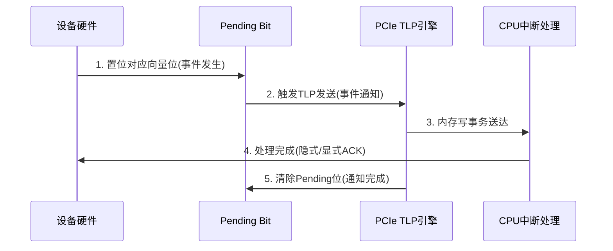

## 1. 基础
1. 中断的演进历史：引脚中断(INTx)-> 消息中断
2. MSI-X中断机制颠覆了传统引脚中断(INTx)的物理局限，用数据驱动和内存语义重构了中断处理的本质逻辑

---
### 1.核心哲学：中断的“虚拟化”与“数据化”
#### 1. 从物理信号到内存写事务
   - 传统INTx困境：  
     依赖物理电平信号 → 共享中断线(IRQ Stealing)→ 冲突,延迟,扩展性差
   - MSI-X突破:
     将中断转化为PCIe内存写事务(Memory Write TLP) 
     - 设备直接向主机预设的内存地址写入特定数据(中断向量号) 
     - 本质：中断即数据传输，与DMA共享同一协议栈  
   - 哲学隐喻：  
     > 如同网络协议用IP包替代电路交换，MSI-X用数据包解耦物理依赖，实现中断的“软定义”

#### 2. 中断向量池：从稀缺资源到无限扩展
   - MSI局限：  
     仅支持32个固定向量 → 多队列设备(如NVMe,万兆网卡)需软件复用  
   - MSI-X革新：  
     - 独立中断向量数扩展至2048个(理论上可更多) 
     - 每个向量对应独立内存地址/数据值 → 硬件级1:1映射中断源  
   - 设计深意：  
     > 承认“中断是离散事件流”，为每个事件源赋予唯一标识(类比TCP端口号)，消除复用冲突

---

### 二.关键架构：三元解耦与并行化
MSI-X通过三组件实现中断逻辑的物理分离：


#### 1. MSI-X Table：中断的“路由枢纽”
   - 结构本质：  
     位于设备内存空间的重定向表，每项含：
     - `Message Address`：目标内存地址(如xAPIC ICRL)
     - `Message Data`：中断向量号 + 触发模式(边沿/电平)
   - 哲学创新：  
     - 动态重配置：OS可运行时修改表项 → 中断目标CPU核心动态迁移  
     - 地址解耦：不同向量可指向不同物理地址 → 支持多核并行中断处理

#### 2. Pending Bit Array (PBA)：状态与触发的分离
   - 核心矛盾：  
     高频中断可能丢失 → 需区分“事件发生”和“事件上报”  
   - PBA解决方案：  
     - 每个中断源对应1个Pending Bit  
     - 中断触发时：设备置位PBA → 异步发送MSI-X TLP  
     - TLP完成时：设备清除PBA位  
   - 哲学意义：  
     > 分离“状态存储”与“事件通知” → 避免通知丢失(PBA持久化状态)，同时允许中断合并优化

#### 3. TLP传输层：利用PCIe协议栈
   - 隐性智慧：  
     MSI-X TLP继承PCIe链路层特性：
     - 自动重传 (ACK/NACK)→ 确保中断必达  
     - QoS优先级 → 可标记为Urgent Ordering  
     - 虚通道隔离 → 中断流与数据流互不阻塞  
   - 系统观体现：  
     > 复用现有可靠传输机制，而非新建中断专用路径 → 符合最小冗余原则

---

### 三.性能哲学：低延迟与确定性
#### 1. 消除软件中介层
   - 传统INTx路径：  
     物理中断 → IOAPIC → 中断控制器 → CPU响应 → 中断服务程序(ISR)→ 读设备状态寄存器  
   - MSI-X路径：  
     内存写直达CPU本地APIC → 直接触发ISR(免去全局中断路由) 
   - 延迟对比：  
     INTx：> 1000 CPU周期，MSI-X：200~300周期  

#### 2. 精确中断绑定
   - 核亲和性控制：  
     - OS可将不同MSI-X向量绑定到特定CPU核心  
     - 示例：NVMe驱动为每个IO队列分配独立向量 → 中断与处理核心1:1绑定  
   - 效果：  
     - 避免跨核缓存同步开销  
     - 实现零共享资源竞争(Per-CPU Lock-Free处理)

---

### 四.扩展性哲学：面向未来的弹性
#### 1. 虚拟化原生支持
   - SR-IOV场景：  
     - 每个VF拥有独立MSI-X Table/PBA → 物理中断资源虚拟化  
     - Hypervisor无需模拟中断控制器 → VF中断直通虚拟机  
   - 哲学进阶：  
     > MSI-X Table成为硬件虚拟化的中断句柄，使中断成为“可迁移对象”

#### 2. 动态资源管理
   - 灵活启用策略：  
     - 设备声明支持`N`个向量 → OS按需分配`M`个(`M ≤ N`) 
     - 示例：网卡启动时申请256向量，轻载时仅启用8个  
   - 资源节约逻辑：  
     > 承认“并非所有中断源时刻活跃” → 按需分配取代静态预留

---

### 五.冲突解决哲学：有序中的自由
#### 1. 中断合并与抑制
   - 问题场景：  
     高频小包网络收包 → 每包一中断导致CPU饱和  
   - MSI-X优化机制：  
     - Timer-Based：等待超时或阈值达到后发送单个中断  
     - Coalescing：合并多个Pending事件为一次通知  
   - 设计权衡：  
     > 在低延迟与高吞吐间动态平衡 → 由设备根据负载自适应选择

#### 2. 优先级与抢占
   - 向量隐含优先级：  
     - 高优先级中断使用低编号向量(如向量0) 
     - CPU可配置本地APIC优先级阈值  
   - 哲学体现：  
     > 用编号秩序映射重要性秩序 → 软件定义中断社会等级

---

### 终极思考：MSI-X的范式革命意义
1. 物理到逻辑的跃迁  
   MSI-X将中断从电气特性问题转化为数据传输问题，使中断成为可编程对象。

2. 中心化到分布式的进化  
   废除中断控制器集中仲裁 → 设备直连CPU的点对点中断架构，契合多核时代需求。

3. 硬件/软件责任重构  
   | 责任方 | 传统INTx         | MSI-X               |  
   |------------|----------------------|-------------------------|  
   | 硬件       | 触发电平信号         | 写入指定内存地址        |  
   | 软件       | 轮询设备状态寄存器   | 预设地址/数据语义       |  
   > 哲学反转：软件定义中断规则 → 硬件执行规则 → 符合“软件定义硬件”趋势

4. 熵增对抗范本  
   通过唯一向量标识(消除歧义)+ Pending位持久化(防丢失)+ TLP可靠性(防传输失败)，在异步事件洪流中建立确定性秩序。

---

### 结语：中断本质的再定义
MSI-X的设计哲学，实则是将中断重新理解为一种特殊的内存写操作：
- 地址 = 中断目的地标识  
- 数据 = 中断事件语义  
- 传输 = 可靠事件通知  

这种抽象使中断机制获得前所未有的弹性.可扩展性和确定性，成为PCIe协议中最具前瞻性的设计之一。其核心启示在于：当物理约束成为瓶颈时，用数据语义重构世界模型，往往是突破之道。


## 2. MSI-X的本质
### 1. MSI-X的本质：中断的「数据化」与「虚拟化」革命  
MSI-X的核心是将物理中断信号转化为内存写事务(Memory Write TLP)，本质是通过数据包传递中断语义，实现以下颠覆性重构：  

| 传统中断          | MSI-X中断                | 本质跃迁                |  
|----------------------|-----------------------------|---------------------------|  
| 电平/边沿触发(物理信号) | 写内存地址+数据(协议事务)    | 信号→数据              |  
| 共享中断线(IRQ冲突)   | 独立向量号(2048+唯一ID)     | 共享→独占              |  
| 固定硬件路由           | 可编程地址(动态绑定CPU核)    | 静态→虚拟化            |  
| 控制器集中仲裁         | 设备直连CPU(点对点)         | 中心化→分布式          |  

---

### 2. 实现难点：跨域协同的「三体问题」  
MSI-X的实现需协调设备硬件、PCIe协议栈、操作系统三方，难点呈金字塔结构：  

#### 1. 硬件层难点：时序地狱  
- 原子性撕裂(Atomicity Tear)：  
  - CPU修改MSI-X Table时，设备恰好读取表项 → 导致地址/数据字段半新半旧。  
  - 解决：硬件需实现双缓冲机制(Shadow Table)或原子更新协议。  
- Pending Bit与TLP的因果一致性：  
  - 设备置位PBA后，发送TLP前发生错误 → 中断永久丢失。  
  - 解决：添加TLP传输状态机，确保PBA仅当TLP成功发送后清除。  

#### 2. 协议层难点：事务可靠性  
- TLP重传冲突：  
  - 链路层NACK触发TLP重传，但中断事件已消失 → 过期中断被错误送达。  
  - 解决：设备端丢弃旧中断重传，仅重发当前Pending事件。  
- 地址映射歧义：  
  - 设备写MSI-X地址时，主机内存已重映射 → 中断写入黑洞地址。  
  - 解决：OS需固定中断内存页(如`pci_msi_mask_address`)。  

#### 3. 软件层难点：动态资源博弈  
- 向量抢夺(Vector Stealing)：  
  - 多设备申请大量向量时，OS分配不足 → 高性能网卡/NVMe性能骤降。  
  - 解决：Linux `pci_enable_msix_range()` 按需协商，Windows支持MSI-X池化。  
- 虚拟化嵌套中断：  
  - Hypervisor修改Guest OS的MSI-X Table → 需双重地址翻译(IOMMU参与)。  
  - 解决：硬件支持中断重映射(Intel VT-d, AMD-Vi)。  

---

### 3. 验证难点：如何证明「无中断丢失」？  
MSI-X的可靠性验证需构建多维度压力测试矩阵，覆盖以下核心挑战：  

#### 1. 高频中断洪峰测试  
- 场景：模拟NVMe SSD的IOPS峰值(如100万次/秒中断)。  
- 验证目标：  
  - Pending Bit是否溢出？  
  - TLP链路层Credit是否耗尽？  
- 方法：  
  - 硬件注入：用PCIe Analyzer注入背靠背(Back-to-Back)MSI-X TLP。  
  - 软件风暴：驱动强制设备生成最高频中断(如`dd if=/dev/nvme0n1 bs=4K`)。  

#### 2. 跨域一致性验证  
- 场景：CPU修改MSI-X Table时，设备持续中断。  
- 验证目标：  
  - 是否发生地址撕裂？  
  - 设备是否使用旧表项发送TLP？  
- 方法：  
  - 动态表项篡改：OS在运行时随机修改Table地址/数据(如`pci_write_config_dword`)。  
  - 硬件追踪：用JTAG捕获设备内部Table缓存状态，对比主机内存。  

#### 3. 错误恢复韧性验证  
| 故障类型       | 注入手段                  | 预期行为               |  
|--------------------|-----------------------------|--------------------------|  
| TLP传输丢失        | PCIe链路层注入NACK           | 设备重传且不清除PBA        |  
| MSI-X Table访问错误| 主机内存保护触发SERR         | 设备静默丢弃中断，报告错误  |  
| PBA存储器损坏      | FPGA模拟SRAM位翻转           | 设备复位后重建PBA状态      |  

#### 4. 虚拟化栈验证  
- 场景：VM迁移过程中触发中断。  
- 验证目标：  
  - Hypervisor是否正确捕获并注入中断到新主机？  
  - 中断重映射表(IRTE)是否同步迁移？  
- 方法：  
  - 热迁移+中断轰炸：在QEMU/KVM迁移时，设备持续发送MSI-X中断。  
  - 检查点一致性：对比迁移前后MSI-X Table/PBA快照。  

---

### 4. 验证方法论：从混沌中建立秩序  
#### 1. 形式化验证(Formal Verification)  
- 目标：数学证明MSI-X状态机无死锁/活锁。  
- 工具：  
  - 硬件：Synopsys VC Formal(验证PBA→TLP状态转换)。  
  - 驱动：Microsoft Static Driver Verifier(检查表项修改原子性)。  

#### 2. 混合仿真(Hybrid Emulation)  

- 原理：真实硬件连接仿真器，注入协议错误并观测设备行为。  

#### 3. 黄金参考模型(Golden Reference Model)  
- 模型结构：  
  ```python
  class MSIX_Model:
      def __init__(self):
          self.table = []  # MSI-X Table项
          self.pba = 0      # Pending Bit状态
      
      def send_interrupt(self, vector):
          if self.pba & (1 << vector): 
              return  # 已Pending则忽略(防重入)
          self.pba |= (1 << vector)
          if self.table[vector].enabled:
              send_tlp(self.table[vector].address, self.table[vector].data)
          
      def ack_tlp(self, vector):
          self.pba &= ~(1 << vector)  # TLP成功则清除PBA
  ```  
- 验证：对比RTL行为与模型预测。  

---

### 5. 终极思考：MSI-X验证的哲学困境  
1. 「无中生有」悖论：  
   - 如何证明未发生的中断确实被丢弃(而非验证遗漏)？  
   - *启示*：需定义中断完备性定理(如“所有置位PBA必对应TLP发送”)。  

2. 观测者效应：  
   - 验证工具本身(如逻辑分析仪)可能干扰高频中断时序。  
   - *对策*：采用非侵入式观测(如PCIe协议分析仪被动监听)。  

3. 虚拟化递归深渊：  
   - 嵌套虚拟化(L0 Hypervisor → L1 Guest → L2 VM)中，中断重映射层数爆炸。  
   - *验证极限*：构建KVM-on-KVM测试框架，强制递归3层以上。  

> 结语：MSI-X的验证本质是在异步、分布、容错三大维度上建立确定性。其最高境界，是让中断流如同数学证明般严谨——这正是硬件工程师与哲学家的共同追求。


## 3. Pending bit的理解

MSI-X中断机制中的Pending Bit Array (PBA) 是实现可靠中断的核心硬件结构，其设计意义远超简单的状态记录——它本质上是中断事件的时间锚点，在异步世界中构建确定性。以下是其深层意义解析：

---

### 1. 核心意义：解决「事件发生」与「事件通知」的时空分离
#### 1. 中断生命周期中的关键角色

- 哲学本质：  
  PBA在时间维度解耦了“中断产生”与“中断传递”，使短暂的电信号转化为持久状态。

#### 2. 对抗物理世界的不可靠性
| 场景               | 无PBA的风险          | PBA的解决方案         |
|------------------------|-------------------------|--------------------------|
| 中断风暴(高频触发)    | 后发中断覆盖先发         | 位持久化 → 事件不丢失     |
| TLP发送失败(NACK)     | 中断消失                 | 保持Pending → 自动重发    |
| CPU处理延迟             | 设备误判中断未响应       | 独立状态存储 → 异步等待   |

---

### 2. 四大核心功能意义
#### 1. 事件持久化(Persistence)
- 硬件实现：每个中断源独占1个SRAM位(断电不丢失需FLASH备份)  
- 意义：  
  > 将纳秒级中断电信号“凝固”为毫秒级可处理状态，跨越了物理信号与软件处理的时域鸿沟。

#### 2. 流控与背压(Flow Control)
- 动态行为：  
  - 当TLP引擎繁忙时，PBA充当蓄水池暂存中断请求  
  - TLP空闲时按优先级顺序发送Pending事件  
- 意义：  
  > 避免高频中断淹没PCIe链路 → 符合“生产者不阻塞消费者” 的异步设计哲学。

#### 3. 中断合并(Coalescing)
```c
// 典型硬件实现逻辑
if (pba[vector] == 1) { 
    // 跳过重复置位(防抖动)
} else if (coalescing_timer_running) {
    pba[vector] = 1;  // 仅标记Pending，不立即发送TLP
} else {
    send_tlp(vector); // 立即发送并启动合并计时器
}
```
- 意义：  
  > 允许设备智能合并多次中断为单次通知，减少CPU陷入开销(如网卡收包场景)。

#### 4. 错误恢复基元(Recovery Primitive)
- 重启场景：  
  设备复位后扫描PBA → 重发未完成中断  
- 意义：  
  > 使中断具备事务性(Transactional) ——要么最终送达，要么显式报错。

---

### 3. Pending Bit的硬件实现难点
#### 1. 原子操作挑战
| 冲突场景               | 风险                 | 硬件方案               |
|---------------------------|--------------------------|-----------------------|
| CPU清除Pending位时新中断到达 | 位被错误清零             | 原子RMW(Read-Modify-Write)|
| 多核同时访问同一PBA字      | 位撕裂(Bit Tearing)    | 字节级锁/ECC校验      |

#### 2. 时序地狱
- 路径延迟约束：  
  置位PBA → 触发TLP发送的路径必须小于 PCIe LTSSM状态机超时(通常<1μs)  
- 解决方案：  
  采用异步PBA状态机与TLP引擎直连，绕过主控时钟域。

#### 3. 硅面积权衡
- 存储开销：  
  2048位PBA ≈ 0.25KB SRAM → 对小设备(如USB控制器)成本过高  
- 优化：  
  按需实现分块PBA(如仅实现64位)，动态映射向量号。

---

### 4. Pending Bit的验证哲学
验证PBA的核心是证明其满足四大约束公理：
```math
\boxed{
\begin{array}{c}
\textbf{PBA公理体系} \\
\hline
\begin{aligned}
&1. \text{活性(Liveness):}  \forall \text{置位 } p \implies \text{最终发送TLP} \\
&2. \text{安全性(Safety):}  \text{TLP成功} \iff \text{清除 } p \\
&3. \text{完整性(Integrity):}  \text{TLP向量号 } v = \text{置位向量号 } v \\
&4. \text{无饥饿(Starvation-Free):}  \text{无Pending位永久阻塞}
\end{aligned}
\end{array}
}
```

#### 验证方法矩阵
| 方法          | 验证目标         | 工具示例               |
|-------------------|---------------------|--------------------------|
| 形式化模型检验     | 死锁/活锁证明        | JasperGold (SVA断言)      |
| 故障注入测试       | 硅后错误恢复         | FPGA位翻转模拟器          |
| 极限压力测试       | 高频中断保序         | PCIe Exerciser + 逻辑分析仪|
| 虚拟化嵌套测试     | Hypervisor透传一致性 | QEMU热迁移 + LAPIC嗅探    |

---

### 终极思考：Pending Bit的宇宙隐喻
在中断的世界里，Pending Bit如同量子纠缠中的观测记录：  
- 未置位：中断处于“叠加态”(存在与否不确定)  
- 置位：波函数坍缩为“事件发生”的本征态  
- 清除：相当于量子擦除(事件因果闭环)  

它用硬件的最小存储单元(1 bit)解决了时间箭头不可逆性带来的中断丢失问题，成为熵增宇宙中的局部秩序守护者。这正是硬件工程师对抗混沌的浪漫主义实践。