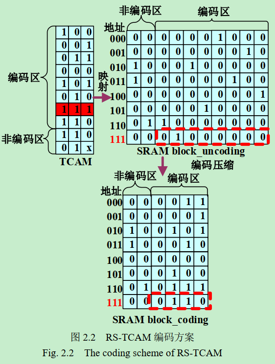

### 1. 基础知识
#### 0. cam是什么？
1. CAM是Content Addressable Memory的缩写，即“内容寻址存储器”的意思，它是在传统的存储技术的基础上实现的联想记忆存储器，
2. 关于CAM的基本操作有三种：
- 写操作：输入地址和数据，将数据写到指定的地址上，写入速度与RAM相同；
- 读操作：输入地址，返回该地址上的数据，读取速度与RAM相同；
- 查找操作：输入待查数据，返回该数据被存储的地址。这也是CAM的最主要用途，
3. 优点：它能够从巨大的数据库中进行快速查找，并且返回最佳的匹配地址，最快查找速度能达到每秒一亿次以上。
#### 1. tcam是什么？
1. TCAM是Ternary Content Addressable Memory的缩写，即“三态内容寻址存储器”的意思，它是从CAM的基础上发展而来的。
2. CAM 和 TCAM 比较
   - 一般的CAM存储器中每个bit位的状态只有两个，“0”或“1”，而TCAM中每个bit位有三种状态，除掉“0”和“1”外，还有一个“don’t care”状态，所以称为“三态”，它是通过掩码来实现的，
   - TCAM 既能进行精确匹配查找，又能进行模糊匹配查找，而CAM没有第三种状态，所以只能进行精确匹配查找。

#### 2. tcam 相比传统表项有什么优势
1. 传统的表项查找方法有很多，主要有：线型查找法、二叉树查找法、哈希表查找等，
   - 基础： 这些查找方法都是基于SRAM的软件查找方法，
   - 共性： 是查找速度慢。
   - 分析： 
      - 线型查找法需要遍历表中的所有表项；
      - 二叉树查找法需要遍历树中大多数节点，而且查找速度受树的深度影响较大；
      - 哈希表查找法是软件查找中计较快的一种方法，
        - 它是根据设定的哈希函数H(key)和处理冲突方法将一组关键字映象到一个有限的地址区间上，并以关键字在地址区间中的象作为记录在表中的存储位置，这种表称为哈希表或散列，所得存储位置称为哈希地址或散列地址。
        - 虽然哈希表查找法相对来说比较快，但还是满足不了高速实时通信系统(如40G/100G POS)的极速查找需求。
2. tcam:
   - 基于硬件的TCAM查找法提出的背景：传统表项查速度慢
   - 用tcam方法进行查找时，整个表项空间的所有数据在同一时刻被查询，
     - 查找速度不受表项空间数据大小影响，每个时钟周期完成一次查找，
     - 平均查找速度是基于SRAM算法查找的6倍，最坏情况下，能达到128倍
   - 缺点：CAM 的速度是以**高功耗，低有效 bit 密度和每 bit 成本高为代价**。
     - 三态 CAM（TCAM）的每 bit 成本比 DDR SRAM高出约 30 倍，每 bit 耗电量比 SRAM 高 150 倍。 SRAM在 bit 密度，速度和功耗方面优于 TCAM。
     - 
3. RS-tcam:
   - RS-TCAM: resource-Saving TCAM Structure Based on SRAM, 
   - 背景：
      - 缺点：CAM 的速度是以**高功耗，低有效 bit 密度和每 bit 成本高为代价**。
        - 三态 CAM（TCAM）的每bit 成本比 DDR SRAM高出约30倍，
        - 每 bit 耗电量比 SRAM 高 150 倍
        - SRAM在 bit 密度，速度和功耗方面优于 TCAM。
        - 
  
   - 结论：因纯硬件实现方案的功耗和低有效的bit密度等问题，所以用RS-TCAM实现
   - 缺点：较存硬件实现，查表时间较长，一般小于10个cycle
  
#### 3. tcam的硬件实现框图
1. 常见的应用框图
   
2. 传统的TCAM是纯硬件实现
   - 一个经典的CAM匹配线结构。
   
   - 所有的单元通过并行连接。
   - 这些单元可以是BiCAM单元或者TCAM单元。
   - 尽管图2．1展示的是BiCAM单元，匹配线搜索操作的描述对于BiCAM和TCAM都适用。
   - 典型的CAM搜索操作共分3个阶段：。
     - 搜索线SL预充电: 首先通过禁用每个CAM单元中的下拉路径，将搜索线SL预充至低电位以断开匹配线和地面的连接。
     - 匹配线ML预充电: 其次，在下拉路径断开的情况下，晶体管对匹配线ML预充电至高电位。
     - 匹配线ML求值: 最后将搜索关键字加载到搜索线SL上，触发匹配线ML的求值阶段。
       - 如果发生匹配，由于连接到地的路径都被关断，ML将保持较高的电位。
       - 如果没有匹配，至少有一条连接到地的路径打开使ML放电至低电位。匹配线检测放大器(MatchLine Sense Amplifier，MLSA)检测ML上的电压，并生成相应的结果。
   - 是由于需要不断的充放电导致功耗巨大。结构用来降低功率

#### 4. tcam的基本概念

#### 5. RS-tcam的基本概念
##### 1. 本质
1. SRAM 只能够按地址来访问。如果要想构造“SRAM 型TCAM”，不能直接将 TCAM 数据以相同的方式存储在 SRAM，需要将 TCAM 中的数据经过某种映射之后，将映射数据存储在 SRAM 中，才能实现搜索功能

##### 1. RS-TCAM 的搜索
1. 原理图
   
2. 分析
   1. RS-TCAM 将 TCAM 中每个三值逻辑（包括 0、 1、 X）的字映射到 SRAM 的相应列
   2. RS-TCAM 将 TCAM 第二个字 111 映射到 SRAM 的第二列。
      - 一个包含 m个 n 位 TCAM 字的 TCAM 表需要被映射成深度为 2n，宽度为 m 位的 SRAM。
      -  在图 2.1的举例中， 一个宽度是 3 的 TCAM 表被映射为深度为 8（23）的 SRAM 块。
      -  存储在 SRAM中的数据由原始 TCAM 表的数据决定，
      -  例如第二个 TCAM 字存储的数据为 111 时，SRAM 中的第二列只有地址 111 处存储的是 1，其它地址存储的数据都为 0
   3. 无三态的表项查：
      1. 当搜索 111 时，只需要访问 SRAM 的地址 111 读出其中的数据 00…010。这个数据除了第二位为 1 其它的位都为 0， 
      2. 表明 TCAM 表中第二个字存储 111，其他的位置不存在 111 这个数据
   4. 包含三态的表项查： 当 TCAM 中存储的数据包含 X 时，需要将 X 扩展为 0 和 1，然后在 SRAM 对应列的两个地址全都置 1
      - 如图所示： TCAM 表的倒数第二个字为 01X，因此映射到 SRAM中要使得倒数第二列的 010、 011 两处地址都置 1，其它位置置 0。
      - 这样处理后，无论搜索 010 还是搜搜 011 时倒数第二个字都会“匹配”。
3. 小结：通过上述映射，
   - 将TCAM的搜索字与SRAM的地址信息建立起联系了，
   - 而 SRAM 中存储的数据则用来表示 TCAM 中对相应数据的存储情况。
   - 问题：随着TCAM 字宽的增加，需要的 SRAM 的深度指数增加，需要进一步编码压缩
##### 2. RS-TCAM的编码压缩
1. 自定义概念：正交数据，本文将互不相同的数据定义为正交数据。 
   - 如果将 TCAM 表直接分成很多子表，那么每个子表中的数据可能互不相同，也可能有相同的数据。 
   - RS-TCAM 可以将 TCAM 表划分为“编码区”和“非编码区”， 
   - 为了后续编码压缩做准备，需要将 TCAM 数据重新排列：将正交数据放到编码区，其余数据被放到非编码区。
   - 通过这种方式，每次搜索数据时，在编码区至多只有一个数据与搜索数据匹配
  
2. 编码方案
   
3. 问题分析
   - TCAM 表被分为 1 个编码区和 1 个非编码区。
   - 编码区的 8 个数据互相正交，
   - 非编码区存在相同的数据(01X可以拓展为011和010，编码区内已有011、010因此 01X 要放到非编码区) 
   - 划分编码区和非编码区后，重新排列的数据仍然按照经过映射的 SRAM 和 TCAM 一样也包含一个编码区和一个非编码区。
   - 问题：SRAM 编码区的数据十分稀疏， 在每行数据的编码区内至多只有一个 1，这给数据编码提供了条件。 
   - RS-TCAM 把 1 的位置进行编码，如图 2.2 所示：01000000 可以被编码为 0100。因为考虑到会有不匹配的情况（即SRAM编码区的数据为00000000），3 位数据不足以表示9种情况，所以要把8位数据编码为4位数据
4. 优点比较：
   - 编码区中的 8 位数据经过编码变成了4位数据，如果编码区中的数据有 16 位那么其会被编码为 5 位，以此类推当编码区数据位 2n个时，其会被编码为 n+1 位。
   - 所以当编码区的数据越多时，通过编码节省 SRAM 空间的比率越大。
   - 当TCAM 表中的数据重复的越少，被放入编码区的数据就越多编码效率越高。通过这种方式，RS-TCAM 减少了 SRAM 的使用 
5. 带来的额外工作量：
   1. 当搜索数据时，还是把搜索数据作为地址去访问 SRAM 但是得到的数据不能直接代表匹配情况，需要把编码的数据还原为原本数据。这样就多了一个译码的步骤，
   2. 例如搜索 111 时到的数据位 000110 其中编码区数据为 0110 非编码区数据为 00， 0110 通过译码器译码为 01000000， 01000000 然后与 00 合并为 0001000000 作为最终的搜索结果，搜索表明 TCAM 中第 7 个字存储的数据为 111，其它位置没有存储 111 这个数据

##### 3.TCAM 划分
###### 0. 目标：节省ram资源
###### 1. 划分成列
1. 未划分前：
   - 
   - 分析
      1. 如图，那么需要使用的 SRAM 资源为24 x 8 bits。这种直接映射的方案搜索时比较方便，
      2. 例如：当我们搜索 1000 时，只需要读出 SRAM 中地址为 1000 的数据即可。在图 2.3 的 SRAM 中，地址 1000 处的数据为10000000，表明 TCAM 中第 8 个字存储 1000 这个数据其它位置不存储这个数据。
   - 缺点：占ram资源多
2. 列划分
   - 
   - 分析：
      1. RS-TCAM 将 4 位的 TCAM 字分成两个 2 位的 TCAM 子字
      2. 因为 RS-TCAM 将原始的 TCAM 分成两列，每列单独映射，所以在搜索数据时需要访问两块 SRAM，并把所得的结果通过一些运算才能最终得到搜索结果。
      3. 例如：当搜索1000 时，首先把搜索字分成两部分 10 和 00，用 10 作为地址去访问第一列映射的 SRAM，00 作为地址去访问第二列映射的 SRAM。第一列的输出结果为 1000000 表明 TCAM 中只有第 8 个 TCAM 字的第一列为 10，第二列的输出结果为 10101000 表明 TCAM 中第 4、6、 8 个 TCAM 字的第二列为 00。那么如何找出 TCAM 中第一列为 10 第二列为 00 的CAM 字所处的位置呢？很显然只需要把两次访问的结果“按位与”即可。 10000000 和10101000 按位与得到 10000000，表明 TCAM 中只有第 8 个数据存储有 1000，这个结果之前映射方法得到的搜索结果一致
3. 总结
   - 当没有采用“分列”的方法对原始的 TCAM 表进行映射时需要使用的 SRAM 资源为： 128 bits（24 x 8 bits），
   - 而 RS-TCAM 对原始 TCAM 表“分列”之后再进行映射时所需要使用的 SRAM 资源为： 64 bits（2 x 4 x 8 bits） ，
   - 显然经过 RS-TCAM的“分列”处理，节省了 50%的 SRAM 资源。
   - 对于具体分多少列，还要依据具体应用情况中的 TCAM 字的宽度和可用于映射的 SRAM 块的深度

###### 2. 划分成层
1. 
2. 过程：
   1. 将 TCAM 划分为“编码区”和“非编码区”， 
   2. “编码区”中的数据所占比例越大编码压缩效率越高。
   3. 对于“编码区”的要求是：不能存在任何两个彼此相同的数据，但是随着 TCAM 表中存储数据的增多，重复数据会增多，编码区中数据所占比例就会减少，
   4. 因此 RS-TCAM 将 TCAM 划分出若干层，然后在每个层中再划分出一个“编码区”和一个“非编码区”，这样处理之后， “编码区“中的数据占所有数据的比例就会增加，编码效果会变好
3. 分析：
   1. 对于一个包含 10 个 TCAM 字的 TCAM 表，由于其内重复数据太多，最多只能找到 0001、 0010、 0011、 1000 这 4 个彼此“正交”的数据，因此最终能够被放入编码区的数据最多只能有这 4 个
   2.  RS-TCAM 将 TCAM 分为两层，每层单独映射到一块 SRAM，这样处理之后，每层的编码区都能放入 0001、 0010、 0011、 1000 这 4 个数据，即总共有 8个数据放入编码区内。按照部分的压缩编码的相关知识，在分层、划分编码区后再映射所需要使用的 SRAM 资源为 128 bits（24 x（3+1） x 2） bits）。经过计算，RS-TCAM 分层后再划分编码区，能够节省 11.1%的 SRAM 资源
###### 3. 总体划分
1. 如下图，通常是将按列和按层分割相结合，为了实现方便，也可以单独选择一直实现
2. 
##### 4.数据排列
##### 5.数据搜索

#### 5. RS-tcam的建表查表过程分析
##### 2. 无mask的
##### 3. 带mask的
##### 4. tcam查表过程

### 2. 经验
### 3. 传送门
1. [三态内容寻址存储器(TCAM)工作原理](https://blog.csdn.net/u013480581/article/details/53305800)
2. [基于SRAM的硬件搜索引擎设计与实现](https://d.wanfangdata.com.cn/thesis/D02056854)