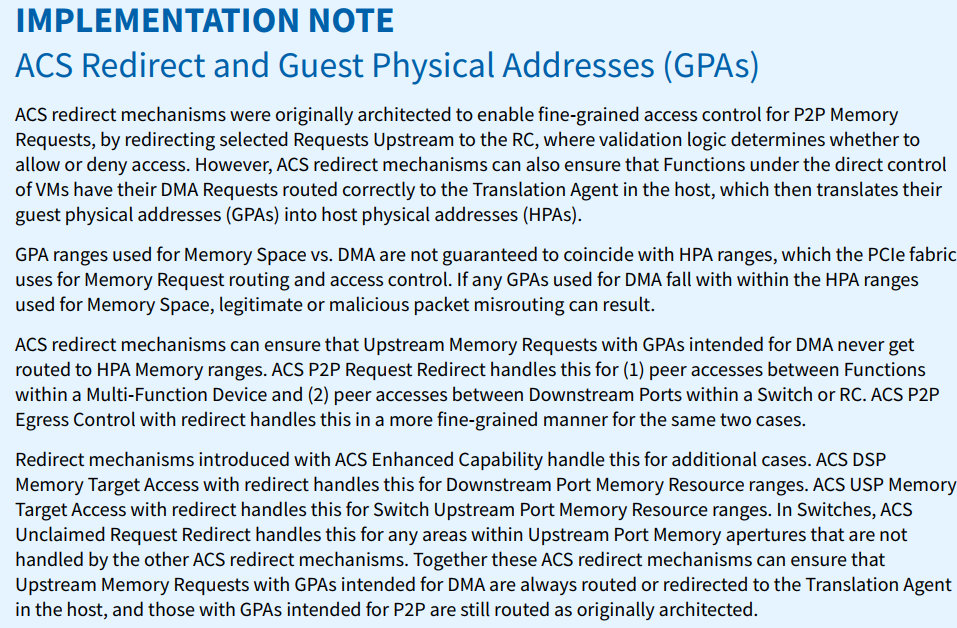

### 1. 基础
#### 1. 存储器读请求 TLP 中没有 Data Payload 字段,此时使用Length 字段表示需要读取多少数据。
1. 当该字段为 n 时,表示需要获取 n 个 DW,其中 0≤n≤0x3FF，
2. 当 n=0 时,表示数据长度为 1024DW,
3. 如果 PCIe 主设备传送的单位小于 1 个 DW 或者传送的数据不足以 DW 为界时需要使用“DE BE”字段
#### 2. DUT 的RCB的理解
1. RCB取值64B/128B,EP的RCB取值64B/128B
2. 所以dut是EP时，RCB其实可以选择为128B，因为RCB要求是第一个cpl是N倍的RCB对齐的，所以可以用128B覆盖rc为64B的的值

### 2. ACS
1. AT（Address Type）只对MEM报文和原子报文有效，IO报文该字段默认为0
2. ACS重定向时候GPA&HPA
    1. 协议说明：
     
    2. 翻译
        1. ACS重定向机制最初设计用于实现对等内存请求(P2P Memory Requests)的细粒度访问控制，通过将选定请求重定向至根复合体(RC)进行验证逻辑判断。同时，该机制可确保虚拟机直接控制的设备功能将其DMA请求正确路由至主机的地址转换代理，从而将客户机物理地址(GPA)转换为主机物理地址(HPA)。
        2. 需注意：用于内存空间与DMA的GPA范围未必与HPA范围重合，而PCIe架构依赖HPA范围进行内存请求路由和访问控制。若DMA使用的GPA落入内存空间HPA范围，可能导致合法或恶意的数据包错误路由。
        3. ACS重定向机制能确保以下两类场景中，用于DMA的GPA内存请求绝不会被路由至HPA内存区域：
            1. 多功能设备内部功能间的对等访问 → 由ACS P2P请求重定向处理
            2. 交换机或RC内部下游端口间的对等访问 → 由带重定向的ACS P2P出口控制实现更细粒度管理

        4. ACS增强功能引入的新机制可扩展应用场景：
            1. 带重定向的ACS DSP内存目标访问：管理下游端口内存资源范围
            2. 带重定向的ACS USP内存目标访问：管理交换机上行端口内存资源范围
            3. ACS未声明请求重定向：处理其他ACS机制未覆盖的上行端口内存区域

        5. 协同作用下，这些机制确保：
            1. 目标为DMA的上行内存请求始终被路由/重定向至主机地址转换代理
            2.目标为P2P的请求仍按原始架构路由
