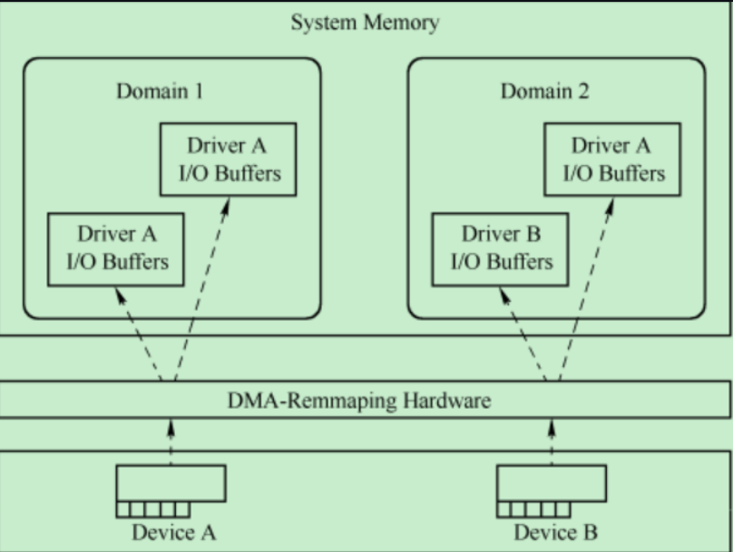

### 一. 演化目标
同一个PCIE 设备可以被多台虚拟主机共享式使用

### 二.关键词
1. IOMMU ：将PCI总线地址转换为HPA存储器域地址(主机端)
2. ATS   ：将PCI总线地址转换为HPA存储器域地址(本地),即允许端点设备(EP)缓存地址转换结果,达到减少与IOMMU(输入输出内存管理单元)的交互次数
3. HPA   ：Host Physi⁃cal Address,处理器系统中真实的物理地址。
4. GPA   :Guest Physical Address, Domain内独立编码
5. SR-IOV:Single Root I / O Virtualization Extended Capabilities,将pcie 设备虚拟化的功能,需要设备支持
6. TA    :Translation Agent
7. ATPT  :Address Translation and Protection Table
8. DMA_Repmaping：将PCI 总线地址转换为 HPA 存储器域地址

### 三. 演化路径

无IOMMU --> IOMMU- > ATS -> SR-IOV

### 四. 演化过程详解

#### 1. 无IOMMU
0. 
   
1. 背景：
  - 一个处理器系统中存在两个Domain,其中一个为Domain 1,而另一个为Domain 2
  - 这两个Domain分别对应不同的虚拟机,并使用独立的物理地址空间
  - GPA1和GPA2采用独立的编码格式, 其地址都可以从各自GPA空间的0x0000⁃0000地址开始, 只是GPA1和GPA2空间在System Memory中占用的实际物理地址HPA(Host Physi⁃cal Address)并不相同
  - Device A属于Domain 1,而Device B属于Domain 2
  - 在同一段时间内, Device A只能访问Domain 1的GPA1 空间,也只能被Domain 1操作；而Device B只能访问GPA2空间,也只能被 Domain 2 操作
  - Device A和Device B通过DMA⁃Remmaping机制最终访问不同 Domain 的存储器
2. 效果：
   device A/B 访问的空间彼此独立, 而且只能被指定的Domain访问, 从而满足了虚拟化技术要求的空间隔离
3. 问题：
  未实现每个Domain都可以自由访问所有外部设备

#### 2. IOMMU
0. 

1. 背景
  - 存在两个虚拟机,其使用的地址空间分别为GPA Domain1和GPA Domain2
  - 假设每个GPA Domain使用1GB大小的物理地址空间,而且Domain间使用的地址空间独立, 其地址范围都为 0x0000⁃0000~0x4000⁃0000
  - 其中Domain 1使用的GPA地址空间对应的HPA地址范围为 0x0000⁃0000～0x3FFF⁃FFFF； Domain 2使用的GPA地址空间对应的HPA地址范围为0x4000⁃0000~0x7FFF⁃FFFF。
  - EP1隶属于Do⁃main1,而EP2隶属于Domain2, 即EP1和EP2进行DMA 操作时只能访问Domain1和Domain2对应的HPA空间
2. 实现方式
    intel的 VT⁃d/AMD的IOMMU细节不同
3. 转换过程(EP1和EP2向主机进行DMA写操作为例)
   - Domain1和Domain2填写EP1和EP2的DMA写地址和长度寄存器启动DMA操作, Domain1和Domain2填入EP1和EP2的DMA写地址为0x1000⁃0000,而长度为0x80,这些地址都是PCI总线地址
   - EP1和EP2的存储器写TLP到达RC,由RC将TLP的地址字段转发到TA和ATPT,进行地址翻译
        - TA将使用Domain1或者Do⁃main2的I/O页表,进行地址翻译, 
        - EP1隶属于Domain1,其地址0x1000⁃0000(PCI总线地址)被翻译为0x1000⁃0000(HPA)； 
        - 而EP2隶属于Domain2,其地址0x1000⁃0000(PCI总线地址)被翻译为0x5000⁃0000(HPA)
   - 来自EP1和EP2存储器写TLP的数据将被分别写入到0x1000⁃0000 ~ 0x1000⁃007F和0x5000⁃0000~0x5000⁃007F 这两段数据区域
4. 效果
    不同的设备被映射到不同的domain空间内

#### 3. AT
0. 

1. 解决思路：
  支持ATS机制的PCIe设备(注意是EP设备),内部含有ATC(Address Translation Cache)
2. 过程：
   - 在ATC中存放ATPT的部分内容,当PCIe设备使用地址路由方式发送 TLP时,其地址首先通过ATC转换为 HPA 地址。
   - 如果PCIe设备使用的地址没有在ATC中命中时,PCIe设备将通过存储器读TLP从ATPT中获得相应的地址转换信息, 更新ATC后,再发送TLP
3. 新问题：
  需要维护设备内部的ATC相关的表项
4. 实现：
  - 具体见TLP报文的AT字段,
  - AT:
    - 0b00： addr 未转换；
    - 0b01： 转换请求报文
5. 效果：
  解决RC处TA和ATPT的性能瓶颈,因为地址在设备本地进行了转换
6. 问题：
  还未解决跨domian域的设备访问

#### 4. SR-IOV- 基于硬件的虚拟化解决方案
0. 
1. 简介：
    - SR⁃IOV的PCIe设备由多个物理子设备PF(Physical Function)和多组虚拟子设备VF(Virtual Function)组成
    - 其中每一组VF与一个PF对应,M个PF,分别为PF0~M。其中“VF0, 1~N1”与PF0对应；而“VFM, 1~N2”与PFM对应。
    - **每个PF都有唯一的配置空间**, 
    - 而与PF对应的VF**共享该配置空间**, **每一个VF都有独立的BAR空间**, 分别为VF BAR 0~5
    - 虚拟化环境中,每个虚拟机可以与一个VF绑定, 其中每个虚拟机可以使用一个VF,从而实现多个虚拟机使用一个设备的目的
2. 与传统的虚拟化技术对比
    - 
    - 传统虚拟化系统使用Hypervisor(或者VMM)软件对虚拟机进行管理,
      - 软件层既消耗CPU资源,又有较深的调用栈,使得PCIed设备的性能优势无法彻底发挥。
    - SR-IOV可以实现多个虚拟机共享物理资源,且bypass Hypervisor(或者VMM)软件层,使得虚拟机可以使用到设备的高性能
    - 优点：VM可直接与VF通信,不需要Hypervisor接入IO处理,节约vCPU资源的同时,又可以实现不同VF之间性能相互隔离,互不影响

### 五. 传送门
- [PCIE 虚拟化技术.xmind](https://github.com/bulaqi/IC-DV.github.io/blob/main/doc/01_pcie/PCIE_%E8%99%9A%E6%8B%9F%E5%8C%96.xmind)
