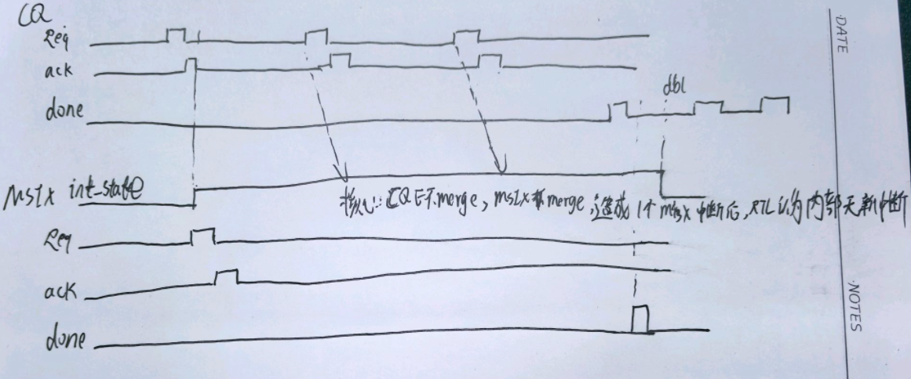
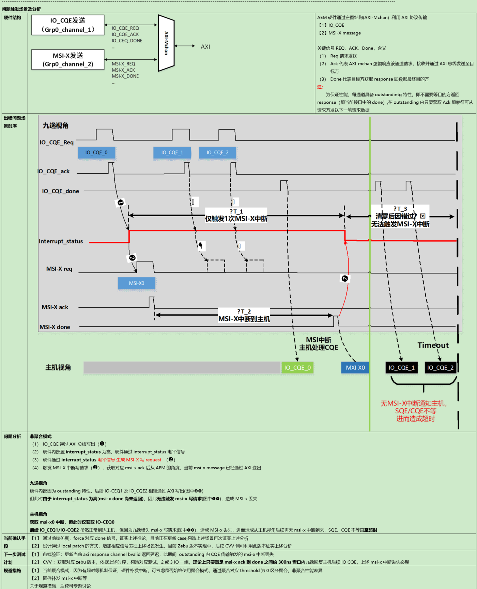

### 1. 基础知识

#### 1. 工作方式
1. pure polling
   - pcie 协议的要求
      ~~~
      If a masked vector has its Pending bit Set, and the associated underlying interrupt events are somehow satisfied (usually by software though the exact manner is Function-specific), the Function must Clear the Pending bit, to avoid sending a
      spurious interrupt message later when software unmasks the vector. However, if a subsequent interrupt event occurs while the vector is still masked, the Function must again Set the Pending bit.

      Software is permitted to mask one or more vectors indefinitely, and service their associated interrupt events strictly based on polling their Pending bits. A Function must Set and Clear its Pending bits as necessary to support this “pure polling” mode of operation.
      ~~~
   - 不使能msix中断，也不读pending_bit 寄存器，利用定时器，时间到后，直接读CQE队列，根据phase_tag判断有效的cqe数据，然后ring cqe hdbl
2. 中断，不屏蔽pvm
   - 当前公版nvme驱动的处理逻辑
   - 主机收到msix中断后，直接读cq队列中查看cqe的phase bit,pvm不动作
3. 中断（正常模块），
   - rc vip的处理逻辑
   - 进入中断时，pvm置位，退出中断前，pvm 清0 

#### 2. 控制信号
1. msix_func_en
2. msix_func_mask
3. pvm
4. pba状态--置位
   - 当msix_func_en为0时,PBA保持0       
   - 当msix_func_en为1时：
     - 若msix_func_mask为1，则触发中断时PBA置位；
     - 若msix_func_mask为0, 且pvm为1时，触发中断时PBA置位。
     - 中断服务程序过程中有新的中断源产生（非nvme的msix中断聚合）
        1. 结论：
           - 结论：msix 发生消耗时间，但没有ostd，会影响后续的msxi逻辑
        2. 第一次msix中断已发送，但未发生完，可能触发中断的被动聚合
           - 表现：少n次中断
           - 条件：在msix发送过程中，发送msix的axi信号未返回done，即msix无ostd 
           - 分析：第一次msix 的aw/w已握手，b通道未完成时，此时，dut满足发一次新的dma的条件（第二笔cq_dma完成），因第一次的msix未发完，dut是不会再发出新的msix中断，主机进入第一次中断服务程序后，查询cq 队列内有2笔cqe，如果一次性处理，则第二笔的dma 就不会产生中断，表现为中断的被动聚合

        3. 第二次中断激励在第一次的中断服务处理程序的位置
           - 已收到msix中断，PVM置1前,即进入中断前 --> 中断不聚合，不影响PBA,有N次触发条件，则触发N次中断
           - [PVM置1]  --> 无影响
           - PVM置1后，ring dbl前  -->PBA置1
           - [Ring dbl]  -->清掉PBA(前提：如果有)
           - 在ring dbl后，PVM 清0 前 -->PBA置1(常见模式)（因dut内部处理逻辑限制，PBA清0到再次置1，清0的过程，持续两个周期）
           - [PVM清0]  -->如果PBA为1，则立刻发送msix, 并清PBA
           - PVM清0后  --> 下次中断
           - 待续
     - 中断场景过程总结：
        1. mask场景下，进入中断服务程序，PVM置1，但主机未Ring CQ HDBL前，有新的中断条件触发（比如新的CQ_DMA），PBA会置1，此时在主机Ring CQ HDBL后会清除PBA；
        2. 在PBA清0后，dut会重新判断msix中断条件是否满足（比如在非聚合条件下队列中有CQ存在），若满足则会再次置起PBA，注：PBA清0到再次置1，清0的过程，持续两个周期。
        3. 总结（针对当msix_func_en为1时）：
            - 若msix_func_mask为1，则触发中断时置位PBA；
            - 若msix_func_mask为0,且vector mask为1则触发中断时置位PBA。
            - 综上，置位条件就是msix_fuvenc_mask为1或ctor_mask为1时满足中断条件置位PBA。

5. pba清0（前提：pba为1）
   - 中断模式下,主机ring cq dbl
   - 中断模型下，退出中断服务程序，发msix中断，pvm 清0后，
   - pure polling 模式下，ring cq dbl的时候

   
#### 3. msix_en
1. 功能msix功能的总开关
2. 为减少对设计的复杂性和状态切换的残留影响，建议msix_en不使能，其他状态保持默认非工作状态
   
#### 4. PBA
1. pba有2个功能
   - 在msix使能，msix mask时，指示是否有中断激励待处理
   - 潜在功能，因mask时，有该状态，可以防止中断丢失
2. 上述的中断激励处理包括
   - 可以是unmask后发生清PBA后立即msix_int，即中断模式，保证中断不丢失
   - 跳过中断状态，主机直接处理， 即纯pure polling 模式
3. PBA置位条件
   - cfg_msix_en=1
   - msix_func_mask或vector_mask为1
   - 期间有中断激励产生
4. 不使能MSI-X，PBA不能被置1
   - 原因：残留PBA有影响
   - 具体分析： 主机会在初始化CQ之前，把MSI-X配置好并且使能。如果此时，由于在使能前有残留PBA，并且发中断，主机会发现此时CQ并未初始化，然后在内核log中记录一个warning。

#### 4. 非中断聚合
1. 在非聚合模式下一次CQE DMA完成上报一次MSIX中断，因中断源太多仲裁不上、AXI总线反压等的被动聚合，中断数量可以少于DMA完成数量；
   
#### 5. 中断聚合

### 2. 经验
#### 1. nvme 协议解读
1. 协议
   ~~~
   It is recommended that the interrupt vector associated with the CQ(s)being processed be masked during processing of completion queue entries 
   within the CQ(s) to avoid spurious and/or lost interrupts. The interrupt
   mask table defined as part of MSI-X should be used to mask interrupts.

   建议在处理CQ(s)内的完成队列条目时，屏蔽与正在处理的CQ(s)相关的中断向量，   
   以避免产生虚假或丢失的中断。MSI-X定义的中断掩码表应用于屏蔽中断。
   ~~~
2. 虚假中断的理解
   - 如果不mask,没有pba，则无法表征是否在mask 期间是否有中断发生
   - 如果在第一次pvm mask 后和ring_dbl前，有中断激励触发的条件，则ring dbl可能会ring 全部的dbl
   - 待进入第二次中断的时候，cq队列为空，为虚假中断
3. 丢中断的理解,
   - eg，如果有mask,无pba,在进入第一次中断后，mask置位，此时新中断激励条件满足，因mask无中断产生
   - unmask后，上述的中断也无法发出，因为无信号标志标志有待发生的中断，该信号还必须是主机和dut都能看到的状态信号

### 3. 验证bug总结
1.	在不使能MSIX_FUN_EN的时候，pending bit不能动作，否则在使能后可能多发中断
2.	MSIX是消息中断，在线路上有时延，在时延过程中，pvm使能和ring_dbl触发，pvm闭合，有新中断都需要考虑
3.	地址对齐问题：pcie 协议要求addr DW对齐，msix数据长度32bit，如果axi 数据位宽大，需要用到窄带传输；
 - eg:如果总线位宽是128bit, 满带传输，地址[3:0] tie 0，DW 对齐，地址[1:0] tie 0，所以总线位宽是128时候，需要窄带传输
4.	丢中断问题: 考虑总线时延的影响，构造典型场景覆盖，在各种主机中断复位程序下，不丢中断，不多发中断
5.	如果有中断聚合，考虑总线时延的影响，确保典型场景不丢中断，不多发中断
6.	PVM使能后，如果有新中断产生，pending bit 需要拉高，ring dbl后新离开清该标志位，立刻发生msix消息
7.	中断的处理，应该有pvm和msix_unmask和pure polling等
8.	考虑纯pure 模块，即PVM不动作下的msix是否正常
9.	Ring dbl后不能多发中断
10. 复位对中断的影响，尤其是非完全复位，复位后中断个数的正确性
11. 内部逻辑的正确性，随机的ring dbl和pvm 不能触发不断的发送msix
12. 主机收到msix中断后，是否有可能CQ队列空--> 有可能，主机不处理pvm信号，设备发送1个msix后，又发送了1个cq, 主机dbl的时候，将第2个cqe,一并读走处理了，第二个cqe产生了第二个msix中断    ->    **初步认为是属于正常，不属于多发msix中断，因为硬件不知道主机处理的时候第二个msix到没到**

### 3. 血泪史
1. 核心问题：
- cq和msix在mchan_aximst内的一个通道，因为cqe msix的逻辑，是先发cqe再发送msix,有依赖关系，是串行的, cqe的axi done的信号阻塞msxi的逻辑
2.	核心检测手段：应该检测最后一个axi_wr是msxi中断，而不是写cqe
3.  设计修改：
	1. 方案1：用msix_ack上升沿信号拉低inter_status信号，而不是用done
    2. 方案2：用将cq 和msix用在mchan_aximst的同一个通道
4. 图示：
   - 
   - 

### 4. 传送门
