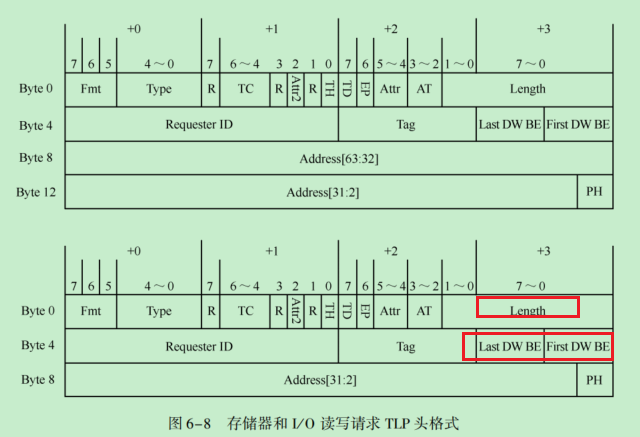
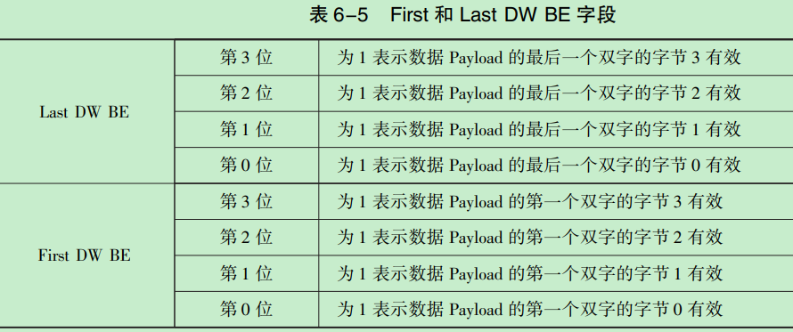
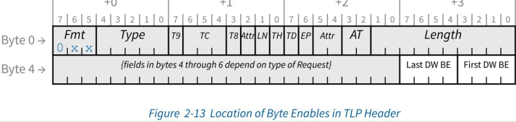
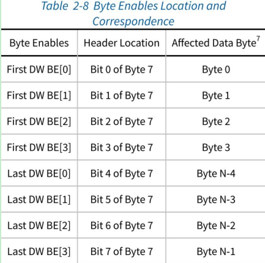
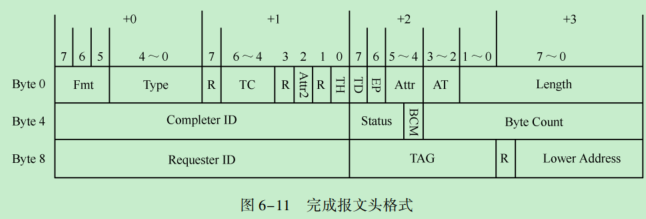
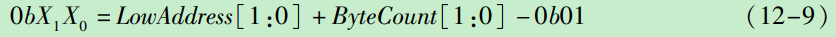
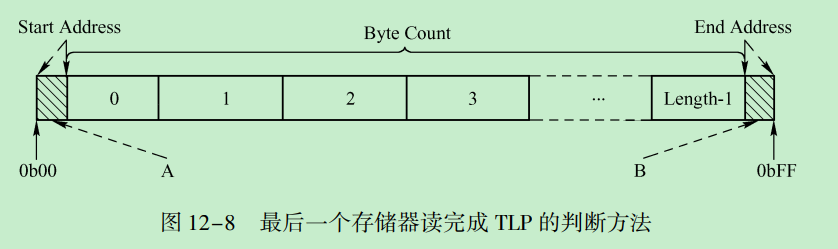
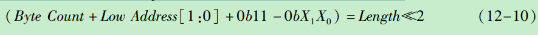

### 1. 基础
#### 1. req

0. tag
    - 注意mem_rd,mem_wr都有tag
    - 个人理解：wr是post, 在来拿
1. Length 字段
    - 在存储器读请求TLP中并不包含 Data Payload， - 不同报文中length的含义：
        - req_rd该报文中，Length 字段表示需要从目标设备数据区域读取的数据长度；
        - req_wr而在存储器写 TLP 中,Length 字段表示报文的DataPayload 长度。
    - Length 字段的最小单位为 DW。 
    - 当该字段为n 时， 表示需要获得的数据长度或者当前报文的数据长度为 n 个 DW
        - 其中 0≤n≤0x3FF。 
        - 当 n 等于 0 时， 表示数据长度为 1024 个 DW
2.DW BE 字段
    - 基础使用(TH为0)
        - PCIe 总线以字节为基本单位进行数据传递， 但是 Length 字段以 DW 为最小单位。 
        - 为此TLP使用Last DW BE和First DW BE这两个字段进行字节使能，使得在一个TLP中，有效数据以字节为单位。
        - “Zero⁃Length”读请求。 此时Length字段的长度为1DW，而First DW BE 字段和Last DW BE字段都为0b0000，即所有字节都不使能。 
        - BE其实是bitmap，对应的位为4DW中有效的那个DW,全0,默认是00地址是有效的
        
    - TH 字段值为 1
        - 适用： Memory Read Request，Byte Enable 字段被重新指定为携带 ST [7:0]字段。
        - 此时，隐含的定义了 Byte Enable 的值
            
        - 对于 TH 字段置 1 的 Memory Read Request，Byte Enable 隐含以下值
            - 如果此请求的Length字段指示此请求的数据为1,则First DW Byte Enable 的值隐含为 1111b，Last DW Byte Enable 的值隐含为 0000b
            - 如果此请求的Length 字段指示此请求的数据大于1,，First DW Byte Enable 和 Last DW Byte Enable 的值隐含为 1111b
        - 带有TH位设置且针对非可预取内存空间的存储器读取请求，仅当能够保证此类读取操作的完成不会产生不良副作用时方可发起。
            - 对于某些基址寄存器(BAR)，即使其映射的某些存储位置具有读取副作用，仍可能设置了可预取位，相关注意事项请参阅第7.5.1.2.1节。
        - 规则：
            - 1st DW BE [3:0]字段指明所请求的第一个(Length = 1 时为唯一一个)DW 的 Byte Enable 。
                - 如果 Request 的 Length 字段指示的长度大于 1 DW，则此字段不得等于 0000b。
            - Last DW BE [3:0]字段指明请求的最后一个 DW 的 Byte Enable 。
                - 如果 Request 的 Length 字段指示的长度等于 1 DW，则此字段必须等于 0000b。
                - 如果 Request 的 Length 字段指示的长度大于 1 DW，则此字段不得等于 0000b。
            - 对于 Byte Enable 字段的每个比特：
                - 如果值为 0b 表示不得写入相应的数据字节，或者如果 non-prefetchable，则不得读取。
                - 如果值为 1b 表示必须在写入或读取相应的数据字节。
            - 对于长度为 1 DW 的所有请求类型，1st DW BE [3:0]字段中允许使用非连续的 Byte Enable 。
                - 非连续的 Byte Enable 指的是 1010b，0101b，1001b，1011b，1101b 这种形式。
            - 对于长度为 2 DW 的 QW 对齐的 Memory Request，1st DW BE [3:0]和 Last DW BE [3:0]中均允许非连续的 Byte Enable。
            - 长度为 2 DW 的所有非 QW 对齐的 Memory Request 和长度为 3 DW 或更大的 Memory Request 必须仅启用与请求的第一个
            DW 和最后一个 DW 之间的数据连续的字节
                - 连续的 Byte Enable 的例子：
                    - 1st DW BE: 1100b，Last DW BE: 0011b
                    - 1st DW BE: 1000b，Last DW BE: 0111b
            - Byte Enable 字段的比特分布，它们在 Request header 中的位置以及所引用数据的相应字节之间的对应关
                - 
            - 允许长度为 1 DW 且未启用任何字节的 Write Request，除非特别说明，否者这对 Completer 没有影响

#### 2. cpl
1. 
2. BCM(Byte Count Modified)字段由 PCI⁃X 设备设置。 而 PCIe 设备不能操纵 BCM 位和 BCM 位
3. Byte Count
    - 记录源设备还需要从目标设备中获得多少字节的数据就能完成全部数据
    - 当前 TLP 中的有效负载也被 Byte Count 字段统计在内。 
    - 该字段由 12 位组成(和req的length 长度一致)。 
        - 0b0000⁃0000⁃0001 表示还剩一个字节， 
        - 0b1111⁃1111⁃1111 表示还剩 4095 个字节， 
        - 而为0b0000⁃0000⁃0000 表示还剩 4096 个字节。 
    - 除了存储器读请求的完成报文外， 大多数完成报文的 Byte Count 字段为 4 
    - eg：一个源设备向目标设备发送一个 “读取 128B 的存储器读请求 TLP”，
        - 目标设备收到这个读请求TLP后，可能使用两个存储器读完成TLP传递数据。 
        - 第1个存储器读完成TLP的有效数据为64B，而Byte Count字段为 128；
        - 当数据请求端接收完毕第 1 个存储器读完成TLP后，发现还有64B的数据没有接收完毕
            - 此时必须等待下一个存储器读完成 TLP。
            - 等到数据请求端收齐所有数据后，才能结束整个存储器读请求。
        - 第2个存储器读完成TLP中的有效数据为64B，而Byte Count字段也为 64
            - 目标设备发出的第2个读完成TLP中的有效数据为64B，而Byte Count字段为 64，当数据请求端接收完毕这个读完成TLP后，将完成一个完整的存储器读过程，从而可以释放这个存储器读过程使用的Tag资源
5. Lower Address 字段
    - 如果当前完成报文为存储器读完成 TLP， 该字段存放在存储器读完成 TLP 中第一个数据所对应地址的最低位。 
    - 值并不存在First DW BE和Last DW BE字段，因此接收端必须使用存储器读完成 TLP 的Low Address字段，识别一个TLP 中包含数据的起始地址。
    - 存储器读完成TLP中Data0(即第一个双字) 中包含的有效数据， 以及 Data( Length⁃1)(即最后一个双字) 中包含的有效数据
    - 存储器读完成TLP并不含有First DW BE字段， 此时Capric卡需要使用存储器读完成 TLP 中的 Lower Address 字段识别 Data0 中的有效字节
    - 在第1个存储器读完成TLP中，Lower Address[1：0] = A1A0，对于其他存储器读完成TLP，其 Low Address[1：0] = 0b00。 因此通过Lower Address字段，可以识别 Data0 中第一个有效数据，即 Data0[A1A0]为第一个有效数据
    - 存储器读完成TLP并没有设置Last DW BE字段，Capric卡需要使用Byte Count和 LowerAddress字段联合识别Data(Length⁃1)中的有效数据。
    - 如果当前存储器读完成TLP不是最后一个 TLP，那么其 Data(Length⁃1)中的数据全部有效。 因为PCIe总线规定，如果RC为1个存储器读请求TLP 发送多个存储器读完成 TLP，如果这个存储器读完成 TLP 不是最后一个报文，那么其结束地址必须64B对界
    - 如果当前存储器读完成 TLP 不是第1 个 TLP，那么其 Lower Address[1：0] = 0b00。 在这两种情况下，Data(Length⁃1)中的有效数据较易计算
    - 特殊情况： RC 只发出了一个存储器读完成TLP给Capric卡，此时这个 TLP 既是第一个存储器读完成 TLP 也是最后一个存储器读完成 TLP
    - 计算 Data(Length⁃1)中的有效数据的通用方法， Data(Length - 1)[X1X0]为存储器读完成 TLP 中最后一个有效数据
        - 
    - 计算完毕存储器读完成TLP的Data0和Data(Length⁃1)中的有效数据后，还需要判断当前存储器读完成TLP是不是 RC 发出的最后一个与当前 Tag 对应的存储器读完成 TLP
        - 
        - Start Address 为存储器读完成 TLP 的起始地址， 而 End Address 为存储器读完成 TLP 的结束地址。
        - 在一个存储器读完成TLP中， 无法得到Start Address和End Ad⁃dress的确切的数值， 因为存储器读完成TLP不包含Address 字段，但是可以得到阴影A和阴影B的大小。 
            - 其中阴影A的大小为Low Address[1：0] 
            - 而阴影B的大小为0b11-0bX1X
        - 如果当前TLP的Byte Count字段加上阴影A和B的大小与Length×4相等，即公式12-10成立时，该TLP为RC发给Capric卡的最后一个存储器读完成 TLP
            - 

### 2. 经验

### 3. 总结