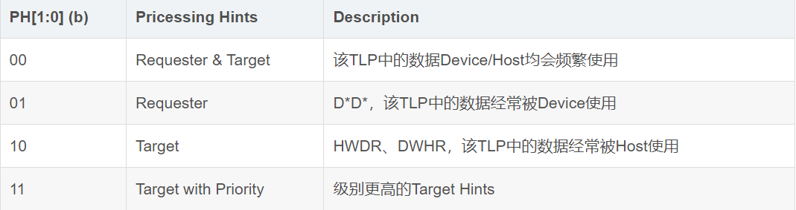
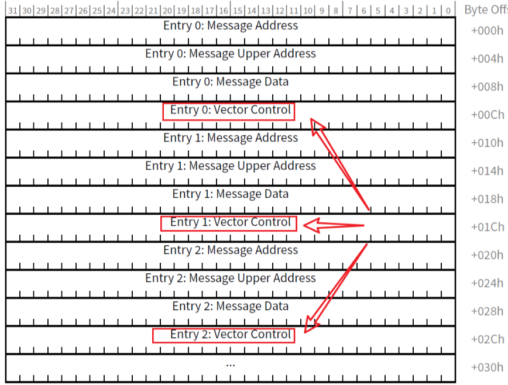
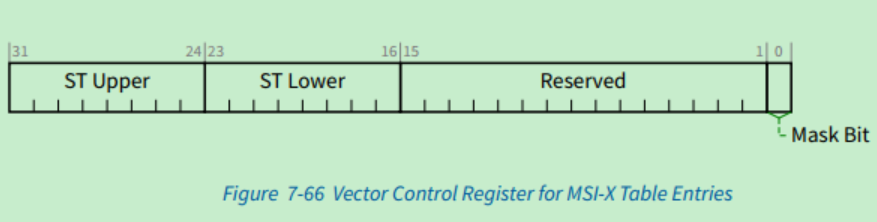
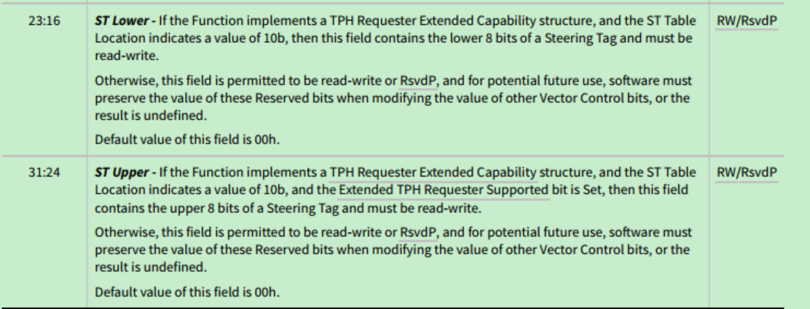
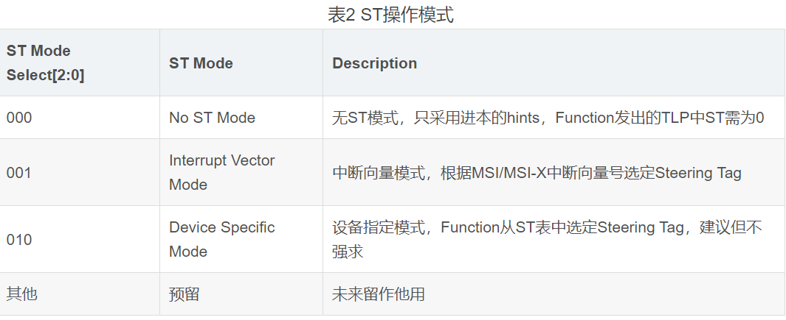
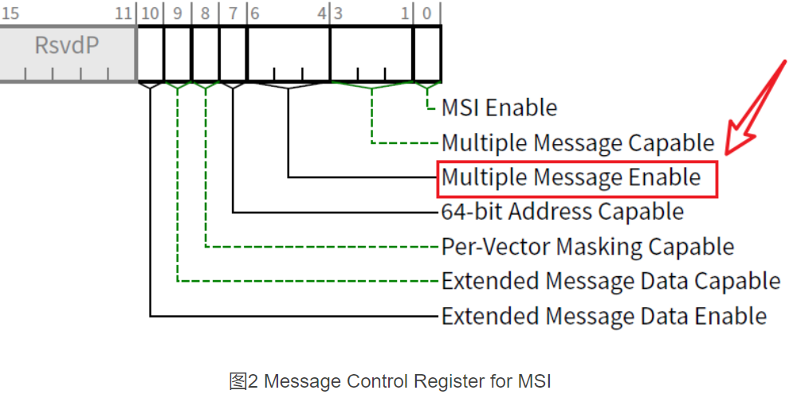
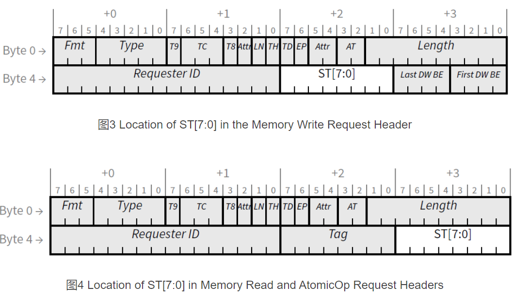
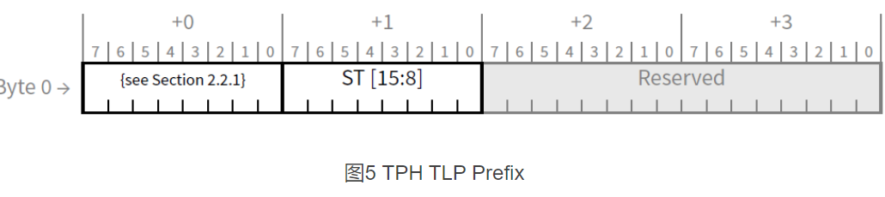

#### 1. TPH 基本介绍
1. 概述
    - TLP Processing Hints，直译:事务处理提示,缩写TPH。
    - 适用于存储器读、存储器写及原子操作事务。
    - TPH携带有请求者对完成者目标存储空间数据的使用信息，
        - 通知完成者即将访问数据的特性，
        - 完成者可以根据TPH合理地安排数据缓存及管理数据，
        - 从而降低PCIe设备的访问时延、降低系统带宽压力、提高cache的利用率、降低能耗。
2. TLP域段概述
    - 在发送带有TPH的TLP时，用到了TLP头标中的TH、PH及ST三个字段，
    - 其中**TH及PH字段仅用于TPH请求事务**，TH=1时PH有效。
        - TH置1表示该TLP含有TPH信息，
        - PH用以提供较粗粒度的Processing Hints控制能力
        - ST用以提供细粒度的控制能力。

#### 2. 粗粒度控制：Processing Hints
1. 在请求者给完成者发送存储器访req前，显然请求者能够知道接下来将如何使用这些访问请求中的数据，但完成者难以知晓。
2. 请求者通过TLP头标PH字段给RC或其他目的设备提供提示hints，提示主机或设备接下来将如何使用该TLP中的数据。
3. hints包括以下6种：
    ~~~
    DWHR：Device对这段数据进行写操作后，很快Host会对这段数据进行读操作；
    HWDR：Host对这段数据进行写操作后，很快Device会对这段数据进行读操作；
    DWDW：Device对这段数据进行写操作后，很快Device会再次对这段数据进行写操作；
    DWDR：Device对这段数据进行写操作后，很快Device会对这段数据进行读操作；
    DRDW：Device对这段数据进行读操作后，很快Device会对这段数据进行写操作；
    DRDR：Device对这段数据进行读操作后，很快Device会再次对这段数据进行读操作；
    ~~~
4. 说明：
    - D*D* 归为一类，表示该TLP中的数据经常被Device使用；
    - HWDR和DWHR归为一类，表示该TLP中的数据经常被Host使用；
    - 此外，还有Device/Host均会频繁使用及级别更高的Host频繁使用
5. 这几类与PH字段的对应关系如下表(表1)所示
    - PH字段意义
    

#### 3. 细粒度控制：Steering Tags
- 如果某Function想要给Host处理器或系统cache hierarchy等特定的处理资源发送TLP，那么该Function需要知道目标cache的拓扑信息。
- 这个拓扑信息哪里来呢 —— Steering Tags。
- Steering Tags就是系统指定的一组值，用以指示系统cache hierarchy中的host或cache结构

##### 3.1 ST表
1. Steering Tags存放在ST表中，
2. 可通过软件配置TPH请求者能力寄存器的ST table Location字段选择将ST表存放在TPH请求者扩展能力结构或MSI-X表两者中的任意一个(不可同时存放)。
3. ST表每个Entry为2-bytes，ST表的大小由TPH请求者能力寄存器指定。
4. 若Function同时支持MSI及MSI-X且MSI启动，即便MSI-X未启动，仍然可以将ST表存放在MSI-X表中。
5. 若选择存放在MSI-X表中，则MSI-X表每个Entry的向量控制寄存器(Vector Control Register，图1)将用于存放Steering Tag
    - 
    - 
    - 
6. 在更新ST表的时候，为减小不确定性，也为了确保在请求事务中采用确定的SteeringTags，建议软件在这个过程中暂停使用该Function或关闭其TPH能力。

##### 3.2 ST操作模式
1. ST表的位置由Function的TPH请求者扩展能力结构指定。
2. 若Function实现了ST表，需要软件来填充该表。
3. ST有3中操作模式，如下表：
    
  - No ST mode，只采用基本的hints，不采用ST。
      
      - 在无ST操作模式中，Function必须采用0作为Steering Tags，而非软件提供的Steering Tags。
  - Interrupt Vector Mode，在中断向量模式中，根据MSI/MSI-X中断向量号到选择ST对应Entry中的Steering Tags。
      1. 若Function开启MSI，Function须在MSI控制寄存器Multiple Message Enable字段(图2)最大范围内选择Tag；
      - 
      2. 若Function开启了MSI-X，Function需在MSI-X表大小范围内选择Tags。
      3. 若ST表的大小比中断向量号的范围小，该Function可以在特定事务中不使用TPH，可以采用Steering Tags全0的TPH，亦采用在ST表中选择Steering Tags的TPH。
      4. 若ST表的大小比中断向量号的范围大，超出范围i的St Entry会被Function忽略掉。
- Device Specific Mode，设备指定Steering Tags的值，该Steer Tags值与ST表中的Steering Tags无关也无需来自ST表。
5. 注意：具备发送TPH请求事务的Function需支持无ST操作模式。除表2中指定模式外，也可以选择其他自定义的模式，但一次只能选择一个模式。

##### 3.3 TLP中的ST字段
1. **存储器写请求无需Tag字段**，因此在存储器写请求中，原Tag字段用作ST[7:0]字段(图3)；
2. 特别注意：在**存储器读请求中，原Last BE、First DW字段被用作 ST[7:0]字段**(图4)。
    - 
3. 考虑到部分存储器读请求仍然需要BE、DW字段来进行边界对齐，因此ST字段仅用于无需边界对齐的请求事务。
- Mem_rd_req,Byte Enable 隐含以下值
    1. 请求的Length为1,则FBE的值隐含为1111b,LBE的值隐含为0000b -->只有1个DW，且4个字节都有效，因为只有1个DW，所以LBE都是0
    2. 请求的Length请求的数据大于1,FBE和LBE的值隐含为1111b --> 天然DW对齐

4. ST字段有16bit，一般采用上述ST[7:0]可以提供255个(0表示No ST Mode，不计入)不同的ST，足以满足绝大部分需求。
5. 若有意采用更宽位宽的ST，可以在TLP Header前添加TLP Prefix(参考链接)，采用TLP Prefix的Byte1作为`ST[15:8]`(图5)。
    - 
6. PS:注意：对于不支持或不需要Steering Tags的情况，可以把ST字段置零。

