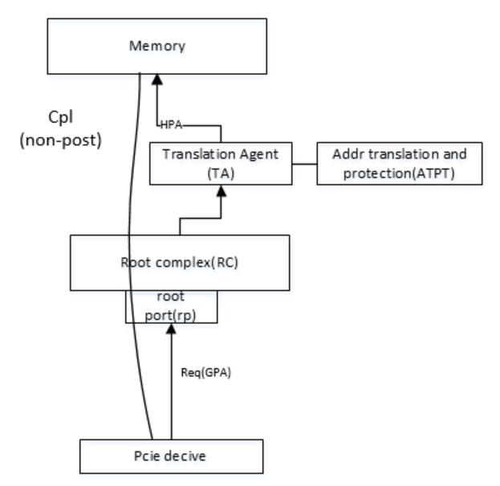

### 1. 基础知识

#### 1. 概述
1. 优化I/O设备对系统内存的访问效率。
2. 允许PCIe设备直接参与地址转换过程，减少传统DMA操作中由IOMMU（I/O Memory Management Unit）或系统软件介入的开销，提升性能(虚拟化)

#### 2. 基本概念说明
1. TA & ATPA-->就是IOMMU
2. 只有EP才能发出AT=2'b01(at req),AT=2'b10(at translated)
3. AT字段只对req才效，对cpl无效

#### 2. ATS产生的背景
1. 在未启用ATS的虚拟机系统,已开启IOMMU：
    - PCIe设备发起DMA请求时使用物理地址（GPA），但设备驱动通常使用虚拟地址（HPA）。
    - 
        - note: ep发起的req，addr都是GPA, 都需TA&ATPT转为HAP,才能访问真正的主机
    - 每次DMA操作需通过IOMMU将虚拟地址（GPA）转换为物理地址（HPA），产生额外延迟。
2. 解决方案在EP端实现IOMMU的转换，即ATS功能

#### 3. 工作原理
- 在EP端实现地址转换功能，首先需要在EP端有地址转换的相关表项,即ATC，该表的建立是EP通过
##### 1. 地址转换请求（Translation Request）
    - PCIe设备向IOMMU发送ATS Translation Request，携带需转换的虚拟地址（VA）。
    - 请求中包含设备的PASID（Process Address Space ID），标识所属进程或虚拟机。
    - 

##### 2. 地址转换响应（Translation Response）
    - IOMMU返回ATS Translation Response，包含转换后的物理地址（PA）及访问权限。
    - 转换结果被缓存至设备的ATC（Address Translation Cache） 中。

##### 3. 直接使用转换结果
    - 后续DMA操作中，设备直接使用缓存的PA发起请求，绕过IOMMU的实时转换。

##### 4.缓存失效管理
    - 当内存页表更新时，IOMMU向设备发送ATS Invalidate Request，使ATC中相关条目失效。
    - 设备响应ATS Invalidate Completion，确保地址一致性。

#### 4. 配置前提要求
1. CPU 开启了IOMMU (如Intel VT-d, AMD-Vi, ARM SMMU)

### 2. 经验总结

### 3. 传送门
