#### 1. ATS产生的背景
1. 在已开启IOMMU，但未启用ATS的虚拟机系统：
    1. PCIe设备发起DMA请求时使用物理地址(GPA)，但设备驱动通常使用虚拟地址(HPA)
    2. 过程示意图
        - 
    3. PS: ep发起的req,addr都是GPA,都需TA&ATPT转为HAP,才能访问真正的MEM
2. 问题：
    - 每次DMA操作需通过IOMMU将虚拟地址(GPA)转换为物理地址(HPA)，产生额外延迟。
3. 解决方案:在EP端实现IOMMU的转换，即ATS功能

#### 2. 工作原理
##### 1. 概述
1. 在EP端实现分布式的地址转换功能
    1. 首先需要在EP端有地址转换的相关表项,即ATC，该表的建立是EP通过发送Translation_req申请转换后的地址，RC通过translation completion tlp将转换地址同步给EP
    2. 后续mem_req根据转换后的地址，发送新的请求
2. 工作流程
    1. - 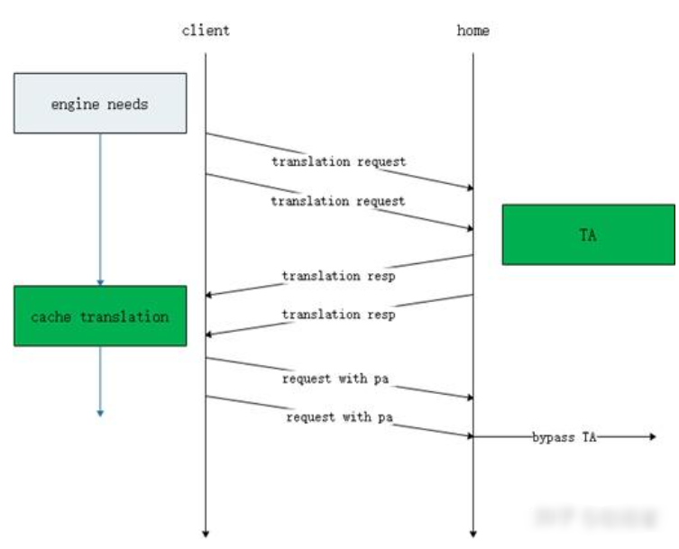
    2. 说明：
        1. client有数据访问需求(或者是prefetching引入的需求)；
        2. client发出翻译请求给home侧，携带需要访问的虚拟地址空间块和响应属性、提示信息；
        3. home侧进行翻译，之后返回翻译结果给client；
        4. client在本地cache翻译结果；
        5. client引擎发出数据访问，查本地cache，直接发出查完后的结果访问home侧
        6. home侧直接bypass TA，访问home本地内存。

##### 2. 地址转换请求(Translation Request)
1. PCIe设备向IOMMU(TA)发送ATS Translation Request，携带需转换的虚拟地址。
2. 请求中包含设备的PASID(Process Address Space ID)，标识所属进程或虚拟机。
3. 架构拓扑图
    - 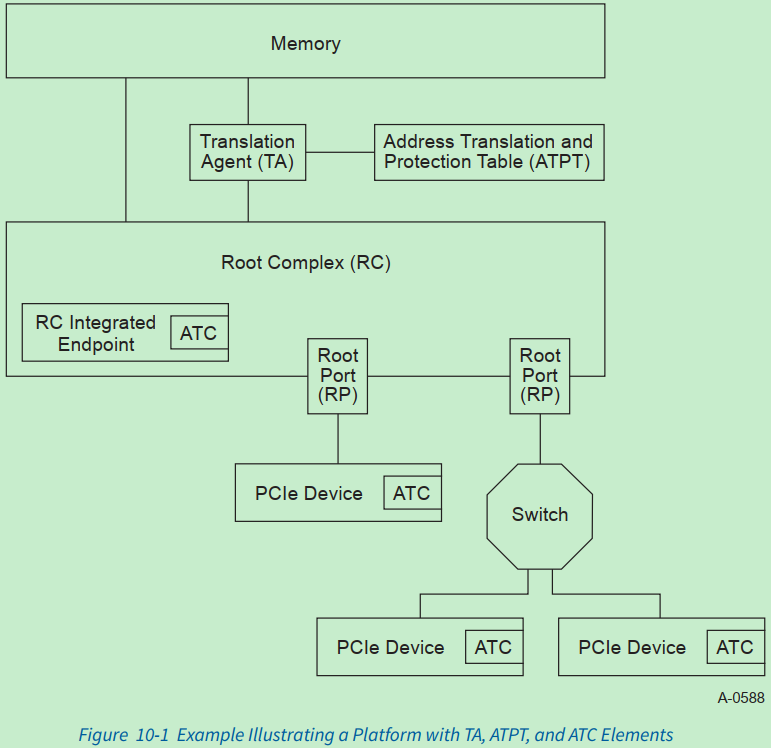
4. req tlp格式，AT=2'b01
    - 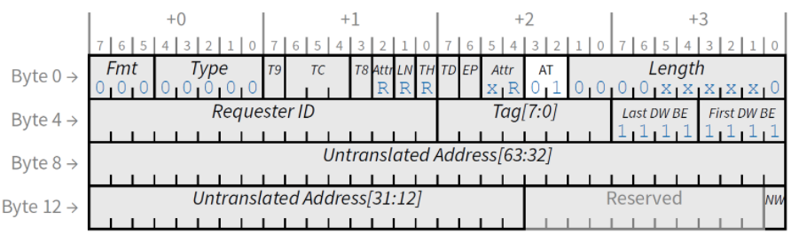
5. AT域段说明
   - 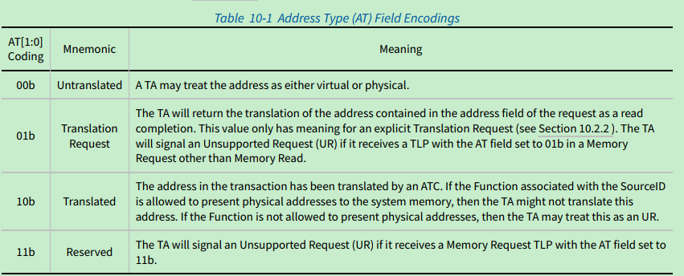
    

##### 3. 地址转换响应(Translation Response)
1. IOMMU返回ATS Translation Response，包含转换后的物理地址(PA)及访问权限。
2. 转换结果被缓存至设备的ATC(Address Translation Cache)中。
3. req_cpl header& payload
    - 
    - 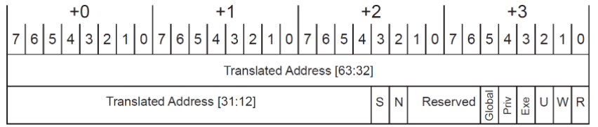

##### 4. 直接使用转换结果
1. 后续DMA操作中，设备直接使用缓存的PA发起请求，绕过IOMMU的实时转换。
2. 发送AT= 2'b10的men_req, 注意也可以发出AT=2b'00的报文(IOMMU转换)
3. 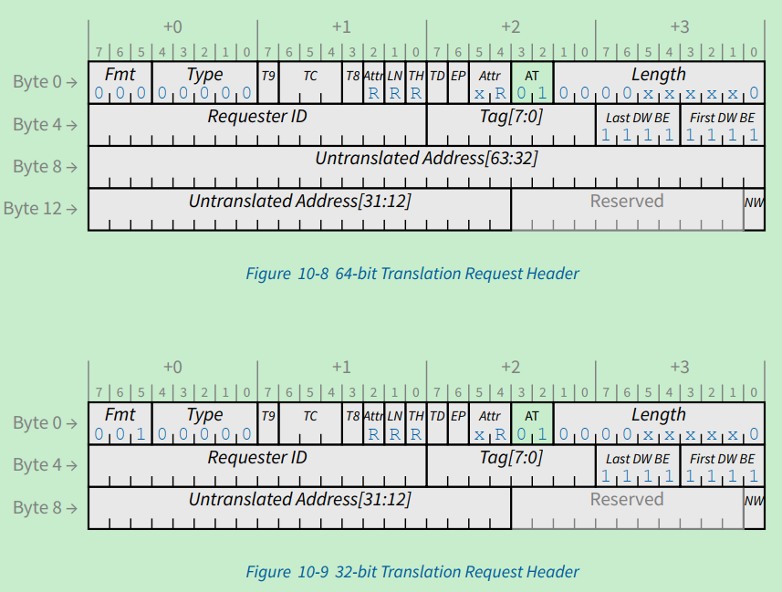

##### 5.缓存失效管理
1. 当内存页表更新时，IOMMU向设备发送ATS Invalidate Request，使ATC中相关条目失效。
2. 设备响应ATS Invalidate Completion，确保地址一致性。
3. 涉及报文： Invalidate Request &  Invalidate Completion
3. 拓扑图
    - 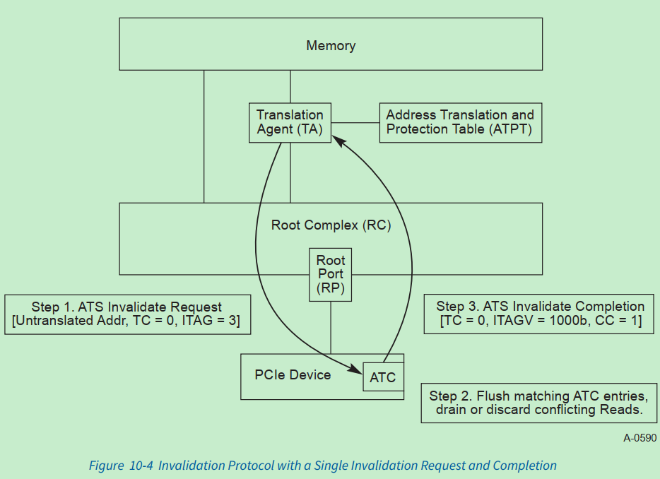
    - 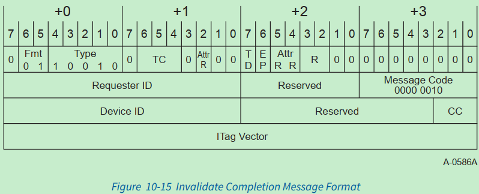

##### 6. Page Request Message & PRG Response Message
1. 背景
    1. PRS就是在数据Unpin情况下实现EP DMA的一种机制。
    2. Page Request Services(PRS)，页请求服务，是Address Translation Services (ATS)地址转换服务的扩展项。
    3. 若支持ATS的EP发送一笔地址转换请求，但RC地址转换代理(Translation Agent，TA)的地址转换保护表(Address Translation & Protection Table，ATPT)中没找到该虚拟地址对应的物理地址，这时候设备仍然想访问这个地址的数据，该怎么办？有两种解决办法：
        - ① 放弃ATS服务，EP端继续发送未转换地址的读写访问，让RC端的SMMU/IOMMU对未转换地址进行转换处理，这种方式显然不如ATS性能好；
        - ② RC端把这一段地址映射添加到RC TA ATPT中，继续采用ATS进行访问。PRS便是属于第二种方式。
2. ATS和PRS的关系
    1. ATS不一定支持PRS，但PRS一定需要ATS，
    2. 原因：因为PRS是ATS的扩展啊，两者紧密配合，携手并进
3. ATS+PRS协同工作流程
    1. EP发送地址转换请求给RC;
    2. RC未找到相关地址映射，反馈转换失败消息给EP；
    3. EP发送页请求消息给RC;
    4. 如果虚拟地址对应主存空间，那就直接pin住；如果虚拟地址对应外存空间，从外存搬到主存后pin住，并生成虚拟地址到物理地址的映射；
    5. RC反馈页请求组响应消息给EP；
    6. EP再次发送地址转换请求给RC；
    7. RC回复转换完成消息CplD给EP；
    8. EP采用转换后的地址完成访问。
    
4. Page Request Message
    - 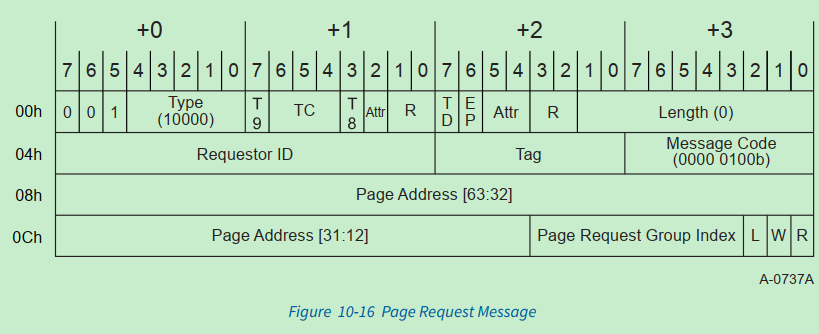
5. PRG响应消息格式
    - 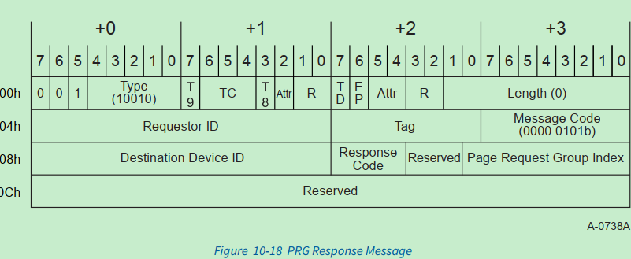
    - 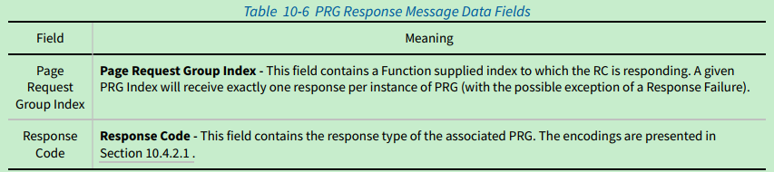

