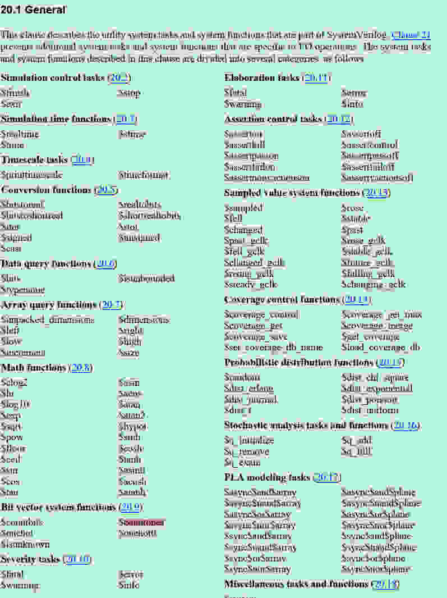

### 1. 基础知识
#### 1. 调试与日志函数
~~~
$trace：跟踪事件。
$monitor：输出调试信息。
$print：打印消息。
$peek：查看信号值。
~~~

#### 2. 逻辑运算函数-用于数据流建模：
~~~
&：按位与。
|：按位或。
^：按位异或。
~：按位非。
~~~

#### 3. Verilog 接口扩展函数： - 调用Verilog代码：
~~~
$call：执行Verilog代码。
$return：返回调用Verilog代码的位置。
$exit：退出Verilog环境。
$break：终止Verilog执行。
~~~

#### 4. 数值处理函数：
0. 获取数字属性
~~~
$abs：绝对值。
$max：最大值。
$min：最小值。
$sign：符号位。

$countbits(expression , control_bit，control_bit) -- 计算位向量中指定的0 1 x z的数量；返回值位一个整数，这个整数就是指定的control_bit的数量
$countones (expression)  --计算位向量中指定的1的数量
$onehot (expression)   --返回只有1个的结果
$onehot0 (expression)  --返回只有0个的结果
$isunknown(expression)   --返回不稳定态的结果
~~~

1. 基础数值函数
~~~
绝对值函数：$abs(number)  用于计算给定数值的绝对值。
符号函数：$sign(number)  返回输入数值的符号。返回值为-1（符号位为1）、0（符号位为0）或1（符号位为-1）。
零检查函数：$zero(number) 检查输入数值是否为零。如果为零，返回1，否则返回0。
~~~

2. 数学运算函数
~~~
和函数：$sum(ints)  计算输入整数列表的总和。
积函数：$prod(ints) 计算输入整数列表的乘积。
最小值函数：$min(ints)  从输入整数列表中找到最小值。
最大值函数：$max(ints)  从输入整数列表中找到最大值。
~~~

3. 位操作函数
~~~
符号扩展函数：$signed(number)  将输入的无符号数转换为有符号数。
无符号数函数：$unsigned(number)  将输入的有符号数转换为无符号数。
位宽度函数：$bitwidth(number)  返回输入数值的位宽。
符号位函数：$bitmin(number)  返回输入数值的符号位。
位数函数：$bitmax(number)  返回输入数值的有效位数。
~~~

4. 位操作与逻辑函数
~~~
符号位扩展函数：$signExt(n, number)  将输入的n位数进行符号扩展。
截断函数：$truncate(n, number) 截断n位数，截断多余部分。
填充函数：$fill(n, bit) 生成n位的重复bit值。
自定义函数 用户可以根据需求自定义数值处理函数，实现复杂的数值计算逻辑，如加密算法、数据压缩算法等。
~~~

#### 5. 特性检测函数  -- 检测时序
~~~
$reg：时钟周期。
$clk：时钟信号。
$rst：复 Hak 信号。
~~~

#### 6. 硬件描述函数： --管理设计结构：
~~~
$top：顶层模块。
$module：定义模块。
$port：模块接口。
~~~

#### 8. 高级功能函数： --验证与调试：
~~~
$assert：断言验证。
$stop：停止调试。
$pause：暂停处理。
$resume：继续处理。
~~~

### 2. 经验总结

### 3. 传送门
1. [systemverilog中位向量系统函数---$countbits/$countones/$onehot/$onehot0/$isunknown](https://blog.csdn.net/michael177/article/details/120937977)