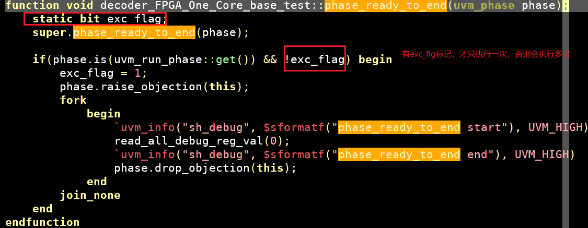

### 1. 基础知识
0. 翻译
~~~
 Function: phase ready to end
 Invoked when all objections to ending the given -phase- and all sibling phases have been dropped, thus indicating that-phase- is 
 ready to begin a clean exit. sibling phases are any phases that 
 have a common successor phase in the schedule plus any phases that 
 sync'd to the current phase. Components needing to consume delta 
 cycles or advance time to perform a clean exit from the phase
 may raise the phase's objection.

|phase.raise_objection(this, "Reason");

 It is the responsibility of this component to drop the objection once it is ready for this phase to end (and processes killed). If no objection to the given -phase- or sibling phases are raised, 
 then phase ended() is called after a delta cycle. If any objection 
 is raised, then when all objections to ending the given -phase- 
 and siblings are dropped, another iteration of phase ready to end 
 is called. To prevent endless iterations due to coding error, 
 after 20 iterations, phase ended() is called regardless of whether previous iteration had any objections raised.
 
 功能：阶段准备结束
当针对结束指定阶段及其所有兄弟阶段的所有反对意见均被撤销时触发，表明该阶段已准备好开始正常退出。兄弟阶段包括：

在调度表中具有共同后继阶段的任何阶段

已与当前阶段同步的任何阶段

若组件需要消耗增量周期（delta cycle）或推进时间以完成阶段正常退出，可提出阶段反对：
phase.raise_objection(this, "原因");

组件职责：
该组件必须在准备好结束本阶段（且相关进程被终止）时撤销反对。若未对指定阶段或兄弟阶段提出任何反对，则经过一个增量周期后将调用phase ended()。

反对处理机制：

若存在反对：当针对结束指定阶段及兄弟阶段的所有反对均被撤销时，将再次触发phase ready to end

防死锁设计：若因编码错误导致连续20次迭代触发本回调，无论是否仍有反对，均强制执行phase ended()
~~~
1. 该phase_ready_to_end 可以实现某个phase(包括runphase 或者其他非task_phase)回调函数
2. 特别注意：虽然是函数，但是实际内部可以调用task
3. 使用过程中，需要注意避免多次被调用

### 2. 经验
#### 1. 应用
1. 背景：
    - base_test的run_phase,实现dut的初始化配置
    - 用例继承于base_test, 用例的run_phase实现发包逻辑，具体为：先super.run_phase调用父类的初始化流程，然后实现发包task用父类的初始化流程，然后实现发包task
- 需求：需要已开发的全部用例结束前，统一都执行某comom_task（消耗时间的）
- 方法1： 在用例的run_phase中，发包任务后，调用task
    - 缺点：每个用例都需要调用，会涉及到多个用例的修改
- 方法2：将run_phase 修改为main_phase
- 方法3：phase_ready_to_end
    

2. 注意事项，必须要添加static exc_flag,否则会多次执行,超过20次调用，则自动结束
3. 为什么会多次执行，是因为该该函数drop_obj,会新一轮触发该逻辑，但是如果是递归的调用，实际应该不能结束仿真，但是现在可以结束，具体原因不明

#### 2. 该方法可以被用在结束仿真

### 3. 传送门
1. [如何优雅地结束UVM Test](https://zhuanlan.zhihu.com/p/592480267)