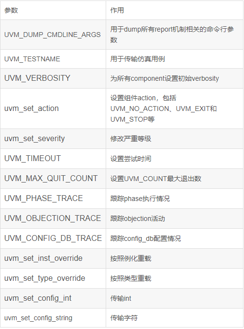

### 1. 基础知识
#### 1. 概述
- uvm_cmdline_processor为给定仿真提供了命令行传递参数的接口。
- 在object构造过程中，存储命令行参数信息的数据structures就会生成。初始化时会创建一个名为<uvm_cmdline_proc>的全局变量，该变量可用于访问命令行信息。
- uvm_cmdline_processor类还支持从命令行设置各种UVM变量，例如组件的verbosity以及整数类型和字符串的配置设置。 这些功能中都在“Built_in UVM Aware Command Line Arguments”部分中进行了描述。

#### 2. 主要函数介绍
##### 1. get_args
- 用于获取仿真开始时命令行传递的参数。
~~~
  function void get_args (output string args[$]);
    args = m_argv;
  endfunction
~~~

##### 2. get_plusargs
- 用于获取仿真开始时“+”传递的命令行参数。“+”参数可以被仿真向量使用；
~~~
  function void get_uvm_args (output string args[$]);
    args = m_uvm_argv;
  endfunction
~~~

##### 3. get_uvm_args
- 用来回去方正开始时的UVM参数。UVM参数需要以“+”或者“-”和以UVM为首的关键字开头。
~~~
  function void get_uvm_args (output string args[$]);
    args = m_uvm_argv;
  endfunction
~~~

##### 4. get_arg_matchs
- 参数匹配函数，返回匹配上的变量个数。

~~~
  function int get_arg_matches (string match, ref string args[$]);
 
   `ifndef UVM_CMDLINE_NO_DPI
    chandle exp_h = null;
    int len = match.len();
    args.delete();
    if((match.len() > 2) && (match[0] == "/") && (match[match.len()-1] == "/")) begin
       match = match.substr(1,match.len()-2);
       exp_h = uvm_dpi_regcomp(match);
       if(exp_h == null) begin
         uvm_report_error("UVM_CMDLINE_PROC", {"Unable to compile the regular expression: ", match}, UVM_NONE);
         return 0;
       end
    end
    foreach (m_argv[i]) begin
      if(exp_h != null) begin
        if(!uvm_dpi_regexec(exp_h, m_argv[i]))
           args.push_back(m_argv[i]);
      end
      else if((m_argv[i].len() >= len) && (m_argv[i].substr(0,len - 1) == match))
        args.push_back(m_argv[i]);
    end
 
    if(exp_h != null)
      uvm_dpi_regfree(exp_h);
    `endif
 
    return args.size();
  endfunction
~~~

~~~
void'(uvm_cmdline_proc.get_arg_matches("+foo",myargs));  //能够匹配+foo，+foobar等以foo开头的变量；
 
void'(uvm_cmdline_proc.get_arg_matches("/foo/",myargs));  //能够匹配+foo、barfoo等包含foo的变量；
 
void'(uvm_cmdline_proc.get_arg_matches("/^foo.*\.sv",myargs));  //能够匹配上以foo开头，以.sv结尾的参数；
~~~

#### 3. get_arg_value
- Get_arg_value或返回第一个匹配上的参数
~~~
  function int get_arg_value (string match, ref string value);
    int chars = match.len();
    get_arg_value = 0;
    foreach (m_argv[i]) begin
      if(m_argv[i].len() >= chars) begin
        if(m_argv[i].substr(0,chars-1) == match) begin
          get_arg_value++;
          if(get_arg_value == 1)
            value = m_argv[i].substr(chars,m_argv[i].len()-1);
        end
      end
    end
  endfunction
~~~

#### 4. get_arg_values
- get_arg_values放回所有匹配上的参数；
~~~
  function int get_arg_values (string match, ref string values[$]);
    int chars = match.len();
 
    values.delete();
    foreach (m_argv[i]) begin
      if(m_argv[i].len() >= chars) begin
        if(m_argv[i].substr(0,chars-1) == match)
          values.push_back(m_argv[i].substr(chars,m_argv[i].len()-1));
      end
    end
    return values.size();
  endfunction
~~~

#### 5. new
~~~
  function new(string name = "");
 
    string s;
 
    string sub;
 
    super.new(name);
 
    do begin
 
      s = uvm_dpi_get_next_arg();                            //通过DPI获取命令行内容
 
      if(s!="") begin
 
        m_argv.push_back(s);
 
        if(s[0] == "+") begin
 
          m_plus_argv.push_back(s);                          //“+”参数
 
        end
 
        if(s.len() >= 4 && (s[0]=="-" || s[0]=="+")) begin   //获取UVM参数
 
          sub = s.substr(1,3);
 
          sub = sub.toupper();                               //大小写UVM都识别
 
          if(sub == "UVM")
 
            m_uvm_argv.push_back(s);
 
        end
 
      end
 
    end while(s!="");
 
  endfunction
~~~

#### 3. m_convert_verb
- 用于转换verbosity值
~~~
  function bit m_convert_verb(string verb_str, output uvm_verbosity verb_enum);
    case (verb_str)
      "NONE"       : begin verb_enum = UVM_NONE;   return 1; end
      "UVM_NONE"   : begin verb_enum = UVM_NONE;   return 1; end
      "LOW"        : begin verb_enum = UVM_LOW;    return 1; end
      "UVM_LOW"    : begin verb_enum = UVM_LOW;    return 1; end
      "MEDIUM"     : begin verb_enum = UVM_MEDIUM; return 1; end
      "UVM_MEDIUM" : begin verb_enum = UVM_MEDIUM; return 1; end
      "HIGH"       : begin verb_enum = UVM_HIGH;   return 1; end
      "UVM_HIGH"   : begin verb_enum = UVM_HIGH;   return 1; end
      "FULL"       : begin verb_enum = UVM_FULL;   return 1; end
      "UVM_FULL"   : begin verb_enum = UVM_FULL;   return 1; end
      "DEBUG"      : begin verb_enum = UVM_DEBUG;  return 1; end
      "UVM_DEBUG"  : begin verb_enum = UVM_DEBUG;  return 1; end
      default      : begin                         return 0; end
    endcase
  endfunction
~~~

#### 4. 内置UVM参数
 -

### 2. 经验总结
 

### 3. 传送门
1. [uvm_cmdline_processer介绍]（https://blog.csdn.net/muyiwushui/article/details/109691205）