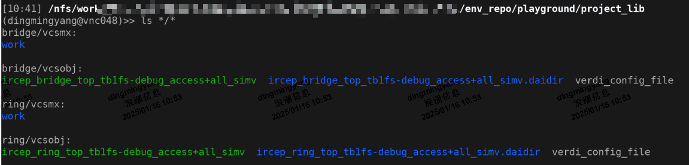

### 1. 背景
当前项目验证环境采用的环境变量形式控制synopsys sim setup文件，使所有的TB编译结果输出在相同文件路径下，引起不同仿真环境文件冲突问题。
为了规避该问题，对当前验证环境进行改造。详述如下。

### 2. 步骤
#### 1.修改Makefile中的对于SIMV文件路径的定义 (附图1)
添加VCS_WORK_DIR变量定义：VCS_WORK_DIR ?= $(WORKAREA)/playground/project_lib/$(MODULE/SS/SOC_NAME) 
 Note：请将$(MODULE/SS/SOC_NAME)替换为对应模块/SS/SOC名字，不要重复
修改SIMV_DIR变量为：SIMV_DIR ?= $(VCS_WROK_DIR)/vcsobj
设置SYNOPSYS_SIM_SETUP环境变量为当前Makefile平级的synopsys_sim.setup文件（或者unsetenv  SYNOPSYS_SIM_SETUP），后面考虑在cshrc.project中删去该环境变量的配置。
#### 2.在各自atb/sim/vcs/目录下建立synopsys_sim.setup文件。可先复制$WORKAREA/env/synopsys_sim.setup（附图2）
并修改synopsys_sim.setup文件，指定对应WORK，DEFAULT等路径，以及可能存在的library路径。如：
WORK      ： $WORKAREA/playground/project_lib/$((module_name)/vcsmx/work
DEFAULT  ： $WORKAREA/playground/project_lib/$(module_name)/vcsmx/work
以及可能存在的库目录如IBM、ARM、unisim等
上述$(module_name)替换为对应模块/SS/SOC名。以ring为例即为：$WORKAREA/playground/project_lib/ring/vcsmx/work
### 3. 修改ICRun的相关文件，在相关文件中添加将对应路径的指定simv等文件链接到$(sim_dir)。一般为修改global.cfg文件中的link_file_list。在global.cfg文件的tool_cmd_list中添加命令设置SYNOPSYS_SIM_SETUP为$(sim_dir)/synopsys_sim.setup（附图3）
#### 4. 注意，若重新链接了新的编译目录，需同步链接synopsys_sim.setup文件至新的编译目录下

### 3. 效果
可有效解决不同验证平台eda version/simv/database/checksum冲突引起的问题

### 4. 附录

#### 1. 附图1 - Makefile

#### 2. 附图2 - synopsys_sim.setup

#### 3.附图3 - global.cfg

#### 4.附图4 - project_lib结果图

### 5.题外话：
1. VCS 查找synopsys_sim.setup文件优先级：SYNOPSYS_SIM_SET环境变量 > $PWD/synopsys_sim.setup > $HOME/synopsys_sim.setup > $VCS_HOME/bin/synopsys_sim.setup
   
2. synopsys_sim.setup文件支持include形式。可从项目层级考虑，对该文件公共部分进行划分、定义。以避免不合理的使用。